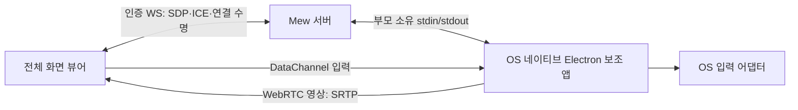

# 원격 데스크톱

[개발 지도](MOC.md) · [설치·사용법](../guides/remote-desktop.md) · [ADR 0136](../../../.mew/docs/decisions/0136-mew-native-remote-desktop-webrtc.md)

## 경계와 수명

`RemoteDesktop`은 body portal의 전체 화면 dialog다. DockWorkspace, workspaceUi, 패널 복원 목록에 넣지 않는다. 화면을 닫으면 세션을 종료하며, 재접속·공유 화면 변경은 새 세션이다. 내부 브라우저의 DOM 전송 계약은 바뀌지 않는다.



`server/remote-desktop-host.ts`는 OS 판별·고정 실행 경로·ICE 설정, `server/remote-desktop.ts`는 API·권한·단일 제어 연결을 맡는다. serve/Vite 양쪽에 같은 WS 핸들러를 설치한다. 공개 보조 앱 포트와 사용자 지정 실행 명령 API는 없다. WSL은 Windows에 설치한 `electron.exe`를 실행하고 WSLg를 대체 화면으로 사용하지 않는다.

네이티브 `main.mjs`만 OS 캡처·입력·클립보드 권한을 가진다. 숨겨진 renderer는 sandbox·contextIsolation을 켜고 nodeIntegration을 끄며 고정된 로컬 파일만 읽는다. preload는 시그널링·검증되는 입력만 노출한다. 세션용 임시 Chromium 프로필은 정상 종료 시 제거한다. Windows 파일 핸들 또는 강제 종료 때문에 임시 폴더가 남을 수 있다. 캡처 영상·키 입력·SDP·ICE 자격증명은 파일에 기록하지 않는다.

## 내부 tmux 설치

보조 앱을 찾지 못하면 `/api/remote-desktop/status`의 `installable`에 따라 설치 버튼을 표시한다. manager·owner만 `POST /api/remote-desktop/install`로 실행하고 `GET`으로 상태를 조회한다. `server/remote-desktop-install.ts`가 고정 `mewcmd-desktop-install` 세션을 소유하며 HTTP 입력으로 명령·폴더·세션을 지정할 수 없다.

서버의 Node 실행 파일과 mew 앱 루트의 `native/remote-desktop/install.mjs`를 사용한다. 프로젝트 cwd와 독립적이며, POSIX 셸로 감싸 사용자의 fish/zsh 설정과 무관하게 종료 코드를 기록한다. 현재 서버의 PATH·WSL_INTEROP·MEW_DESKTOP_HELPER_DIR을 전달한다. 동시에 들어온 시작 요청은 하나로 합치고 진행 중인 설치는 재사용한다. 완료한 작업을 재시도할 때만 이전 터미널을 교체한다.

설치 작업은 tmux manager의 `startCommand`로 새 세션의 첫 프로세스에서 시작한다. 대화형 셸에 `send-keys`로 명령을 입력하지 않아 셸 초기화 중 입력 유실·지연을 피한다. 완료 후 `/bin/sh -i`를 남겨 출력을 유지하며, 세션 시작 자체가 실패하면 종료 코드 125를 기록해 영구 실행 중으로 남지 않게 한다. 일반 터미널의 기존 `runCommand` 동작은 유지한다.

`MEW_DATA_DIR/desktop-install/`에는 시작 표시와 종료 코드만 저장한다. npm 출력은 tmux에 남고 별도 로그로 복사하지 않는다. 세션이 남아 있어도 종료 코드로 설치 완료·실패를 구분하며, 결과 없이 세션이 사라지면 중단으로 표시한다. 서버 재시작 뒤에도 상태와 터미널을 다시 읽는다.

UI는 기존 `SessionTerminalPopup`을 전체 화면보다 높은 레이어의 별도 portal로 사용한다. 열려 있는 동안 원격 화면을 inert 처리하고, 터미널 Esc가 원격 화면을 닫지 않게 한다. 닫기는 설치를 종료하지 않으며 완료 후 사용자가 다시 연결한다. 상태 확인은 터미널 표시 중 또는 설치 진행 중에만 반복한다.

WSL 설치기는 PowerShell을 통해 Windows 복사본을 설치한다. `npm.cmd`가 PATH에 없으면 Windows Program Files의 Node 설치를 확인하고, npm 실행 전 Windows 대상 폴더로 이동해 WSL UNC 작업 폴더 문제를 피한다. Windows Node와 WSL interop 자체를 자동 설치·변경하지 않는다. 모든 OS 설치기가 `MEW_DESKTOP_HELPER_DIR`을 런타임과 동일하게 사용한다.

설치기와 연결 준비는 `native/remote-desktop/wsl-powershell.mjs`의 같은 PowerShell 탐색을 사용한다. PATH에 Windows 경로가 없어도 `/proc/mounts`에서 Windows 드라이브 루트를 찾아 `Windows/System32/WindowsPowerShell/v1.0/powershell.exe`의 실행 가능한 절대 경로를 사용한다. 사용자 지정 마운트 위치·공백 이스케이프를 처리하고 기본 `/mnt/c`도 확인한다. 실행 파일을 못 찾는 오류는 드라이브 마운트 안내로, 파일을 찾았지만 실행할 수 없는 오류는 WSL interop 안내로 구분한다. 설치 명령을 탐색용으로 실행하거나 실패 후 자동 재실행하지 않는다.

설치 순서는 `[1/3] npm ci` → `[2/3] Electron 실행 파일 다운로드·압축 해제` → `[3/3] 실행 파일·버전·path.txt 검증`이다. Electron 44는 npm 패키지 설치 시 실행 파일을 받지 않으므로 `install-runtime.mjs`가 설치된 패키지의 `install.js`를 Node로 명시 실행한다([공식 설치 계약](https://github.com/electron/electron/blob/main/docs/tutorial/installation.md#binary-download-step)). WSL/Windows에서는 Windows Node로 같은 검증기를 실행한다. 다운로드 단계는 10분 상한을 두며 오류·비정상 종료·실행 파일 누락·버전 불일치가 있으면 성공으로 기록하지 않는다. OS 화면 캡처나 Electron GUI를 실행하는 검증은 아니다.

준비 상태 API는 경로 탐색/interop 오류와 파일 접근 권한 오류에 재설치를 권하지 않는다. 실행 파일이 실제로 없을 때만 설치 버튼과 `[3/3]` 검증 완료 안내를 제공한다. 실행 중인 서버에 로드된 연결 코드 수정은 서버 재시작 후 적용되며, 설치 스크립트 수정은 새 설치 시 읽는다.

## 전송과 지연

- Electron desktopCapturer/Chromium 캡처 → WebRTC. H.264를 우선 협상하고 상대 코덱에 맞춰 폴백한다. 하드웨어 인코딩 여부는 Chromium·OS·드라이버에 달려 있다.
- 캡처 상한 1920×1080·60fps, 인코더 상한 6Mbps. 프레임 간 압축·혼잡 제어를 사용한다. 정적 화면의 변화가 적으면 전송량이 줄어든다. JPEG 폴링·영상 WebSocket 경유는 없다.
- Mew 서버는 영상을 중계하지 않는다. ICE 설정이 없으면 직접 경로만 사용하며 외부 망은 운영자가 STUN/TURN을 설정한다. HTTPS 터널이 영상 중계를 제공하지는 않는다.
- 확대·뷰 이동·조이스틱 위치는 로컬 변환이며 재캡처·재협상하지 않는다.
- UI의 `왕복 … ms`는 candidate pair RTT, Mbps는 수신 바이트 증가량이다. 화면의 실제 종단 간 지연이나 보장 수치가 아니다. 실제 OS·모바일·망에서 지연과 발열을 별도 측정해야 한다.

## 입력과 권한

`desktop-input.ts`와 네이티브 `protocol.mjs`의 v1 스냅샷은 누적 이동/휠 카운터, 전체 버튼 비트셋(left=1, middle=2, right=4), 키 목록, 선택적 정규화 절대 위치를 담는다. 소수 이동을 누적한 뒤 정수로 전송해 미세 입력을 보존한다.

- `motion`: unordered, maxRetransmits=0. 송신 큐가 2KB를 넘으면 건너뛰고 다음 누적 스냅샷으로 거리를 복구한다.
- 이동·휠·절대 포인터는 공통 프레임 펌프에서 최대 초당 60개로 합친다. 고주사율 화면·여러 조이스틱·고속 마우스도 입력 메시지를 과도하게 보내지 않는다. 버튼·키 전환은 프레임을 기다리지 않는다.
- `control`: ordered/reliable. 버튼·키 전환과 250ms heartbeat마다 epoch를 올린다. 큐가 64KB를 넘으면 연결을 종료한다.
- seq로 오래된 패킷을 버린다. 미래 epoch의 motion은 최신 하나만 보관하고 해당 reliable 전환 뒤 적용한다. 빠른 이동 패킷이 클릭 down/up을 추월해 클릭 자체를 없애지 못한다.
- 유실된 마지막 이동은 기존 버튼 상태로 먼저 복원하고 새 버튼 전환을 적용한다. 절대 클릭도 최신 위치에서 발생한다.
- blur·pointercancel·lost capture·닫기에서 해제한다. 백그라운드 진입은 영상도 종료한다. 네이티브 입력 heartbeat가 1.5초 끊기면 해제 후 종료한다.
- 서버는 3초마다 인증과 WS 생존을 검사한다. 계정·역할·세션 무효화는 연결을 종료한다. 보조 앱은 부모 lease가 8초 없거나 stdin이 닫히면 종료한다. 정상 종료가 지연되면 자신이 띄운 자식만 종료한다. 이전 자식 종료 전 새 제어권을 주지 않는다.
- 입력 초당 240개, WS 3초당 128개 및 128KB 메시지 상한, Wayland 입력 대기 32개 상한을 둔다.

물리 데스크톱은 Mew 계정별로 격리되지 않는다. 한 서버 프로세스에 제어 연결 하나만 허용한다. 같은 OS 사용자로 서버 여러 개를 실행하면 서버 간 잠금은 공유되지 않으므로 원격 제어용 서버는 하나만 운영한다. 권한 기준본은 [SECURITY.md](../../SECURITY.md)다.

## OS 어댑터

| 호스트 | 캡처·실행 | 입력 |
| --- | --- | --- |
| macOS | 로그인한 Mac의 Electron + 화면 기록 권한 | CoreGraphics·손쉬운 사용 권한. modifier flags와 중간 버튼 드래그 유지 |
| Linux X11 | 같은 DISPLAY/Xauthority의 Electron | libX11·libXtst/XTest. 누적 휠을 notch로 변환 |
| Linux Wayland | Chromium/PipeWire 화면 공유 승인 | D-Bus RemoteDesktop portal의 별도 입력 승인. XWayland 주입 폴백 없음 |
| WSL | Windows LocalAppData의 Electron, WSL interop | Windows SendInput·실제 픽셀 커서 위치. Linux 화면 사용 안 함 |

Wayland 캡처와 입력 portal의 ScreenCast stream이 같지 않아 절대 좌표를 주입하지 않는다. 조이스틱 상대 이동·클릭·드래그·휠을 사용한다. compositor에 RemoteDesktop portal이 없으면 오류로 종료한다. 키보드 권한을 제외하면 포인터만 사용할 수 있다. PipeWire에서는 OS 선택기가 공유 소스 하나를 반환할 수 있다.

붙여넣기는 사용자가 제출한 최대 4096자만 서버 클립보드에 쓰고 Ctrl+V/Mac Cmd+V를 보낸다. 양방향 클립보드 동기화·오디오·파일 전송은 구현하지 않는다. 로컬 Esc는 닫기이며 도구의 원격 Esc로 키를 전달한다.

## 검증

```bash
MEW_DATA_DIR=/tmp/mew-desktop-test-data node --test server/remote-desktop.test.ts server/remote-desktop-install.test.ts server/remote-desktop-native.test.ts server/remote-desktop-ui.test.ts src/utils/desktop-input.test.ts
npx tsc -b
npm run lint
```

- protocol/joystick: 유실·역순·클릭 추월, 절대 위치, timeout, tap/즉시 이동/hold/cancel, 휠 축 제한, 로컬 뷰.
- 서버: Origin·역할·임시 비밀번호, OS/WSL 경로, 메시지 검증, 단일 제어권, 화면 교체, 권한 회수·자식 종료. 가짜 stdio 프로세스를 사용한다.
- OS: Windows INPUT 레이아웃, Mac modifier/middle drag, X11 notch, Wayland 승인 응답 경합·입력 순서·종료. FFI/DBus는 모의 객체다.
- 설치: 역할 제한·고정 명령·중복 시작·실패 출력 보존·재시도·상태 복구, 따옴표/공백 경로의 셸 실행, WSL PowerShell 인자·interop 실패·사용자 지정 설치 경로. 실제 npm 설치 대신 임시 스크립트와 모의 프로세스를 사용한다. UI에서는 터미널 렌더러를 대체하고 실제 팝업의 레이어·입력·닫기·재열기·실패/완료를 검증한다.
- Chromium UI: 실제 sender.mjs와 WebRTC 영상·DataChannel, 합성 canvas 화면만 사용한다. 터치 탭·hold/cancel, 5개 컨트롤, 핸들, 붙여넣기, 모바일/데스크톱 배치, 오류/재접속, Esc, 백그라운드 종료. Chromium이 없으면 skip한다.

**실기 검증은 별도다.** Mac/Windows 바이너리·OS 권한, X11/Wayland 실제 데스크톱 주입, Safari/iOS, 외부 TURN·모바일 망, Retina/혼합 DPI·다중 모니터, 실제 지연·대역폭은 자동 테스트만으로 검증됐다고 간주하지 않는다. 각 OS에서 로그인·권한 승인·커서/휠/세 버튼 드래그·한글 붙여넣기·닫은 뒤 해제·권한 회수를 확인해야 한다. 잠금 화면·로그인 전·Windows UAC secure desktop 지원은 범위 밖이다.
