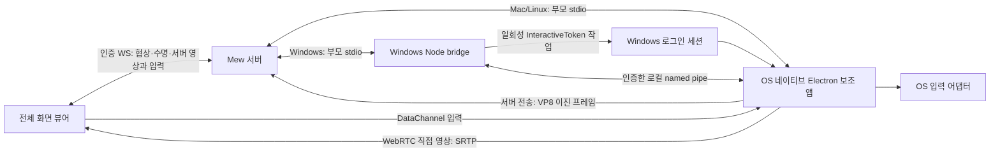

# 원격 데스크톱

[개발 지도](MOC.md) · [설치·사용법](../guides/remote-desktop.md) · [배포 라이선스](remote-desktop-distribution.md) · [ADR 0139](../../../.mew/docs/decisions/0139-mew-desktop-server-transport.md) · [ADR 0144](../../../.mew/docs/decisions/0144-mew-desktop-local-cursor.md)

## 경계와 수명

`RemoteDesktop`은 body portal의 전체 화면 dialog다. DockWorkspace, workspaceUi, 패널 복원 목록에 넣지 않는다. 화면을 닫으면 세션을 종료하며, 재접속·공유 화면 변경은 새 세션이다. 내부 브라우저의 DOM 전송 계약은 바뀌지 않는다.



`server/remote-desktop-host.ts`는 OS 판별·고정 실행 경로·ICE 설정, `server/remote-desktop.ts`는 API·권한·단일 제어 연결을 맡는다. serve/Vite 양쪽에 같은 WS 핸들러를 설치한다. 공개 보조 앱 포트와 사용자 지정 실행 명령 API는 없다. WSL은 Windows에 설치한 `electron.exe`를 실행하고 WSLg를 대체 화면으로 사용하지 않는다.

Windows Electron의 익명 stdin은 실제 환경에서 즉시 EOF가 되어 직접 stdio 경로를 사용할 수 없다. [ADR 0137](../../../.mew/docs/decisions/0137-mew-windows-desktop-pipe-bridge.md)·[0138](../../../.mew/docs/decisions/0138-mew-desktop-automatic-preparation.md)에 따라 WSL Mew → Windows Node stdio → 인증한 named pipe → Electron으로 연결한다. bridge는 소스의 `windows-bridge.mjs`, Electron은 설치본의 `parent-channel.mjs`를 사용한다. 인증은 실행별 256bit 토큰, 3초/64자·후보 소켓 최대 4개로 제한한다. 전체 초기 연결은 40초, 부모가 끊기면 파이프 EOF와 8초 lease 만료로 캡처를 종료한다.

`windows-session.ps1` broker는 임의 bootstrap 파이프를 연 뒤 현재 Windows 사용자 SID의 InteractiveToken·최소 권한으로 임시 작업을 등록·실행한다. 작업 정의에는 고정 스크립트 경로와 공개 파이프 이름만 기록한다. 비밀번호나 토큰을 저장하지 않으며 부팅/로그인 트리거도 없다. 토큰은 부모 stdio와 bootstrap 파이프를 통해 받은 뒤 Electron 자식 환경으로 전달하고 인증 후 환경에서 제거한다.

bootstrap과 영상 시그널링 파이프는 현재 사용자 SID에만 허용하고 Network SID는 거부한다. libuv 기본 DACL이 서비스 로그온 SID에 묶일 수 있어 실제 파이프 ACL도 갱신한다. bootstrap 첫 바이트 수신 후 impersonation 사용자 SID와 실제 클라이언트 프로세스 세션 ID(0 아님)를 검사한다. 로그인 실행 대기는 25초이며 부모 소멸·실패·완료에서 작업을 제거한다. 로그인 세션의 launcher가 직접 시작한 Electron 프로세스 핸들을 보관한다. bootstrap 파이프는 연결 동안 유지하고 broker·bridge가 사라져 EOF가 오면 2초 뒤에도 끝나지 않은 Electron을 그 핸들로 종료한다. WSL이 서비스 쪽 프로세스들을 한꺼번에 종료해도 로그인 세션의 supervisor가 정리하며 PID 재사용으로 다른 프로세스를 죽이지 않는다. 비정상 OS 종료로 작업 정의가 남더라도 트리거·인증 정보가 없어 자동 실행되지 않는다. 다른 사용자나 로그인 전 화면으로 권한을 확장하지 않는다.

Windows 실행 전 설치한 전용 Node → Program Files → PATH 순서로 지원 버전을 찾는다. 해당 Electron 실행 파일의 명시적 inbound 방화벽 차단 규칙을 발견하면 서버가 `network-hint`를 전달한다. 직접 연결 실패 시 먼저 서버 전송으로 전환하며, 브라우저가 서버 전송을 준비하지 못할 때만 방화벽 안내를 함께 표시한다. 설정 위치는 Mew 서버가 실행 중인 컴퓨터의 Windows라고 명시한다. 규칙 존재만으로 실행을 막지 않고 조회만 한다. `ready`는 구성 파일 준비 상태이며 OS 로그인·네트워크 접근 성공을 보장하지 않는다.

Electron ESM 진입점에서 `await app.whenReady()`를 최상위로 기다리면 모듈 평가 완료와 앱 준비가 서로 기다린다. `createWindow()`를 비동기로 시작하고 진입 모듈 평가는 즉시 끝낸다. 시작 중 부모가 종료되면 준비 후 창을 만들지 않는다.

네이티브 `main.mjs`만 OS 캡처·입력·클립보드 권한을 가진다. 숨겨진 renderer는 sandbox·contextIsolation을 켜고 nodeIntegration을 끄며 고정된 로컬 파일만 읽는다. preload는 시그널링·검증되는 입력·단일 캡처 요청을 노출한다. 고정 로컬 renderer에만 media와 Chromium Local Network Access 권한을 허용한다([Electron 권한 계약](https://www.electronjs.org/docs/latest/api/session)). 세션용 임시 Chromium 프로필은 정상 종료 시 제거한다. Windows 파일 핸들 또는 강제 종료 때문에 임시 폴더가 남을 수 있다. 캡처 영상·키 입력·SDP·ICE 자격증명은 파일에 기록하지 않는다.

## 자동 준비와 내부 tmux

`desktop-preparation.ts`는 `/api/remote-desktop/status`가 준비 가능하다고 응답하면 `POST /api/remote-desktop/install`을 한 번 호출하고 완료까지 `GET`으로 기다린다. manager·owner만 사용할 수 있다. 실패 시 자동 반복하지 않으며 준비 후 상태를 다시 확인한 뒤 WS를 연다. 준비 대기는 최대 20분, 영상 연결 제한 시간은 준비가 끝난 다음부터 계산한다. 뷰어 종료는 요청·폴링만 취소한다. `server/remote-desktop-install.ts`가 고정 `mewcmd-desktop-install` 세션을 소유하며 HTTP 입력으로 명령·폴더·세션을 지정할 수 없다.

서버의 Node 실행 파일과 mew 앱 루트의 `native/remote-desktop/install.mjs`를 사용한다. 프로젝트 cwd와 독립적이며, POSIX 셸로 감싸 사용자의 fish/zsh 설정과 무관하게 종료 코드를 기록한다. 현재 서버의 PATH·WSL_INTEROP·MEW_DESKTOP_HELPER_DIR을 전달한다. 동시에 들어온 시작 요청은 하나로 합치고 진행 중인 설치는 재사용한다. 완료한 작업을 재시도할 때만 이전 터미널을 교체한다.

설치 작업은 tmux manager의 `startCommand`로 새 세션의 첫 프로세스에서 시작한다. 대화형 셸에 `send-keys`로 명령을 입력하지 않아 셸 초기화 중 입력 유실·지연을 피한다. 완료 후 `/bin/sh -i`를 남겨 출력을 유지하며, 세션 시작 자체가 실패하면 종료 코드 125를 기록해 영구 실행 중으로 남지 않게 한다. 일반 터미널의 기존 `runCommand` 동작은 유지한다.

`MEW_DATA_DIR/desktop-install/`에는 시작 표시와 종료 코드만 저장한다. npm 출력은 tmux에 남고 별도 로그로 복사하지 않는다. 세션이 남아 있어도 종료 코드로 설치 완료·실패를 구분하며, 결과 없이 세션이 사라지면 중단으로 표시한다. 서버 재시작 뒤에도 상태와 터미널을 다시 읽는다.

UI는 기존 `SessionTerminalPopup`을 전체 화면보다 높은 레이어의 별도 portal로 사용한다. 열려 있는 동안 원격 화면을 inert 처리하고, 터미널 Esc가 원격 화면을 닫지 않게 한다. 준비·오류 화면의 **준비 내역 보기**로 열며, 닫기는 설치를 종료하지 않는다. 준비 완료 후 자동 연결한다. 내역이나 준비 화면이 활성화된 동안만 상태를 반복 확인한다.

WSL 설치기는 PowerShell을 통해 Windows 복사본을 설치한다. `npm.cmd`가 PATH에 없으면 Windows Program Files의 Node 설치를 확인하고, npm 실행 전 Windows 대상 폴더로 이동해 WSL UNC 작업 폴더 문제를 피한다. 지원 Windows Node/npm이 없으면 `windows-runtime.ps1`이 공식 Node 24.21.0 x64/arm64 ZIP을 고정 SHA-256으로 검증하여 helper의 `runtime/`에 압축 해제한다. 전용 런타임 다운로드·체크섬·실행은 임시 폴더에서 실기 검증했다. 전역 설치·PATH·레지스트리는 변경하지 않고 interop 자체도 변경하지 않는다. 모든 OS 설치기가 `MEW_DESKTOP_HELPER_DIR`을 런타임과 동일하게 사용한다.

설치기와 연결 준비는 `native/remote-desktop/wsl-powershell.mjs`의 같은 PowerShell 탐색을 사용한다. PATH에 Windows 경로가 없어도 `/proc/mounts`에서 Windows 드라이브 루트를 찾아 `Windows/System32/WindowsPowerShell/v1.0/powershell.exe`의 실행 가능한 절대 경로를 사용한다. 사용자 지정 마운트 위치·공백 이스케이프를 처리하고 기본 `/mnt/c`도 확인한다. 실행 파일을 못 찾는 오류는 드라이브 마운트 안내로, 파일을 찾았지만 실행할 수 없는 오류는 WSL interop 안내로 구분한다. 설치 명령을 탐색용으로 실행하거나 실패 후 자동 재실행하지 않는다.

설치 순서는 `[1/3] npm ci`(의존성 지문이 같고 필수 패키지가 있으면 재사용) → `[2/3] Electron 실행 파일 다운로드·압축 해제` → `[3/3] 실행 파일·버전·path.txt 검증`이다. Electron 44는 npm 패키지 설치 시 실행 파일을 받지 않으므로 `install-runtime.mjs`가 설치된 패키지의 `install.js`를 Node로 명시 실행한다([공식 설치 계약](https://github.com/electron/electron/blob/main/docs/tutorial/installation.md#binary-download-step)). WSL/Windows에서는 Windows Node로 같은 검증기를 실행한다. 다운로드 단계는 10분 상한을 두며 오류·비정상 종료·실행 파일 누락·버전 불일치가 있으면 성공으로 기록하지 않는다. OS 화면 캡처나 Electron GUI를 실행하는 검증은 아니다.

준비 상태 API는 경로 탐색/interop 오류와 파일 접근 권한 오류에 재설치를 권하지 않는다. `helper-version.mjs`의 공통 파일 목록과 콘텐츠 해시를 `.mew-ready`에 기록하며 실행 파일 누락·마커 없음·소스 버전 변경이면 자동 준비한다. `.mew-dependencies`는 lockfile·OS·아키텍처 지문이며 코드만 바뀌면 npm 재설치를 생략한다. 성공 마커는 실행 파일 검증과 Mac 네이티브 모듈 준비 후에만 기록한다. Mac의 dylib가 없으면 다시 준비한다. 실행 중인 서버에 로드된 연결 코드 수정은 서버 재시작 후 적용되며, 설치 스크립트 수정은 새 설치 시 읽는다.

## 전송과 지연

배경은 [지연·대역폭 연구](../research/remote-desktop-latency.md), 구현 범위·검증 결과는 [작업 문서](../work/remote-desktop-latency.md)에 있다.

- Windows/WSL은 아래의 DXGI worker를 우선하고 초기화 실패 시 GDI 보조 경로, 그마저 실패하면 Chromium 캡처를 사용한다. macOS는 아래의 ScreenCaptureKit 경로를 우선한다. Linux와 네이티브 초기화 실패 경로는 Electron desktopCapturer/Chromium이 캡처를 소유한다. `sender.mjs`는 캡처 수명을, `direct-sender.mjs`와 `relay-sender.mjs`는 각 전송을 맡는다. 뷰어의 `desktop-connection.ts`가 준비·수명·전환 정책을, `desktop-direct.ts`와 `desktop-relay.ts`가 수신을 맡는다.
- 직접 연결은 VP8 WebRTC, 최대 1920×1080·60fps·6Mbps다. 연결 실패 또는 offer 수신 후 4초 안에 영상 디코딩이 확인되지 않으면 서버 전송으로 한 번 전환한다. 화면 공유 승인을 기다리는 시간에는 이 4초 타이머를 시작하지 않는다. 이미 연결된 직접 경로가 끊겨도 서버 전송으로 전환한다.
- 서버 전송은 같은 캡처 track → WebCodecs VP8 인코더 → 이진 IPC → Mew WS → WebCodecs 디코더 → canvas다. 최대 1920×1080·30fps이며 2.5Mbps에서 시작해 표시 ACK의 기준 시간 대비 증가와 전송 중 바이트에 따라 0.35–4Mbps로 조절한다. 서버는 디코딩·재인코딩하지 않는다. 하드웨어 가속 여부는 Chromium·OS·드라이버에 달려 있다.
- 인코더 작업 하나, 캡처 버퍼 하나와 최신 미인코딩 프레임 하나, 전송 중 최대 4프레임을 둔다. 전송 중 바이트가 1MiB 이상이면 다음 인코딩을 중단한다. 한 패킷도 1MiB 이하이므로 허용 직전 프레임까지 포함한 바이트 상한은 2MiB 미만이다. 네이티브 출력·서버 WS에도 별도 상한이 있다. 느린 수신자는 인코딩 전 프레임을 생략하며 이미 인코딩한 delta 프레임을 임의로 버리지 않는다.
- 브라우저는 디코딩된 최신 프레임 하나만 rAF에서 그린 뒤 누적 ACK를 보낸다. 표시하지 않는 대기 프레임과 사용한 VideoFrame은 즉시 닫는다. 디코딩 오류는 최대 두 번 키 프레임으로 재동기화한다. 송신 ACK 10초·수신 표시 15초 중단 시 종료한다. 다만 아래의 명시적 유휴 상태는 예외다. 키 프레임은 시작·복구 요청·설정 변경·활성 영상의 약 10초 간격에 생성하며 정지 중 주기적으로 생성하지 않는다.
- 기본 ICE 설정은 `[]`이며 외부 STUN/TURN 요청은 없다. 서버 전송은 기존 인증 WS URL을 사용하므로 추가 계정·공개 포트가 없다. 기존 프록시/터널 자체가 외부 서비스면 그 경로는 유지한다. 외부 접속은 HTTPS/WSS를 사용하며 TLS를 종료하는 프록시와 Mew 서버가 영상 신뢰 경계에 포함된다.
- WebCodecs는 보안 컨텍스트와 VP8 디코딩 지원이 필요하다. 런타임 기능 검사로 미지원 브라우저에 안내하며 JPEG 폴링이나 별도 코덱 다운로드로 우회하지 않는다. WebSocket/TCP는 손실 시 후속 영상도 기다리므로 망에 따라 직접 UDP 연결보다 지연이 커질 수 있다.
- 확대·뷰 이동·조이스틱 위치는 로컬 변환이며 재캡처·재협상하지 않는다.
- UI의 **직접 연결**·**서버 연결**이 선택한 경로를 표시한다. 직접 경로의 `왕복 … ms`는 candidate pair RTT, Mbps는 수신 바이트 증가량이다. 실제 종단 간 지연이나 보장 수치가 아니며 OS·모바일·망에서 지연과 발열을 별도 측정해야 한다.

### Windows 캡처·로컬 커서·유휴 영상

- `capture-windows.mjs`가 기존 Koffi로 Windows DXGI/D3D11을 호출한다. `capture-worker.mjs`의 별도 Node worker에서 GPU 복사·Map을 수행하여 main의 OS 입력 주입을 막지 않는다. `native-capture.mjs`는 worker 준비/요청당 3초 제한과 요청 하나 상한을 둔다. worker는 프로세스의 로그인 세션·수명을 공유하며 자기 스레드에서 COM 초기화·해제를 수행한다. 정상 종료는 worker에 자원 해제를 요청하고, 1초를 넘으면 종료한다. Chromium 화면 캡처와 동일하게 연결 중 display/system idle을 막는 Windows 스레드 실행 상태를 유지하고 종료 시 해제한다. 수동 절전·잠금은 우회하지 않는다.
- 선택한 물리 모니터의 bounds와 DXGI output을 맞춘다. 현재 x64/arm64 ABI, 회전 없는 BGRA 화면, 최대 4096×2160 픽셀 수를 지원한다. 회전·포맷·출력·포인터 분리가 지원되지 않거나 초기 프레임을 확보하지 못하면 GDI에서 커서를 분리한 화면을 준비한다. 두 네이티브 경로 모두 실패해야 Chromium으로 복귀한다. 실행 중 capture access lost·포인터 지원 실패 등은 입력을 해제하고 재연결 안내로 종료한다.
- [ADR 0146](../../../.mew/docs/decisions/0146-mew-desktop-cursor-capture-fallback.md)의 `capture-gdi.mjs`는 로그인 Default desktop에 연결한 worker에서 최대 30Hz로 BitBlt+GdiFlush를 수행한다. 픽셀을 native memcmp로 비교하고 바뀐 화면만 V8 버퍼에 복사·전달한다. 권한·활성 desktop·모니터 bounds가 바뀌면 종료한다. `cursor-windows.mjs`가 GetCursorInfo/GetIconInfo/GetDIBits로 모양·hotspot을 읽으며 생성된 bitmap 핸들은 해제한다. DXGI보다 CPU 읽기·비교 비용이 크고 일부 GPU/보호 콘텐츠는 읽지 못할 수 있다.
- 커서를 영상에 합성하지 않는다. `LastPresentTime=0`인 포인터 전용 갱신에서는 원시 화면 복사를 생략한다. 실제 화면 변경은 GPU staging→V8 소유 BGRA 버퍼→worker transfer→Electron IPC로 전달한다. Electron의 V8 memory cage 때문에 매핑 메모리를 외부 ArrayBuffer로 직접 노출하지 않는다. CPU readback·IPC 복사가 있으므로 zero-copy는 아니다.
- `native-stream.mjs`는 원시 프레임을 최대 1080p canvas로 축소하고 수동 갱신 track을 생성한다. 직접 연결과 서버 전송이 이 track을 공유한다. 표시하지 않은 raw 프레임을 큐에 쌓지 않는다. 초기 직접 협상과 서버 전환·복구 요청은 canvas를 다시 그려 정지 화면도 전달한다.
- `cursor-protocol.mjs`는 모양·hotspot·표시 상태·호스트 좌표·물리 화면 크기·적용 입력 seq를 검증한다. 모양은 최대 128×128, PNG의 실제 IHDR 크기도 확인한다. 모양이 바뀔 때만 PNG를 보내며 입력 주입으로 예상한 좌표와 일치하는 위치 echo는 생략한다. 호스트 실제 마우스·앱의 커서 이동은 별도 보정으로 보낸다. 데이터는 기존 인증 WS를 사용하며 이미지 파일로 저장하지 않는다.
- CSS로 배경 반전을 표현할 수 없는 monochrome/masked XOR 픽셀은 밝은 중심·어두운 테두리로 근사한다. 일반 alpha 커서는 유지한다. 원격 앱이 화면에 직접 그린 커서는 분리 대상이 아니다.
- `desktop-cursor.ts`는 모양 하나의 Blob URL을 캐시·회수한다. 마우스는 native CSS cursor, 조이스틱은 rAF에서 변환하는 이미지 레이어를 사용한다. 로컬 이동은 React 렌더·영상 ACK를 기다리지 않는다. 확대·pan·letterbox를 반영하며 늦은 입력 seq의 위치는 적용하지 않는다. 호스트 보정은 마지막 마우스/조이스틱 표시 방식을 바꾸지 않는다. 첫 영상의 metadata 수신 또는 canvas 해상도 확정 시 위치를 다시 계산하여 초기 커서가 숨은 채 남지 않게 한다. 연결 도움말의 커서 표시 상태는 실제 localCursor 협상 결과를 표시한다.
- 네이티브 캡처가 500ms 이상 정지하고 최근 2초 안에 worker 응답이 왔으며, 미인코딩/인코딩/전송 중 프레임이 없을 때 송신기는 1초마다 `relay-status {seq,idle,ackMs,bitrate}`를 보낸다. 수신기는 해당 seq를 실제로 그린 상태에서 최근 3초 안의 유휴 응답만 인정한다. 입력 heartbeat만으로 영상 정상 상태를 판단하지 않는다. 복구 요청은 정지 중에도 최신 화면을 다시 공급한다.
- `relay-adaptation.mjs`는 최근 6개 10초 구간의 최소 ACK를 기준으로 쓴다. 기준보다 80ms 이상 증가·전송 중 256KiB 초과·ACK 1초 초과이면 최소 2초 간격으로 25% 낮춘다. 안정 상태는 최소 10초 간격으로 8% 올린다. 긴 기본 RTT만으로 220ms 임계값에 걸려 하한으로 내려가는 문제를 제거한다. 최대 4프레임 window는 유지하므로 높은 RTT에서는 여전히 FPS 상한이 생긴다.
- 서버의 `표시 응답 … ms`는 인코더 output 이후 전송·디코드·canvas 그리기·ACK 복귀 시간이다. 순수 네트워크 RTT나 click-to-photon이 아니다. `화면 정지`에서는 영상 payload가 없어도 제어·생존 확인 트래픽은 남는다. macOS의 ScreenCaptureKit 경로에도 유휴 생략을 적용한다. Linux와 네이티브 초기화 실패 경로는 기존 캡처를 유지한다.

### 이진 프로토콜과 신뢰 경계

`relay-protocol.mjs`는 브라우저·서버·네이티브가 공유하는 VP8 패킷 계약이다. 24바이트 헤더는 magic/version(`MDV1`), uint32 순서, float64 정수 마이크로초 timestamp, uint16 가로/세로, key flag와 예약 바이트를 담는다. network byte order를 사용한다. 길이·버전·순서·차원·유한한 timestamp를 디코딩 전에 검사한다. 제어 JSON에 Base64를 넣지 않는다.

`host-wire.mjs`는 기존 `MEW_DESKTOP <JSON>\n`과 `MEW_DESKTOP_FRAME <길이>\n<이진 패킷>`을 구분한다. pipe 청크 경계와 UTF-8 분할에 의존하지 않는다. Windows Node bridge는 인증 후 스트림을 그대로 전달하므로 다른 OS와 같은 프로토콜이다.

서버의 `desktop-relay.ts`는 전환을 한 번만 허용한다. 선택한 세션에서만 `relay-input`과 `frame-ack`를 받고 기존 입력 스냅샷 또는 제한된 붙여넣기 형태만 허용한다. 전송한 프레임을 넘는 ACK·중복 전환·과도한 입력·큰 패킷은 거부한다. 닫기·권한 회수·원본 캡처 종료는 두 경로를 모두 종료한다.

## 입력과 권한

[ADR 0145](../../../.mew/docs/decisions/0145-mew-desktop-mouse-controls.md)에 따라 상단 좌클릭·휠·우클릭과 하단 전체 너비의 커서 전용 패드를 마우스 형태로 묶는다. 화면 이동·확대는 옆의 별도 열에 두며 기존 핸들로 전체를 옮긴다. 좌·우 조이스틱은 3px 이동 문턱에서 첫 이동보다 먼저 button-down을 보내고, up/cancel/blur에서 해제한다. 커서 패드는 탭·hold 모두 버튼을 보내지 않는다. 휠만 일반 세로 스크롤과 320ms hold 후 중간 버튼 드래그를 구분한다. 방향키 드래그도 모든 방향키 해제·blur·비활성화에서 button-up을 보낸다.

[ADR 0154](../../../.mew/docs/decisions/0154-mew-desktop-touchpad-motion.md)에 따라 모든 터치 컨트롤은 직전 입력과의 위치 차이를 즉시 처리한다. 커서·버튼 드래그는 CSS px당 원격 2px, 일반 휠은 세로 3배, 화면 이동은 1배, 확대는 세로 -100px당 로그 배율 +1이다. 최초 3px 문턱을 넘으면 시작 거리도 포함하고 이후 미세 이동·방향 반전을 보존한다. rAF는 hold·시각 피드백만 처리하며 정지 중에는 이동을 만들지 않는다. 손잡이의 8px 시각 반경은 입력 거리를 제한하지 않는다. 새 터치는 기준점을 초기화한다. 기존 속도 방식은 사용자 요청 없이 다시 도입하지 않는다.

`desktop-input.ts`와 네이티브 `protocol.mjs`의 v1 스냅샷은 누적 이동/휠 카운터, 전체 버튼 비트셋(left=1, middle=2, right=4), 키 목록, 선택적 정규화 절대 위치를 담는다. 소수 이동을 누적한 뒤 정수로 전송해 미세 입력을 보존한다.

- `motion`: unordered, maxRetransmits=0. 송신 큐가 2KB를 넘으면 건너뛰고 다음 누적 스냅샷으로 거리를 복구한다.
- 로컬 커서가 활성화된 일반 포인터 이동은 최대 초당 30개, 드래그·휠·기존 캡처 입력은 최대 60개로 합친다. 마지막 이동/휠 이후 약 70ms의 첫 rAF에서 reliable 스냅샷으로 유실을 복구한다. 고주사율 화면·여러 조이스틱·고속 마우스도 입력 메시지를 과도하게 보내지 않는다. 버튼·키 전환은 프레임을 기다리지 않는다.
- `control`: ordered/reliable. 버튼·키 전환과 250ms heartbeat마다 epoch를 올린다. 큐가 64KB를 넘으면 연결을 종료한다.
- seq로 오래된 패킷을 버린다. 미래 epoch의 motion은 최신 하나만 보관하고 해당 reliable 전환 뒤 적용한다. 빠른 이동 패킷이 클릭 down/up을 추월해 클릭 자체를 없애지 못한다.
- 유실된 마지막 이동은 기존 버튼 상태로 먼저 복원하고 새 버튼 전환을 적용한다. down/up/wheel 모두 UI 이벤트의 좌표를 먼저 계산하고, 놓는 위치가 화면 밖이면 가장자리로 제한한다. 휠도 같은 좌표를 동반하며 수신기가 위치를 적용한 뒤 처리한다.
- blur·pointercancel·lost capture·닫기에서 해제한다. 백그라운드 진입은 영상도 종료한다. 네이티브 입력 heartbeat가 1.5초 끊기면 해제 후 종료한다.
- 서버는 3초마다 인증과 WS 생존을 검사한다. 계정·역할·세션 무효화는 연결을 종료한다. 보조 앱은 부모 lease가 8초 없거나 stdin이 닫히면 종료한다. 정상 종료가 지연되면 자신이 띄운 자식만 종료한다. 이전 자식 종료 전 새 제어권을 주지 않는다.
- 입력 초당 240개, 협상 메시지 3초당 128개 및 수신 WS 메시지 128KB 상한, Wayland 입력 대기 32개 상한을 둔다. 서버 전송의 입력·프레임 ACK는 별도 초당 240개 제한을 적용한다.
- 서버 전송도 같은 스냅샷과 입력 수신기를 사용한다. 전환 시 클라이언트는 기존 입력을 해제·분리하고 네이티브 수신기는 `pause()`로 누른 상태와 이전 입력 watchdog을 비운다. 새 연결의 heartbeat로 watchdog을 다시 시작한다. 전환 뒤 늦게 도착한 이전 DataChannel 입력은 받지 않는다.

물리 데스크톱은 Mew 계정별로 격리되지 않는다. 한 서버 프로세스에 제어 연결 하나만 허용한다. 같은 OS 사용자로 서버 여러 개를 실행하면 서버 간 잠금은 공유되지 않으므로 원격 제어용 서버는 하나만 운영한다. 권한 기준본은 [SECURITY.md](../../SECURITY.md)다.

## OS 어댑터

| 호스트 | 캡처·실행 | 입력 |
| --- | --- | --- |
| macOS | 로그인한 Mac의 ScreenCaptureKit + 화면 기록 권한; 초기 실패 시 Chromium | CoreGraphics·손쉬운 사용 권한. modifier flags와 중간 버튼 드래그 유지 |
| Linux X11 | 같은 DISPLAY/Xauthority의 Electron | libX11·libXtst/XTest. 누적 휠을 notch로 변환 |
| Linux Wayland | Chromium/PipeWire 화면 공유 승인 | D-Bus RemoteDesktop portal의 별도 입력 승인. XWayland 주입 폴백 없음 |
| WSL | Windows LocalAppData의 Electron, WSL interop | Windows SendInput·실제 픽셀 커서 위치. Linux 화면 사용 안 함 |

Wayland 캡처와 입력 portal의 ScreenCast stream이 같지 않아 절대 좌표를 주입하지 않는다. 조이스틱 상대 이동·클릭·드래그·휠을 사용한다. compositor에 RemoteDesktop portal이 없으면 오류로 종료한다. 키보드 권한을 제외하면 포인터만 사용할 수 있다. PipeWire에서는 OS 선택기가 공유 소스 하나를 반환할 수 있다.

붙여넣기는 사용자가 제출한 최대 4096자만 서버 클립보드에 쓰고 Ctrl+V/Mac Cmd+V를 보낸다. 양방향 클립보드 동기화·오디오·파일 전송은 구현하지 않는다. 로컬 Esc는 닫기이며 도구의 원격 Esc로 키를 전달한다.

## macOS 캡처·설치 계약

[ADR 0148](../../../.mew/docs/decisions/0148-mew-macos-local-cursor.md)에 따라 macOS 12.3 이상에서 자체 `capture-macos.m` 모듈을 사용한다. 별도 서비스·계정·공개 포트를 추가하지 않는다.

- `install-macos.mjs`가 helper 준비 중 `/usr/bin/xcrun --sdk macosx clang`으로 현재 Node CPU(Apple Silicon arm64 또는 Intel x64)의 dylib를 컴파일한다. Apple Command Line Tools와 ScreenCaptureKit을 포함한 SDK가 필요하다. `codesign`의 로컬 ad-hoc 서명·검증 후 임시 파일을 원자적으로 교체한다. 컴파일/서명 실패는 준비 실패이며 `.mew-ready`를 만들지 않는다. CLT 설치·업데이트 후 다시 연결한다. 바이너리는 저장소 밖 설치 산출물이며 소스·헤더·설치 스크립트는 `HELPER_FILES`에 포함한다.
- `capture-macos.mjs`가 기존 Koffi로 작은 C ABI를 호출한다. ScreenCaptureKit 비동기 콜백은 Objective-C 내부 queue에서 처리한다. Electron main도 라이브러리를 유지하여 worker 종료 후 도착한 native stop completion이 해제된 코드에 접근하지 않게 한다. 시작 도중 닫기는 시작 completion 이후 stream까지 종료한다.
- Electron의 `display_id`를 `CGDirectDisplayID`와 맞추고 CoreGraphics의 논리 bounds를 확인한다. 화면은 배율을 반영하되 OS 변환 단계에서 최대 1920×1080의 짝수 크기·60Hz·BGRA로 제한한다. 입력·포인터 정규화는 논리 좌표를 사용하므로 Retina 및 음수 원점의 두 번째 화면에서 픽셀 배율을 중복 적용하지 않는다. 회전 화면도 화면 bounds의 종횡비를 사용한다.
- `SCStreamConfiguration.showsCursor = NO`, `queueDepth = 3`으로 화면에서 커서를 제외한다. native queue는 최신 미소비 CVPixelBuffer 하나만 보관하고 이전 surface를 해제한다. worker가 요청하면 행 stride를 반영해 이전 화면과 비교하고 변경분이 있을 때만 V8 소유 버퍼에 전체 화면을 복사한다. 유휴 상태는 픽셀 없이 응답하며 기존 생성 track·VP8·WebRTC와 ACK/idle 프로토콜을 공유한다. GPU→CPU 복사는 남으며 zero-copy나 하드웨어 VP8 인코딩을 보장하지 않는다.
- `CGEventGetLocation`의 전역 위치와 `CGCursorIsVisible`을 읽고 AppKit main queue에서 `NSCursor.currentSystemCursor`의 모양·hotspot을 최대 30Hz 확인한다. 이미지는 논리 크기의 premultiplied BGRA, 최대 128×128로 제한하고 변경 시에만 PNG로 전송한다. 현재 OS에서 시스템 모양 조회가 nil이면 시스템 화살표를 사용한다. `currentSystemCursor`와 `CGCursorIsVisible`은 deprecated 공개 API이며 최신 macOS에서 커서 모양·숨김 상태 실기 확인이 필요하다. 비공개 API나 전역 hide/show는 쓰지 않는다.
- 첫 화면을 확보하기 전에는 커서 모양을 소비하지 않는다. 약 3초의 초기 프레임 probe에 성공해야 로컬 커서를 켠다. 초기 API/권한/화면 실패는 Chromium 영상 커서로 복귀하며 도움말에 실제 모드를 표시한다. 실행 중 stream 종료·blank/suspended/stopped·권한/활성 사용자/디스플레이 bounds·화면 크기·회전 변화는 오류로 종료한다. 연결 중 idle sleep을 막는 activity는 close 때 해제한다. 잠금·수동 절전·로그인 전 화면은 지원하지 않는다.

근거: [ScreenCaptureKit 소개](https://developer.apple.com/videos/play/wwdc2022/10156/), [프레임 상태](https://developer.apple.com/documentation/screencapturekit/scframestatus), [커서 제외](https://developer.apple.com/documentation/screencapturekit/scstreamconfiguration/showscursor), [시스템 커서](https://developer.apple.com/documentation/appkit/nscursor/currentsystem).

## 검증

```bash
MEW_DATA_DIR=/tmp/mew-desktop-test-data node --test --test-concurrency=1 server/remote-desktop.test.ts server/remote-desktop-relay.test.ts server/remote-desktop-bridge.test.ts server/remote-desktop-install.test.ts server/remote-desktop-native.test.ts server/remote-desktop-latency.test.ts server/remote-desktop-ui.test.ts src/utils/desktop-input.test.ts src/utils/desktop-preparation.test.ts server/remote-desktop-windows.test.ts
npx tsc -b
npm run lint
```

- protocol/joystick: 유실·역순·클릭 추월, 절대 위치, timeout, tap/즉시 이동/hold/cancel, 휠 축 제한, 로컬 뷰, 정지 중 무이동·미세 반전·시각 반경 밖 이동·새 터치 기준점 초기화.
- 서버: Origin·역할·임시 비밀번호, OS/WSL 경로, 메시지 검증, 단일 제어권, 화면 교체, 권한 회수·자식 종료. 가짜 stdio 프로세스를 사용한다.
- OS: Windows INPUT 레이아웃, Mac modifier/middle drag, X11 notch, Wayland 승인 응답 경합·입력 순서·종료. FFI/DBus는 모의 객체다.
- Windows bridge: 세션 0/로그인 세션 실행 인자·방화벽 차단 안내·오류의 WS 전달을 검사한다. `MEW_DESKTOP_TEST_WINDOWS_NODE`에 Windows `node.exe` 경로를 지정하면 실제 임시 작업·Electron 실행·화면 목록·인증 파이프·부모 종료·Electron 이벤트 루프 정지 시 강제 종료 테스트를 실행한다. 실제 Windows 로그인 세션에서 화면 목록이 나오는 것까지 확인했다. 픽셀이나 입력은 기록하지 않는다.
- Windows 영상 통합 검사는 추가로 `MEW_DESKTOP_TEST_WINDOWS_VIDEO=1`을 지정한다. 직접 후보를 사용할 수 없는 뷰어와 빈 ICE 설정으로 실제 Windows 로그인 화면의 서버 전송·디코딩·부모 종료를 검사했다. DXGI 경로는 정지 화면에서 연속 프레임을 요구하지 않는다. 초기 프레임이 없는 duplication은 약 1초 대기 후 한 번 재생성하고, 다시 실패하면 GDI 보조 경로를 준비한다. 검증 결과와 적용 범위는 [진행 문서](../work/remote-desktop-latency.md)를 따른다. `MEW_DESKTOP_TEST_WINDOWS_LOCAL_CURSOR=1`을 함께 지정하면 네이티브 로컬 커서 활성화·실제 이미지 디코드·보이는 픽셀·DOM 표시와 첫 표시 후 계속 연결됨을 검사한다. `MEW_DESKTOP_TEST_WINDOWS_GDI=1`은 임시 복사본에서 DXGI 실패, `=timeout`은 초기 프레임 부재를 모사해 실제 Windows GDI 보조 경로를 검사한다. 커서 위치 검사는 뷰어 DOM만 이동하며 Windows 입력을 보내지 않는다. 화면 파일·키 입력을 만들지 않는다. 설치본을 덮지 않고 별도 임시 helper 폴더와 Windows junction으로 기존 런타임을 참조하고 종료 후 제거한다. 실패 시 후보 유형·프로토콜·요청/응답 수만 출력하며 IP·포트·SDP·자격증명은 출력하지 않는다. Windows 실기 테스트는 `--test-concurrency=1`로 실행한다.
- 서버 전송 프로토콜: 이진 내용과 UTF-8/pipe 청크 경계, 과대 프레임·버전·차원·timestamp, 순서·위조/중복 ACK·프레임/바이트 상한, 잘못된 입력·전환 전 입력, 실제 WS의 영상 전달·권한 회수·부모 종료를 검사한다.
- 자동 준비: 설치 생략·한 번 시작·완료 후 재검사·중단/실패에서 반복 금지·닫을 때 폴링 취소, 코드 변경과 의존성 재사용 지문을 검사한다.
- Mac 캡처: 크기/Retina/음수 원점, 초기 프레임 전 커서 보존, 유휴 픽셀 생략, 커서만 변경, transfer 이후 버퍼 소유권, 실패·중복 close를 모의 FFI로 검사한다. Apple SDK 15.5와 Clang으로 arm64/x86_64 Mach-O 객체 컴파일을 검사했다. 이는 macOS 링크·실행·권한·영상 실측을 대신하지 않는다. 실제 Mac에서는 설치된 런타임과 화면 기록 권한을 준비한 뒤 `MEW_DESKTOP_TEST_MACOS_CAPTURE=1 node --test server/remote-desktop-macos.test.ts`로 임시 helper의 native 캡처·별도 커서 PNG 디코드·연속 응답·종료를 검사한다. 입력은 주입하지 않고 화면/커서 파일을 저장하지 않는다.
- 설치: 역할 제한·고정 명령·중복 시작·실패 출력 보존·재시도·상태 복구, 따옴표/공백 경로의 셸 실행, WSL PowerShell 인자·interop 실패·사용자 지정 설치 경로. 실제 npm 설치 대신 임시 스크립트와 모의 프로세스를 사용한다. UI에서는 터미널 렌더러를 대체하고 실제 팝업의 레이어·입력·닫기·재열기·실패/완료를 검증한다.
- Chromium UI: 실제 sender와 VP8 인코딩/디코딩을 사용해 직접 경로 및 후보 차단 후 서버 전송을 모두 검사한다. 네이티브 캡처 입력을 모사한 실제 WebCodecs 경로에서 로컬 커서·16초 정지 중 추가 영상 0프레임/0바이트·연결 유지·정지 중 키 프레임 복구와 갱신 재개를 확인한다. 화면은 합성 canvas다. 터치 탭·즉시 드래그·hold/cancel·6개 컨트롤·핸들·붙여넣기·모바일/데스크톱 배치·재접속·Esc·백그라운드 종료, 누른 키를 해제하는 연결 중 전환, 캡처 재사용, ACK 정지 시 프레임 상한과 복구, VP8 미지원 안내를 확인한다. Chromium이 없으면 skip한다.

**나머지 실기 검증은 별도다.** Mac 바이너리·OS 권한, X11/Wayland 실제 데스크톱 주입, Safari/iOS 실물, 사용자의 외부 모바일 망, Retina/혼합 DPI·다중 모니터, 실제 지연·대역폭은 자동 테스트만으로 검증됐다고 간주하지 않는다. 각 OS에서 로그인·권한 승인·커서/휠/세 버튼 드래그·한글 붙여넣기·닫은 뒤 해제·권한 회수를 확인해야 한다. 잠금 화면·로그인 전·Windows UAC secure desktop 지원은 범위 밖이다.
