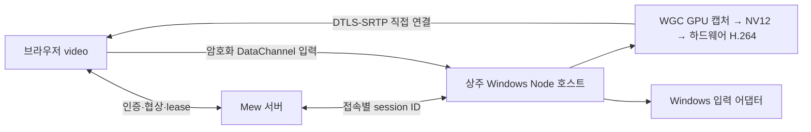

# 원격 데스크톱

[개발 지도](MOC.md) · [설치·사용법](../guides/remote-desktop.md) · [배포 라이선스](remote-desktop-distribution.md) · [ADR 0185](../../../.mew/docs/decisions/0185-mew-desktop-resident-direct-host.md) · [ADR 0189](../../../.mew/docs/decisions/0189-mew-desktop-external-direct-connectivity.md) · [ADR 0144](../../../.mew/docs/decisions/0144-mew-desktop-local-cursor.md)

## 경계와 수명

[ADR 0185](../../../.mew/docs/decisions/0185-mew-desktop-resident-direct-host.md)에 따라 영상·입력은 WebRTC 직접 연결만 사용한다. Mew의 인증 WebSocket은 협상·접속 승인·수명과 커서 메타데이터만 전달한다. TURN과 WebSocket 영상 중계는 거부한다. 기존 Electron·서버 전송의 구현·검증은 [이전 기록](../history/remote-desktop-electron-transport.md)에 보존한다.

`server/desktop-resident-host.ts`는 지원 OS에서 설치본이 준비되어 있으면 서버 시작 시 로그인 호스트를 미리 실행한다. 준비 중에는 D3D 장치·화면 목록만 유지한다. 캡처·인코더·GPU polling·절전 방지 요청과 타이머 해상도 요청은 활성 세션에만 존재한다. 닫기·공유 화면 변경은 새 세션이며 호스트 프로세스는 재사용한다. 영구 Windows 서비스나 로그인 자동 실행을 설치하지 않는다. Mac/Linux도 상주 Node·네이티브 하드웨어 H.264를 사용한다. [POSIX 상세 계약](remote-desktop-posix.md)을 따른다. Windows 화면 목록·물리 좌표는 접속마다 다시 조회하며 기본/선호 화면을 서버가 바로 선택해 브라우저 선택 왕복을 생략한다.

Windows 실행은 같은 사용자 SID의 최소 권한 InteractiveToken 임시 작업과 인증한 named pipe를 유지한다. 고정 진입점은 `native-host.mjs`, 실행 파일은 설치한 `runtime/node.exe`다. 파이프는 실행별 256bit 토큰, 현재 사용자 SID 허용·Network SID 거부, 실제 클라이언트 로그인 세션 검사를 사용한다. 토큰은 환경에서 인증 후 제거하며 디스크에 저장하지 않는다. 부모가 사라지면 로그인 supervisor가 보관한 프로세스 핸들로 종료한다. WSLg·세션 0·잠금 화면·UAC로 권한을 확장하지 않는다.

접속마다 무작위 128bit session ID를 내부 메시지에 붙인다. 이전 세션의 응답·입력·worker 콜백은 새 세션으로 전달하지 않는다. 네이티브 `stopped` 확인을 받은 뒤 제어권을 넘긴다. 3.5초 안에 확인하지 못하면 호스트를 폐기하고 부모의 8초·가상 모니터의 10초 lease를 고려해 11.25초 동안 다음 호스트 실행을 지연한다. Mew의 인증·Origin·단일 제어 연결·권한 회수 검사는 유지한다. 활성 입력은 1.5초, 부모 승인은 8초 timeout을 적용하며 worker도 독립적으로 캡처 승인을 확인한다. 입력 주입 전에도 Default desktop인지 검사한다.

Windows 물리·가상 출력의 캡처는 WGC의 GPU 표면을 사용한다. 자체 가상 모니터·권한·서명·설치·미검증 범위는 [가상 디스플레이 계약](remote-desktop-virtual-display.md)이 소유한다. 모니터가 없는 경우에도 GPU 장치는 예열하며, 가상 출력의 실제 좌표가 확정된 뒤 입력을 준비한다. 두 입력 채널과 첫 영상 디코드가 모두 확인돼야 연결 완료를 표시한다.

실행 경로 탐색은 30초 동안 진행 요청·성공 결과만 재사용한다. 설치 버전·권한·접속 승인은 캐시하지 않는다. 방화벽 진단은 호스트 실행을 막지 않는 읽기 전용 조회다. 차단된 `runtime/node.exe`와 명시적 수신 허용 규칙 부재를 발견하면 복구 안내를 전달한다. 설치 단계의 Windows UAC 승인·활성 연결의 임시 NAT 준비는 [외부 직결 계약](remote-desktop-connectivity.md)을 따른다. `ready`는 설치 준비 상태이며 로그인·직접 네트워크 연결 성공을 보장하지 않는다. 영상·클립보드·키 입력·SDP·ICE 자격증명을 파일에 기록하지 않는다.

## 호스트 연결 알림

브라우저에서 첫 영상 디코드와 두 입력 DataChannel의 준비를 모두 확인한 뒤 reliable `control` 채널로 고정 `viewer-ready` 메시지를 한 번 보낸다. 호스트도 두 채널의 준비를 확인하고 현재 연결에서만 **mew 원격 데스크톱 연결됨** 알림을 한 번 표시한다. 예열·협상만 성공한 연결·영상 없는 연결·이전 세션의 늦은 응답에는 표시하지 않는다. 다시 연결하거나 공유 화면을 바꿔 새 세션을 만들면 새 알림을 허용한다.

Windows는 `notification-windows.cpp`를 GPU DLL에 함께 컴파일한다. 캡처·입력 스레드와 분리된 짧은 네이티브 스레드에서 `Shell_NotifyIconW`를 호출하며, 종료 신호 또는 최대 30초 뒤 임시 아이콘·숨은 창·스레드를 정리한다. 대기 중 알림 polling과 별도 실행 프로세스를 만들지 않는다. `NIF_REALTIME`으로 뒤늦은 알림 대기를 피하고 소리를 내지 않으며 OS의 알림 설정을 따른다([Microsoft API](https://learn.microsoft.com/en-us/windows/win32/api/shellapi/ns-shellapi-notifyicondataw)). Mac은 UserNotifications, Linux는 D-Bus Notifications를 사용한다. 알림 서비스·권한·API 오류는 영상·입력 연결을 실패시키지 않는다. 알림 표시 여부는 OS 설정과 알림 서비스 제공 여부에 따라 달라진다.

## 자동 준비와 내부 tmux

`./mew setup`은 설정을 로드하고 앱의 `npm ci`가 끝난 뒤, 빌드·서버 시작 전에 기존 `native/remote-desktop/install.mjs`와 `permissions.mjs`를 순서대로 실행한다. OS 판별·WSL의 Windows 설치·`MEW_DESKTOP_HELPER_DIR`·의존성 재사용·설치 검증은 같은 설치기가 소유한다. 설치·권한 준비 실패는 경고하고 Mew 설치를 계속하되 SIGINT/SIGTERM은 중단한다. `./mew desktop-setup`은 같은 설정·준비 경로만 실행하고 실패 코드를 보존하며 빌드·Mew 서버 시작/중지를 하지 않는다. 출력은 호출한 터미널에 남고 내부 tmux 설치 상태로 기록하지 않는다. 캡처·입력·로그인 자동 시작·상주 helper를 활성화하지 않는다. `./mew update` 뒤 구성 요소 갱신은 기존처럼 다음 뷰어 연결에서 수행한다.

setup 통합은 Bash 구문 검사와 설치·권한 실행을 모사한 성공·실패·중단 후 진행 검사로 확인한다. 실제 setup·다운로드·빌드·서버 시작은 에이전트 검증에서 실행하지 않는다.

`desktop-preparation.ts`는 `/api/remote-desktop/status`가 준비 가능하다고 응답하면 `POST /api/remote-desktop/install`을 한 번 호출하고 완료까지 `GET`으로 기다린다. manager·owner만 사용할 수 있다. 실패 시 자동 반복하지 않으며 준비 후 상태를 다시 확인한 뒤 WS를 연다. 설치 완료 조회는 250 → 500 → 1000 → 최대 1500ms 간격으로 늘려 짧은 코드 업데이트는 빨리 감지하고 긴 다운로드는 요청 빈도를 제한한다. 준비 대기는 최대 20분, 영상 연결 제한 시간은 준비가 끝난 다음부터 계산한다. 뷰어 종료는 요청·폴링만 취소한다. `server/remote-desktop-install.ts`가 고정 `mewcmd-desktop-install` 세션을 소유하며 HTTP 입력으로 명령·폴더·세션을 지정할 수 없다.

서버의 Node 실행 파일과 mew 앱 루트의 `native/remote-desktop/install.mjs`를 사용한다. 프로젝트 cwd와 독립적이며, POSIX 셸로 감싸 사용자의 fish/zsh 설정과 무관하게 종료 코드를 기록한다. 현재 서버의 PATH·WSL_INTEROP·MEW_DESKTOP_HELPER_DIR을 전달한다. 동시에 들어온 시작 요청은 하나로 합치고 진행 중인 설치는 재사용한다. 완료한 작업을 재시도할 때만 이전 터미널을 교체한다.

설치 작업은 tmux manager의 `startCommand`로 새 세션의 첫 프로세스에서 시작한다. 대화형 셸에 `send-keys`로 명령을 입력하지 않아 셸 초기화 중 입력 유실·지연을 피한다. 완료 후 `/bin/sh -i`를 남겨 출력을 유지하며, 세션 시작 자체가 실패하면 종료 코드 125를 기록해 영구 실행 중으로 남지 않게 한다. 일반 터미널의 기존 `runCommand` 동작은 유지한다.

`MEW_DATA_DIR/desktop-install/`에는 시작 표시와 종료 코드만 저장한다. npm 출력은 tmux에 남고 별도 로그로 복사하지 않는다. 세션이 남아 있어도 종료 코드로 설치 완료·실패를 구분하며, 결과 없이 세션이 사라지면 중단으로 표시한다. 서버 재시작 뒤에도 상태와 터미널을 다시 읽는다.

UI는 기존 `SessionTerminalPopup`을 전체 화면보다 높은 레이어의 별도 portal로 사용한다. 열려 있는 동안 원격 화면을 inert 처리하고, 터미널 Esc가 원격 화면을 닫지 않게 한다. 준비·오류 화면의 **준비 내역 보기**로 열며, 닫기는 설치를 종료하지 않는다. 준비 완료 후 자동 연결한다. 내역이나 준비 화면이 활성화된 동안만 상태를 반복 확인한다.

WSL 설치기는 PowerShell을 통해 Windows 복사본을 설치한다. npm 실행 전 Windows 대상 폴더로 이동해 WSL UNC 작업 폴더 문제를 피한다. native host와 설치기는 helper의 전용 Node/npm을 사용하며, 없으면 `windows-runtime.ps1`이 공식 Node 24.21.0 x64/arm64 ZIP을 고정 SHA-256으로 검증하여 helper의 `runtime/`에 압축 해제한다. 전용 런타임 다운로드·체크섬·실행은 임시 폴더에서 실기 검증했다. 전역 설치·PATH·레지스트리는 변경하지 않고 interop 자체도 변경하지 않는다. 모든 OS 설치기가 `MEW_DESKTOP_HELPER_DIR`을 런타임과 동일하게 사용한다.

설치기와 연결 준비는 `native/remote-desktop/wsl-powershell.mjs`의 같은 PowerShell 탐색을 사용한다. PATH에 Windows 경로가 없어도 `/proc/mounts`에서 Windows 드라이브 루트를 찾아 `Windows/System32/WindowsPowerShell/v1.0/powershell.exe`의 실행 가능한 절대 경로를 사용한다. 사용자 지정 마운트 위치·공백 이스케이프를 처리하고 기본 `/mnt/c`도 확인한다. 실행 파일을 못 찾는 오류는 드라이브 마운트 안내로, 파일을 찾았지만 실행할 수 없는 오류는 WSL interop 안내로 구분한다. 설치 명령을 탐색용으로 실행하거나 실패 후 자동 재실행하지 않는다.

Windows/WSL 설치는 `[1/3] npm ci` → `[2/3] node-datachannel·Koffi binding import 검증` → `[3/3] C++ GPU DLL 컴파일`이다. 전용 Windows Node·C++ Build Tools·Windows SDK가 필요하다. DLL이 없거나 ABI가 다르면 연결을 시작하지 않는다. 브라우저 자동 준비 경로는 상주 호스트를 먼저 종료하고 로그인 supervisor 정리 시간을 기다린 뒤 설치한다. 직접 실행하는 `desktop-setup`은 현재 호스트가 DLL을 사용 중이면 실패할 수 있으므로 서버 종료 후 준비하거나 뷰어 자동 준비를 사용한다.

Mac/Linux는 현재 지원 Node의 전용 복사본·Node 고지를 설치하고 네이티브 binding을 검사한다. 자체 GPU 모듈 컴파일과 Mac 앱 로컬 서명까지 성공해야 준비 완료로 기록한다. 다운로드·컴파일 실패에 성공 마커를 남기지 않으며 설치 검증은 화면 캡처나 GUI 실행을 하지 않는다.

준비 상태 API는 경로 탐색/interop 오류와 파일 접근 권한 오류에 재설치를 권하지 않는다. `helper-version.mjs`의 공통 파일 목록과 콘텐츠 해시를 `.mew-ready`에 기록하며 실행 파일 누락·마커 없음·소스 버전 변경이면 자동 준비한다. `.mew-dependencies`는 lockfile·OS·아키텍처 지문이며 코드만 바뀌면 npm 재설치를 생략한다. 성공 마커는 OS 런타임 검증과 네이티브 모듈 준비 후에만 기록한다. Windows DLL·Mac dylib가 없으면 다시 준비한다. 실행 중인 서버에 로드된 연결 코드 수정은 서버 재시작 후 적용되며, 설치 스크립트 수정은 새 설치 시 읽는다.

## 전송과 지연

Windows 경로는 `gpu-worker.mjs` → 자체 `gpu-windows.dll` → `native-direct.mjs`다. Desktop Duplication의 D3D11 텍스처를 GPU VideoProcessor에서 NV12로 축소·변환하고, 같은 어댑터의 Media Foundation 하드웨어 H.264 MFT에 DXGI surface로 전달한다. 비압축 화면을 CPU로 읽거나 Electron renderer·canvas로 복사하지 않는다. GPU 내부 복사·색 변환·프레임별 surface 할당은 남으므로 완전한 zero-copy라고 부르지 않는다.

최대 1920×1080·60fps·초기 6Mbps, Baseline H.264·B-frame 0·저지연 모드를 사용한다. 활성 세션에만 `timeBeginPeriod(1)`을 요청하고 종료 시 같은 값의 `timeEndPeriod`를 호출한다. 짧은 polling이 Windows의 기본 timer 간격으로 늘어나는 문제를 줄이되 대기 전력 요청을 남기지 않는다([Microsoft 타이머 계약](https://learn.microsoft.com/en-us/windows/win32/api/timeapi/nf-timeapi-timebeginperiod)). 하드웨어 MFT의 입력 허용 이벤트를 개별 credit으로 세며, 작은 scheduler 지연은 프레임 시계에 누적하지 않고 긴 정지는 따라잡기 burst 없이 리셋한다. 하드웨어 인코더가 없거나 화면 회전·잠금·장치 변경으로 DXGI가 실패하면 안내 후 종료한다. CPU 인코더로 조용히 전환하지 않는다. 4K·HDR·세로 모니터의 native rotation은 이번 경로의 검증 범위 밖이다.

압축된 Annex B H.264만 worker IPC를 넘고 libdatachannel의 RTP packetizer·SR·NACK responder에서 암호화된 영상으로 전송한다. worker→호스트는 압축 프레임 하나, 인코더 입력은 최대 3개로 제한한다. binding이 송신 큐 크기를 제공하면 적체 시 프레임을 버리고 keyframe을 요청한다. 현재 prebuilt Track에는 해당 API가 없어 실제 송신 큐 크기 제한은 보장하지 않는다. PLI/FIR와 브라우저의 decode feedback으로 화면이 정지된 상태도 복구한다. 수신 손실·jitter-buffer 지연으로 350kbps–6Mbps 범위에서 bitrate를 조절한다. 이 제어는 libwebrtc의 완전한 GCC와 같지 않으며 혼잡·손실 환경의 추가 실측이 필요하다.

브라우저는 `<video>`와 지원되는 `jitterBufferTarget=0`을 사용한다. 실제 최소 buffer는 브라우저가 정한다. 연결 실패 또는 offer 후 20초 안에 decode가 없으면 복구 안내를 표시한다. 기존 1.2초 서버 전송 전환은 제거했다. 커서 PNG·위치는 기존 별도 메타데이터로 보내 로컬 커서·입력 seq 보정을 유지한다. 마우스 motion은 unordered/retransmit 0, 버튼·키·붙여넣기·복구 feedback은 reliable DataChannel을 사용한다.

기본 ICE는 Google·Cloudflare의 공개 STUN이며 네이티브 agent를 교체해 제한적으로 재시도한다. 연결이 지연되면 OS 기본 게이트웨이에서 PCP/NAT-PMP/UPnP의 짧은 임시 매핑을 요청한다. 설치 시 Windows가 승인한 UDP 앱 규칙을 준비하며 기존 차단 정책은 보존한다. 상세 수명·진단·검증 범위는 [외부 직결 계약](remote-desktop-connectivity.md)을 따른다. HTTPS 터널은 인증·협상만 전달하므로 터널 접속 성공과 외부 영상 연결 성공은 구분한다.

## 뷰어 설정과 좌표

전체화면 버튼이 있는 상단 바는 현재 세션의 수신·송신 합계를 `누적 12.3 MB`처럼 표시한다. 수신·송신별 값은 접근성 이름과 title에 제공한다. 기존 stats 조회에서 약 1초마다 갱신하며 준비 중에는 `0 B`, 종료·오류 뒤에는 마지막 집계값을 유지한다. 다시 연결·공유 화면 변경·뷰어를 다시 열면 새 세션으로 0부터 시작하며, 같은 세션의 ICE 협상 재시도·회전·전체화면 전환은 누적값을 유지한다.

`desktop-network.ts`는 브라우저의 [WebRTC candidate-pair 바이트 통계](https://www.w3.org/TR/webrtc-stats/#dom-rtcicecandidatepairstats-bytesreceived)를 ID별 증분으로 합쳐 영상과 DataChannel 입력을 집계한다. RTP·DataChannel 통계를 다시 더하지 않는다. 이전 경로가 stats에서 사라져도 이미 센 값은 유지하고, 새 peer의 카운터는 별도로 시작한다. 인증 WebSocket의 송수신 문자열은 UTF-8 바이트 길이를 더한다. 설치·준비 HTTP와 다른 Mew 기능의 통신은 제외한다. WebRTC 통계에 없는 헤더·padding·ICE 연결 검사 및 WebSocket/TLS/IP 헤더는 포함하지 않으므로 운영체제·통신사의 전체 트래픽 청구량과 다를 수 있다. 종료 시 WebRTC 값은 마지막 stats 표본을 사용한다.

접속별 값의 증분은 [앱 헤더의 누적 네트워크 사용량](network-usage.md)에도 반영한다. 헤더는 여러 원격 세션의 값을 연결 종료 후에도 유지하고 설치·준비 HTTP도 원격 데스크톱 범주에 포함한다. 공통 추적기는 인증 WebSocket을 중복해서 세지 않는다.

입력 장치에 따른 컨트롤 표시는 서로 독립적이다. `(any-hover: hover) and (any-pointer: fine)`의 초기 값·`change` 알림으로 마우스·트랙패드 가용성을 추정하고, 원격 화면의 `pointerType=mouse` 입력으로도 가상 마우스 묶음(화면 이동·확대·핸들 포함)을 숨긴다. `pen`은 마우스로 판정하지 않는다. 미디어 조건이 해제되면 다시 표시하고, 조건이 false인 상태의 화면 터치도 다시 표시한다. 원격 화면·뷰어 루트에 들어온 trusted·비조합·지원 `code`의 첫 keydown으로 핫키 바 전체를 숨긴다. 설정·붙여넣기 필드·조이스틱의 키 입력과 합성 이벤트로는 키보드를 판정하지 않는다. 키보드 감지는 뷰어 수명 동안 재접속·회전·배치 초기화에도 유지한다. 브라우저가 범용 키보드 연결·분리 API를 제공하지 않으므로 연결만 된 키보드의 즉시 감지와 분리 후 자동 복원은 지원하지 않는다. `code`는 가상 키보드·접근성 장치에서도 생성될 수 있어 물리 장치 여부의 확정 근거는 아니다([MDN code](https://developer.mozilla.org/en-US/docs/Web/API/KeyboardEvent/code), [any-pointer](https://developer.mozilla.org/en-US/docs/Web/CSS/Reference/At-rules/@media/any-pointer)). 숨기는 컨트롤은 unmount하여 터치·Tab 탐색 대상에서 제외하고 진행 중 조이스틱 입력을 정리한다.

상단 도구 줄은 다른 패널 헤더와 같은 `surface-deep` 배경·`edge` 아래 경계·36px 높이를 사용한다. 닫기는 24px, 다른 도구는 28px 버튼으로 표시하고 제목·도구 글자는 12px이다. 폭 600px 이하에서는 제목과 도구를 각각 36px의 두 줄로 나누며 safe-area는 별도로 더한다. 데스크톱의 내부 독도 헤더 높이에 맞춘다.

공유 화면과 핫키 보조키는 공통 `SelectField`로 선택한다. 목록은 회전하는 원격 데스크톱 패널에 portal해 영상·컨트롤과 함께 회전한다. `SelectField`는 변환된 portal 컨테이너의 로컬 좌표로 메뉴를 배치하고 컨테이너 크기·변환 변경을 추적한다. 일반 뷰어·브라우저 전체화면에서 같은 위치와 입력 경계를 사용한다. Esc·뒤로가기는 목록 → 설정 → 원격 화면 순으로 닫고, 보조키 선택은 원격 컴퓨터에 키 입력을 보내지 않는다. 공유 화면 변경 시 기존 재연결 경로로 선택한 화면 ID를 전달한다.

기본 뷰어는 작업 독을 표시한다. 모바일에서는 하단 고정 바, 데스크톱에서는 이동 가능한 반투명 캡슐을 사용한다([독 계약](ui-contracts.md#독과-상단-메뉴)). App의 독 컴포넌트는 상태를 유지한 채 `dockHostRef`로 받은 뷰어 내부 DOM에 portal하여 배경 inert에 막히지 않는다. 모바일 영상 영역과 조이스틱은 독 높이 48px + safe-area를 비운다. 실제 브라우저 전체화면에서는 호스트를 숨기고 여백을 없애며, 해제하면 다시 표시한다. 모바일 키보드 중 독 숨김도 유지한다. 독에서 다른 패널을 누르거나 스와이프하면 뷰어를 닫고 연결·눌린 입력을 정리한 뒤 해당 패널로 이동한다. 같은 원격 데스크톱 버튼은 연결을 다시 만들지 않는다. 독 순서·터치 이름 토스트 상태는 portal 이동 때도 유지한다. 배경 편집기와 설치 터미널의 기존 모달/inert 경계는 유지한다. 기본 뷰어에서 독을 가리던 동작은 사용자 요청으로 제거했으며 요청 전 재도입하지 않는다.

- 상단 전체화면은 `document.documentElement.requestFullscreen()`과 `fullscreenchange`로 실제 브라우저 상태를 동기화한다. 설치 터미널이 별도 body portal이므로 문서 전체를 대상으로 한다. 뷰어가 시작한 전체화면만 unmount에서 정리한다. 거절·미지원은 상태 안내로 처리한다([Fullscreen API](https://developer.mozilla.org/en-US/docs/Web/API/Element/requestFullscreen)).
- `.desktop-panel`이 영상·로컬 커서·마우스·핫키·도구 모음·설정·작업 독을 함께 90도씩 회전한다. 90/270도에서는 패널의 레이아웃 폭·높이를 바꾸고 컨테이너 쿼리로 내부 UI를 배치한다. video/canvas는 회전 전 패널 좌표에서 contain·줌·pan을 계산해 중복 회전을 피한다. `desktopLocalPoint`와 `rotateDelta`가 직접 클릭·터치 이동·조이스틱 입력·핸들 이동을 패널 로컬 좌표로 역변환한다. 로컬 커서와 조이스틱 손잡이는 부모 패널과 함께 회전한다. 회전 시 눌린 입력·터치를 해제하고 줌·pan·컨트롤 배치를 초기화한다. 전역 video `max-width` 제한은 해제한다. 직접 영상의 `loadedmetadata`와 `resize`에서 양수 크기를 동기화하여 같은 track의 원격 해상도 변경에도 투영을 갱신한다.
- `DesktopStick`의 감도 배율은 기본 3, 범위 0.5–6, 간격 0.1이다. `desktopStick`의 속도 비례 이동량에 곱한다. 기준 속도 200 CSS px/s에서는 초기 감도 3배일 때 CSS 1px당 원격 6px, 키보드 방향키는 속도 가속 없이 기존 16px의 3배다. wheel·pan·zoom에는 곱하지 않는다. `mew.desktop.sensitivity` localStorage 값은 숫자만 인정하고 범위를 제한한다. 저장 불가 시 현재 창에서만 적용한다.
- `DesktopFloating`은 마우스와 세로 핫키의 pointer capture·방향키 이동·취소·크기 변경 시 경계 제한을 공유한다. 위치는 현재 뷰어 수명 안에서만 유지하고 설정에서 함께 초기화한다. 핫키 목록은 짧은 가로 화면에서 스크롤하고 핸들은 남긴다.
- 핫키 바는 폭 56px·바깥 여백 2px·항목 높이 24px·글자 9px의 밀집 배치다. 위쪽 화살표로 목록을 접고 펼친다. 접으면 폭 32px으로 줄고 펼치기 버튼·이동 핸들만 남으며 숨긴 항목은 포커스·터치 대상에서 제외된다. 접힘 상태는 뷰어 수명 안에서 회전·위치 초기화·재접속에도 유지하고, 펼칠 때 변경된 크기로 화면 경계를 다시 제한한다.
- 핫키는 연결 중에만 보낼 수 있다. 기존 눌린 입력을 해제하고 조합을 순서대로 누른 뒤 역순으로 해제하고 마지막 release를 보낸다. Ctrl/Cmd 선택은 현재 뷰어에 적용한다. OS가 예약하거나 지원하지 않는 키 조합의 처리는 기존 네이티브 입력 어댑터를 따른다.
- 설정을 열면 감도 입력으로 포커스를 이동한다. 도구에 포커스가 있을 때 Esc와 모바일 뒤로가기는 보조 창 → 전체화면 → 뷰어 순으로 정리하며, 닫기 버튼은 연결을 바로 끝낸다. 보조 창/전체화면만 닫은 Back은 `closeOnBack`에서 false를 반환해 history guard를 다시 등록한다. 화면 자체에 포커스가 있을 때만 일반 키보드를 원격으로 전송한다.

## 입력과 권한

마우스 UI의 전체 폭은 132px, 높이는 184.8px이다. 상단 세 영역의 가로 비율은 2:1:2이고 높이는 전체 폭의 2/5(52.8px)다. 좌클릭·우클릭 각각은 52.8×52.8px 정사각형이며 휠은 26.4×52.8px이다. 하단 커서 이동 영역은 132×132px 정사각형이다. 오른쪽 화면 이동·확대 컨테이너 아래에는 같은 폭의 44px 높이 이동 핸들을 8px 간격으로 놓는다. 두 열은 CSS Grid로 위·아래를 맞춰 오른쪽 컨테이너·간격·핸들의 전체 높이가 왼쪽 마우스와 같도록 한다. 패널 회전 시에도 같은 비율을 유지한다. 연결 안내는 플로팅 컨트롤 위에 표시해 크기·이동 위치와 관계없이 재연결·설치 버튼을 누를 수 있게 한다.

[ADR 0145](../../../.mew/docs/decisions/0145-mew-desktop-mouse-controls.md)에 따라 상단 좌클릭·휠·우클릭과 하단 전체 너비의 커서 전용 패드를 마우스 형태로 묶는다. 화면 이동·확대는 옆의 별도 열에 두며 기존 핸들로 전체를 옮긴다. 좌·우 조이스틱은 3px 이동 문턱에서 첫 이동보다 먼저 button-down을 보내고, up/cancel/blur에서 해제한다. 커서 패드는 탭·hold 모두 버튼을 보내지 않는다. 휠만 일반 세로 스크롤과 320ms hold 후 중간 버튼 드래그를 구분한다. 방향키 드래그도 모든 방향키 해제·blur·비활성화에서 button-up을 보낸다.

[ADR 0154](../../../.mew/docs/decisions/0154-mew-desktop-touchpad-motion.md)의 커서·버튼 드래그는 직전 입력과의 위치 차이를 즉시 처리한다. 기본 이득 2px × 속도 가속 × 설정 감도를 적용한다. 최초 3px 문턱을 넘으면 시작 거리도 포함하고 이후 미세 이동·방향 반전을 보존한다. 손잡이의 8px 시각 반경은 터치패드 입력 거리를 제한하지 않으며 새 터치에서 기준점을 초기화한다.

[ADR 0169](../../../.mew/docs/decisions/0169-mew-desktop-view-velocity-controls.md)에 따라 일반 휠·화면 이동·확대는 속도 조이스틱이다. 탭/hold 구분을 위해 최초 3px 이동 뒤 시작하며, 이후에는 최초 접촉점이 아닌 `.desktop-stick-ring` 중앙 기준 변위를 사용한다. 반경 3px은 정지 영역, 32px은 최대 속도다. 정지 영역 밖 거리 / 29px을 0–1의 t로 제한한 뒤 t / (1 + t) 곡선을 휠 900px/s·pan 600 CSS px/s·zoom 로그 배율 1.5/s에 곱한다. 중앙 근처의 미세 조작을 유지하면서 멀리 밀수록 추가 속도 증가폭을 줄인다. 실제 최대 속도는 휠 450px/s·pan 300 CSS px/s·zoom 로그 배율 0.75/s로 기존 선형 응답의 절반이다. 손잡이의 시각적 이동은 기존 선형 비율을 유지한다. 휠·zoom은 세로 축만, pan은 방사형으로 정규화한 두 축을 사용한다. rAF와 입력 표본 사이 경과 시간을 적분해 밀어 둔 동안 계속 조절하며 한 번의 적분은 50ms로 제한한다. 중앙 복귀·up/cancel/blur·비활성화·unmount에서는 멈춘다. 휠 hold 후 중간 버튼 드래그는 터치패드 방식을 유지하고 일반 스크롤 도중 hold 드래그로 전환하지 않는다. 방향키는 기존 반복 입력을 유지한다.

마우스·화면 조절 열·이동 핸들·왼쪽 핫키 바는 테마 surface 78%와 투명색을 혼합한 배경 및 4px backdrop blur를 사용한다. 컨테이너 opacity는 적용하지 않아 글자·아이콘·포커스 표시는 선명하게 유지한다.

속도 가속은 `min(16, hypot(Δx, Δy) / Δt / 0.2)`이며 Δt 단위는 ms다. 브라우저 이벤트의 `timeStamp`와 지원되는 `getCoalescedEvents()` 표본을 사용해 React 처리 지연을 손가락 속도로 오해하지 않는다. 양수 소수 시간 간격은 그대로 사용하고, 같거나 역행하는 timestamp만 1ms로 계산한다. 비정상 좌표/시각은 무시한다. 극단적으로 빠른 이동에는 가속 16배 상한을 두되 저속 하한은 두지 않아 정밀 이동을 유지한다. 같은 일정 속도라면 표본 분할 수와 무관하게 같은 거리를 보낸다. 커서·버튼 드래그에서 손가락을 멈춘 rAF는 이동을 생성하지 않으며 새 터치에서 시각·위치 기준을 초기화한다. wheel의 중간 버튼 드래그에도 가속을 적용하지만 일반 스크롤·pan·zoom·물리 마우스 절대 좌표·키보드 반복 속도에는 적용하지 않는다. 예시의 100px/50ms와 100px/500ms는 상한 이내여서 이동량이 정확히 10배다. 원격 화면 경계에서는 기존 좌표 clamp가 우선한다.

`desktop-input.ts`와 네이티브 `protocol.mjs`의 v1 스냅샷은 누적 이동/휠 카운터, 전체 버튼 비트셋(left=1, middle=2, right=4), 키 목록, 선택적 정규화 절대 위치를 담는다. 소수 이동을 누적한 뒤 정수로 전송해 미세 입력을 보존한다.

- `motion`: unordered, maxRetransmits=0. 송신 큐가 2KB를 넘으면 건너뛰고 다음 누적 스냅샷으로 거리를 복구한다.
- 로컬 커서가 활성화된 일반 포인터 이동은 최대 초당 30개, 드래그·휠·기존 캡처 입력은 최대 60개로 합친다. 마지막 이동/휠 이후 약 70ms의 첫 rAF에서 reliable 스냅샷으로 유실을 복구한다. 고주사율 화면·여러 조이스틱·고속 마우스도 입력 메시지를 과도하게 보내지 않는다. 버튼·키 전환은 프레임을 기다리지 않는다.
- `control`: ordered/reliable. 버튼·키 전환과 250ms heartbeat마다 epoch를 올린다. 큐가 64KB를 넘으면 연결을 종료한다. 커서 feedback만 받은 대기 heartbeat·키보드 입력·해제는 절대 좌표를 보내지 않는다. 실제 클릭·휠·이동과 마지막 유실 이동 복구에는 좌표를 동반한다.
- seq로 오래된 패킷을 버린다. 미래 epoch의 motion은 최신 하나만 보관하고 해당 reliable 전환 뒤 적용한다. 빠른 이동 패킷이 클릭 down/up을 추월해 클릭 자체를 없애지 못한다.
- 유실된 마지막 이동은 기존 버튼 상태로 먼저 복원하고 새 버튼 전환을 적용한다. down/up/wheel 모두 UI 이벤트의 좌표를 먼저 계산하고, 놓는 위치가 화면 밖이면 가장자리로 제한한다. 휠도 같은 좌표를 동반하며 수신기가 위치를 적용한 뒤 처리한다.
- blur·pointercancel·lost capture·닫기에서 해제한다. 백그라운드 진입은 영상도 종료한다. 네이티브 입력 heartbeat가 1.5초 끊기면 해제 후 종료한다.
- 서버는 3초마다 인증과 WS 생존을 검사한다. 계정·역할·세션 무효화는 연결을 종료한다. 보조 앱은 부모 lease가 8초 없거나 stdin이 닫히면 종료한다. 세션이 없을 때 상주 pool만 idle lease를 보낸다. 정상 종료가 지연되면 자신이 띄운 자식만 종료하며, native cleanup 확인 또는 기존 lease 만료 전 새 제어권을 주지 않는다.
- 입력 초당 240개, 협상 메시지 3초당 128개 및 수신 WS 메시지 128KB 상한, Wayland 입력 대기 32개 상한을 둔다. WebSocket 입력·프레임 ACK는 받지 않는다. 세션 종료 시 DataChannel과 입력 수신기를 해제하며 새 세션은 새 seq/epoch 상태로 시작한다.

물리 데스크톱은 Mew 계정별로 격리되지 않는다. 한 서버 프로세스에 제어 연결 하나만 허용한다. 같은 OS 사용자로 서버 여러 개를 실행하면 서버 간 잠금은 공유되지 않으므로 원격 제어용 서버는 하나만 운영한다. 권한 기준본은 [SECURITY.md](../../SECURITY.md)다.

## 키보드 잠금과 클립보드

연결된 원격 화면 또는 뷰어 루트에 포커스가 있을 때 window capture 단계에서 모든 키의 기본 동작·전파를 막고, 지원되는 `KeyboardEvent.code`를 원격으로 전달한다. Escape·F6·Tab도 원격 키다. 도구·설정·입력·도움말·설치 터미널의 로컬 입력은 보존한다. 화면 포커스 이탈·window blur·뷰어 종료에서 눌린 키를 해제한다.

JavaScript 전체화면의 원격 화면 포커스에서는 지원 브라우저의 `navigator.keyboard.lock()`으로 전체 키 잠금을 요청한다. 포커스 이탈·전체화면 해제·보조 창·연결 종료에서 unlock하며 늦은 승인 응답도 수명 검사를 한다. API 미지원·비전체화면·권한 거부에서는 브라우저가 전달한 이벤트만 차단할 수 있다. 권한 거부는 안내로 표시하고 연결을 유지한다. OS 예약 키(Windows 키·Alt+Tab·Ctrl+Alt+Delete 등)의 완전 차단은 보장하지 않는다. Chrome의 Esc 길게 누르기 탈출은 유지한다([Keyboard Lock](https://developer.chrome.com/docs/capabilities/web-apis/keyboard-lock)).

텍스트 클립보드는 reliable WebRTC control 채널로만 요청·응답한다. `clipboard-read`의 양수 요청 ID를 `clipboard` 응답과 대조하며 3초 timeout, 브라우저 대기 요청 2개와 호스트 진행 요청 1개 상한을 둔다. 현재 세션·로그인 데스크톱 제어 권한을 읽기 전후에 검사하고 종료 뒤 응답은 폐기한다. 4096 UTF-16 코드 유닛과 16KB 응답 메시지 상한을 적용하고 NUL·비텍스트·초과 입력은 오류 또는 빈 텍스트로 처리한다. 클립보드 내용은 저장·로그·인증 WS로 전송하지 않는다.

원격 화면에서 Ctrl/Cmd+C·X를 원격으로 보낸 뒤 200ms 후 클립보드 텍스트를 가져와 브라우저 클립보드에 쓴다. Ctrl/Cmd+V는 브라우저 클립보드를 읽고 기존 paste 경로로 원격 클립보드를 설정한 뒤 OS별 붙여넣기를 실행한다. 변경 감시·상시 polling·이미지·파일 클립보드는 제공하지 않는다. 입력 창의 **원격 클립보드 가져오기**·**내 클립보드 붙여넣기**로 명시적으로 재시도할 수 있으며 기존 텍스트 입력도 유지한다. 브라우저의 secure context·클립보드 권한·사용자 활성화 제한으로 자동 동작이 실패하면 안내를 표시한다([Clipboard API](https://developer.mozilla.org/en-US/docs/Web/API/Clipboard_API)).

Windows는 CF_UNICODETEXT의 메모리를 한도 내에서 읽고 lock/clipboard handle을 항상 해제하며 OS 소유 메모리를 free하지 않는다. Mac은 NSPasteboard 문자열을 제한된 UTF-8 버퍼로 읽는다. Linux는 `wl-paste` 또는 `xclip`을 셸 없이 실행하며 2초·16KB 출력 상한을 둔다.

## OS 어댑터

모든 지원 OS에서 `native-host.mjs`·`native-direct.mjs`와 상주 호스트 수명 관리를 공유한다. 영상은 하드웨어 H.264의 WebRTC 직결이며 Electron·VP8·서버 영상 중계로 폴백하지 않는다.

| 호스트 | 캡처·인코딩 | 입력 |
| --- | --- | --- |
| Windows/WSL | D3D11·Media Foundation | SendInput |
| macOS 13+, x64/arm64 | ScreenCaptureKit·VideoToolbox | CoreGraphics·손쉬운 사용 권한 |
| Linux X11, x64/arm64 | GStreamer X11 캡처·VA-API/NVENC | XTest |
| Linux Wayland, x64/arm64 | ScreenCast portal·PipeWire·VA-API/NVENC | 같은 RemoteDesktop portal 세션 |

설치 요구 사항, OS 승인·잠금·캡처 종료 확인과 실제 검증 범위는 [POSIX 네이티브 계약](remote-desktop-posix.md)을 따른다. 대기 중 화면을 캡처하거나 인코딩하지 않는다. 하드웨어·권한이 부족하면 명시적으로 실패한다.

## macOS 캡처·설치 계약

### Mac 터미널 권한 준비

자체 `MewDesktop.app`의 같은 실행 파일에서 권한을 확인하고 누락된 손쉬운 사용·화면 기록 권한만 요청한다. 기존 Electron 권한은 새 앱의 승인을 대신하지 않는다. [권한 준비 상세](remote-desktop-posix.md#%EC%84%A4%EC%B9%98%EC%99%80-%EA%B6%8C%ED%95%9C)를 따른다.

### 캡처 모듈

`gpu-macos.m`의 ScreenCaptureKit NV12 surface를 VideoToolbox 하드웨어 인코더에 전달한다. 비압축 화면을 JS로 읽지 않는다. [GPU 경로와 제한](remote-desktop-posix.md#%EC%98%81%EC%83%81-%EA%B2%BD%EB%A1%9C)을 따른다.

## 검증

상주 호스트 검사는 캡처 없는 예열, 종료 확인 후 재사용, 오래된 세션의 응답 격리와 종료 실패 시 제어권 재사용 금지를 확인한다. WebSocket 검사는 인증 회수·단일 제어권과 중계 거부를 확인한다. 합성 브라우저 검사는 실제 WebRTC의 첫 영상·입력 준비와 연결당 한 번의 알림 신호를 검사한다.

Linux X11의 네이티브 캡처·H.264 직접 전송·XTest 입력·인증 회수·같은 프로세스 재접속은 격리된 Xvfb에서 검사한다. 해당 검사의 소프트웨어 인코더는 별도 테스트 빌드에만 존재하며 운영 하드웨어 성능의 증거가 아니다. Wayland는 격리 D-Bus에서 실제 Unix FD 전달과 portal 수명을 검사한다. 실제 Mac·Linux GPU 및 Wayland compositor 실기는 미검증이다. [구체적 검증 범위](remote-desktop-posix.md#%EA%B2%80%EC%A6%9D)를 따른다.

이전 Windows 검증과 Mac/Linux Electron 검증은 [이전 전송 기록](../history/remote-desktop-electron-transport.md)·[이전 POSIX 기록](../history/remote-desktop-posix-electron.md)에 보존한다.

Windows pipe의 opt-in 검사는 별도 임시 native host로 인증한 입출력·로그인 세션·JS가 멈춘 자식의 부모 종료 처리를 확인한다. 기존 설치본의 launcher·진입점을 덮어쓰지 않는다.

실제 Windows 하드웨어 검증은 `server/remote-desktop-gpu-windows.test.ts`의 opt-in으로 실행한다. 설치본을 덮어쓰지 않는 별도 helper 복사본과 컴파일한 DLL·Windows npm 의존성이 필요하다. `MEW_DESKTOP_TEST_WINDOWS_HELPER`(Windows 절대 경로), `MEW_DESKTOP_TEST_WINDOWS_NODE`(WSL에서 실행할 Windows Node 절대 경로)를 지정한다. 선택한 `MEW_DESKTOP_TEST_WINDOWS_CHROME`은 Windows Chrome 실행 파일 경로이며 테스트 복사본에 Playwright가 필요하다. 실제 화면은 메모리에서만 수신하고 스크린샷·클립보드 변경·포인터/키 입력을 보내지 않으며 성공한 연결은 호스트 연결 알림을 표시할 수 있다. 같은 호스트의 두 세션에서 최초 표시 시간을 측정한다. 이 값은 해당 테스트 환경의 첫 화면 시간이고 인터넷·휴대폰·click-to-photon 보장값이 아니다.

운영 서버 빌드·재시작·실제 helper 설치는 사용자가 수행한다. 과거 검증 수치·서버 전송 실측은 [이전 기록](../history/remote-desktop-electron-transport.md)을 따른다. WSL의 선택적 방화벽 진단은 Windows Node 실행 파일의 명시적 수신 차단과 허용 규칙 부재를 구분해 실패 안내에 전달한다. 조회 실패는 안내를 생략하고 호스트 시작을 막지 않는다. 규칙 부재만으로 실제 패킷 차단을 단정하지 않는다. 설치기의 OS 승인 절차는 [외부 직결 계약](remote-desktop-connectivity.md)을 따른다.
