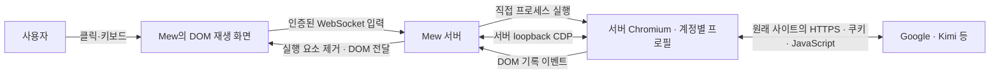

# 확인된 결론

2026-09-11, 사용자가 **실제 Mew 내부 브라우저에서 Google 로그인 성공**을 확인했다.
Kimi Code 로그인에서 Google 인증이 거부되던 흐름을 조사한 결과다.
화면 스트리밍으로 바꾸거나 DOM 중계를 제거하지 않고, **Chromium을 직접 실행한 다음 Playwright를 CDP로 연결하는 방식**으로 해결했다.

실행 방식을 정한 기준은 [ADR 0129](../../../.mew/docs/decisions/0129-mew-browser-native-launch-cdp.md),
DOM 브라우저의 범위는 [ADR 0127](../../../.mew/docs/decisions/0127-mew-browser-server-dom-runtime.md),
브라우저형 인증 통합은 [ADR 0128](../../../.mew/docs/decisions/0128-mew-browser-oauth-uses-internal-browser.md)다.
이 문서는 선택에 이른 증거와 동작 원리를 설명한다. 설치·환경변수·API·코드 구조는
[서버 브라우저 문서](../guides/browser.md), 권한 기준은
[SECURITY](../../SECURITY.md#브라우저-창)를 따른다.

## 사용자가 원한 경험

Mew 안에서 웹 요소를 선택·입력·클릭하되, 사이트의 실제 실행과 네트워크 접속은 서버 컴퓨터에서 이루어져야 했다.
로그인만 다른 기기의 브라우저로 넘기는 것을 기본 동작으로 삼지 않고, 일반 브라우저 기능과 OAuth에 같은 내부 브라우저를 사용한다.
픽셀·영상 전송은 사용하지 않는다. 이를 위해 화면의 의미를 가진 DOM과 사용자 입력을 연결하는 방식을 유지했다.

이 요구는 모든 데스크톱 기능의 완전한 재현을 뜻하지는 않는다. DOM으로 표현되지 않는 Canvas/WebGL·미디어·OS 인증창·물리 장치는 별도 한계다.
이번에 확인한 것은 그 한계를 전부 없앴다는 사실이 아니라, **DOM 중계를 유지하면서도 해당 Google 로그인 흐름이 동작했다는 사실**이다.

## 무엇을 바꿨나

이전에는 Playwright의 `launchPersistentContext`가 Chromium 프로세스를 실행하고 연결까지 소유했다.
창 모드로 전환한 뒤에도 이 실행 경로를 유지했을 때 Google은 “브라우저 또는 앱이 안전하지 않을 수 있습니다”를 표시했다.

현재는 프로세스 실행과 브라우저 제어 연결을 나눈다.

1. Mew가 계정별 전용 프로필로 Chromium 실행 파일을 직접 시작한다.
2. 실행한 자식 프로세스가 알린 loopback 디버깅 endpoint를 확인한다.
3. Playwright는 `connectOverCDP`로 그 브라우저의 기존 문맥에 연결한다.
4. 연결된 실제 페이지에서 사이트와 DOM 기록기를 실행한다.
5. Mew의 기기 화면은 DOM 이벤트를 재생하고 입력을 서버의 실제 요소에 전달한다.

**Playwright를 제거한 것이 아니다.** Playwright의 기본 실행 옵션 묶음을 거치지 않도록 바꾸고,
연결 후의 페이지 조작·DOM 수집·프레임·팝업 처리는 계속 사용한다.
브라우저 식별값을 스크립트로 덮어쓰거나 샌드박스를 끄는 방식으로 해결한 것도 아니다.

기기에 표시되는 재생 문서에서는 원본 사이트의 JavaScript를 실행하지 않는다.
인증 페이지를 Mew origin에서 다시 실행하도록 URL을 재작성하는 구조와도 다르다.
사이트가 보는 실행 주체는 서버 Chromium이며, 기기는 표시와 입력을 담당한다.

## 비교 실험이 알려 준 것

| 단계 | 브라우저 실행·연결 상태 | 로그인 조작 위치 | 관측 결과 |
| --- | --- | --- | --- |
| 기존 구현 | Playwright가 실행한 Chromium + DOM 중계 | Mew 내부 화면 | Google 로그인 거부 |
| 창 모드 변경 | 기존 실행 경로를 유지하고 WSLg 창 모드 적용 | Mew 내부 화면 | 같은 거부 메시지 |
| 수동 실행 | 동일 설치의 Chromium 실행 파일을 직접 실행, 별도 프로필 | WSLg로 뜬 실제 창 | 사용자 로그인 성공 확인 |
| 1단계 비교 | 직접 실행 + CDP 연결, DOM 기록기 없음, 새 프로필 | 실제 창 | 사용자 로그인 성공 확인 |
| 2단계 비교 | 직접 실행 + CDP 연결 + 실제 DOM 기록 코드, 새 프로필 | 실제 창 | 사용자 로그인 성공 확인 |
| 최종 통합 | 직접 실행 + CDP 연결 + Mew의 실제 DOM 재생·입력 경로 | Mew 내부 화면 | 2026-09-11 사용자 로그인 성공 확인 |

1·2단계 비교 창에서는 `navigator.webdriver`가 `false`로 관측됐다. 이를 강제로 덮어쓰는 코드는 넣지 않았다.
2단계의 DOM 기록 이벤트는 버렸으며, 기기에 화면을 재생하거나 입력을 중계하지 않았다.
따라서 2단계만으로 Mew 전체 흐름의 성공을 선언하지 않았고 최종 통합 뒤 사용자 확인을 별도로 받았다.

각 비교 단계에는 새 테스트 프로필을 사용해 직전 로그인 세션이 성공처럼 보이는 일을 피했다.
반대로 이 때문에 기존 Mew 프로필과 완전히 같은 조건의 단일 변수 실험이었다고 말할 수는 없다.
Google의 서버 측 판단과 계정 상태도 관측하지 못했다.

### 확정한 사실과 확정하지 않은 원인

- 창 모드 전환만으로는 해당 차단을 해결하지 못했다.
- WSL이나 사용 중인 Chromium 자체가 항상 Google 로그인을 못 하는 것은 아니었다.
- CDP 연결이 있다는 사실만으로 이번 로그인이 차단되지는 않았다.
- DOM 기록 코드 주입이 있다는 사실만으로도 이번 로그인이 차단되지는 않았다.
- 실행 경로를 교체한 실제 Mew 내부 화면에서 사용자가 성공을 확인했다.

**어느 단일 플래그가 차단을 유발했는지는 확인하지 않았다.**
기존 실행 옵션 묶음·연결 방식·프로필 상태 중 원인을 하나로 특정할 증거는 부족하다.
`navigator.webdriver` 하나만 바꾸면 해결된다는 주장, 모든 Google 계정·모든 공급자에서 영구적으로 허용된다는 주장도 하지 않는다.

이전 조사에서 “내장 브라우저이므로 불가능하다”, “DOM 중계 때문에 Google이 반드시 거부한다”,
“픽셀 스트리밍만이 해결책이다”라고 단정한 판단은 이번 관측으로 수정한다.
공급자의 지원 정책, 실제 거부 메시지, 특정 환경에서의 성공 여부는 구분해서 다뤄야 한다.

## 이 성공 전에 해결해야 했던 중계 오류

로그인 거부와 화면 중계 실패는 서로 다른 문제였다. 다음 구현 오류를 고친 것이 먼저 필요했다.

| 문제 | 확인된 원리 | 유지해야 할 처리 |
| --- | --- | --- |
| Kimi 페이지가 보이다 흰 화면으로 바뀜 | rrweb의 부모 스트림에 들어온 하위 iframe Document 부착 이벤트를 별도 프레임 재생과 함께 처리하면서 부모 문서가 교체됨 | 하위 프레임은 따로 재생하고 부모의 중복 Document 부착 이벤트를 제외 |
| 동적으로 표시되는 프레임·스타일 누락 | 증분 attributes 배열을 일반 속성 객체처럼 다뤄 변경을 잃거나, 부모 노드가 생기기 전에 하위 화면을 연결하려 함 | 증분 배열과 숨김 스타일 보존, 부모 mutation 뒤 대기 중인 하위 화면 연결 |
| Google 버튼 이후 무한 재귀 오류 | rrweb이 원래 DOM 프로토타입을 얻으려고 만든 임시 빈 iframe에서도 기록기를 즉시 시작해 다시 iframe을 생성 | 기록 시작을 다음 작업으로 미뤄 iframe 생성·document.write가 끝나게 함 |
| 빈 OAuth 팝업의 내용·이동이 사라짐 | 이미 사이트가 연 about:blank Page에 Mew가 다시 탐색을 실행 | 기존 Page를 그대로 받아 opener의 문서 작성·후속 탐색을 보존 |
| 접속 실패 뒤 다른 주소도 못 엶 | 초기 탐색 대기가 후속 입력을 막고, Chromium 자체 오류 문서에 기록기를 주입하면 탭이 종료될 수 있었음 | 탐색 변경·중지를 기다림에서 분리, 브라우저 내부 오류 문서 기록 제외, 실패 주소와 이유 표시 |

localhost 접속 문제를 Google 인증 차단과 혼동하지 않는다. localhost는 Mew 서버 환경을 가리킨다.
대상 포트에 실제 서버가 없는 경우에는 브라우저 실행 방식 변경만으로 접속할 수 없다.

## 로그인 상태와 브라우저 수명을 함께 지켜야 하는 이유

프로필은 Mew 계정마다 분리되고, 일반 브라우저와 그 계정의 브라우저형 OAuth가 공유한다.
로그인 작업의 탭·팝업 수명과 사이트 쿠키의 수명은 다르다. 작업이 끝나면 인증 창을 정리하지만,
프로필에 남은 사이트 상태를 임의로 지우거나 사용자의 개인 Chrome 프로필에서 쿠키를 복사하지 않는다.
CLI 자격증명과 토큰 교환은 계속 해당 공식 CLI가 소유한다.

직접 실행으로 전환하면서 Mew가 자식 프로세스의 종료까지 책임지게 됐다.
CDP 연결을 끊는 것만으로 브라우저가 반드시 종료되거나 쿠키 저장이 끝났다고 가정하면 안 된다.
브라우저에 정상 종료를 요청한 뒤 프로필 기록과 프로세스 종료를 기다리고, 반응하지 않을 때 자신이 생성한 프로세스에만 종료 신호를 보낸다.
처음에는 종료 신호를 너무 빨리 보내 영속 쿠키 재검증이 실패했으며, 정상 종료 대기를 둔 뒤 재열기 검증이 통과했다.
새 프로필 사용 요청도 기존 프로세스의 종료가 끝난 뒤 받아 프로필 잠금 충돌을 피한다.

## 연결의 보안 경계

CDP는 해당 브라우저 전체를 제어할 수 있는 채널이다. Mew 사용자 인증이 붙은 공개 API가 아니다.
동적 loopback 포트에서만 연결하며 터널이나 기기 클라이언트에 endpoint를 공개하지 않는다.
실행한 프로세스가 알린 endpoint만 받아 다른 기존 브라우저에 잘못 붙지 않게 한다.
로컬 프로세스가 접근할 수 있으므로 서버 셸 사용자 사이의 격리 경계로 보지는 않는다.
운영 포트 경계는 [접근 모델](access-model.md)이 기준이다.

Mew 화면 쪽에는 기존 계정 소유권과 역할 검사가 유지된다. 브라우저형 OAuth의 최초 URL은 CLI 출력과 등록 호스트로 검증한다.
DOM 재생 문서에서 원본 스크립트는 실행하지 않고, 입력·DOM 전사·로그인 코드·쿠키·토큰을 조사 자료나 로그로 저장하지 않는다.
실제 데스크톱 창 모드에서는 서버에서도 로그인 화면을 볼 수 있다. Linux/WSL의 일반 브라우저는 현재 [전용 가상 화면](../guides/browser.md#브라우저-창)을 기본 사용하여 서버 데스크톱의 포커스와 분리한다. 이는 직접 실행·CDP·DOM 중계를 유지한 변경이며, 가상 화면에서의 실제 Google 로그인 성공까지 과거 결과로 단정하지 않는다.

## macOS에서도 유지하는 실행 방식

macOS에서도 일반 탭과 브라우저형 OAuth는 같은 **직접 실행 → CDP 연결 → DOM 중계** 경로를 사용한다.
WSLg는 Linux 창을 표시하기 위한 환경일 뿐 이 구조의 필수 구성요소가 아니다.
Mac은 기본 창 모드를 사용하며, 로그인한 사용자의 데스크톱 세션에서 Mew를 실행하는 것을 운영 기준으로 둔다.
GUI 없는 SSH·시스템 서비스에서도 같은 창 모드가 동작한다고 간주하지 않는다.

2026-09-11에 사용자별 Applications 폴더와 Chromium 앱까지 자동 탐색 범위를 보완했다.
실행 파일과 프로필 경로에 공백이 있어도 셸 해석 없이 전달하며, 프로세스 종료와 프로필 저장은 공통 경로가 책임진다.
앱을 OS의 일반 열기 명령으로 넘기면 Mew가 실행한 자식 프로세스와 연결의 소유 관계가 달라지므로,
앱 내부 실행 파일을 직접 시작하는 방식을 유지한다. Mac용 설치·경로·환경변수 계약은
[서버 브라우저 문서](../guides/browser.md)가 기준이다.

Chromium의 [macOS 실행 안내](https://www.chromium.org/developers/how-tos/run-chromium-with-flags/#macos)도
앱 내부 실행 파일에 디버깅 플래그를 전달하는 방법을 제시한다.
Chrome 136부터 기본 개인 프로필의 원격 디버깅이 제한되므로,
[Chrome의 별도 데이터 디렉터리 요구](https://developer.chrome.com/blog/remote-debugging-port)에 맞게
Mac에서도 Mew 계정별 전용 프로필을 유지한다.

Mac에서의 인수 확인은 다음 순서로 한다.

1. 로그인한 Mac 사용자 세션에서 Mew를 실행하고 내부 브라우저로 Mac의 개발 서버 localhost 주소를 연다.
2. Kimi Code의 브라우저형 인증에서 Google 버튼을 누르고, 팝업 표시·계정 인증·Kimi 복귀·CLI 완료를 각각 확인한다.
3. 같은 Mew 계정의 모든 일반·인증 탭을 닫은 뒤 다시 열어 영속 로그인 상태가 유지되는지 확인한다.
4. 실패하면 실제 실행 OS·CPU 아키텍처·브라우저 버전·실행 파일·창 모드 여부와 실패 단계를 기록한다. 인증 값은 기록하지 않는다.

이 보완의 자동 검증은 **Linux/WSLg**에서 수행했다. macOS 경로 선택을 파일 fixture로 검사하고,
공백이 있는 앱 형태의 POSIX 실행 경로로 실제 Chromium을 시작해 CDP 연결·정상 종료·쿠키 재열기를 확인했다.
이 검증은 macOS 바이너리·데스크톱·Keychain을 재현하지 않는다.
**Mac 실기기 실행과 Google 로그인, Apple Silicon·Intel 각각의 확인은 아직 남아 있다.**

## 재검증에서 놓치지 말아야 할 구분

동작이 다시 달라졌다면 기존 운영 프로필을 지우거나 실행 옵션을 한꺼번에 바꾸기 전에 같은 실행 파일·같은 서버에서 비교한다.
수동 실행, CDP 연결, DOM 기록, Mew 재생 화면 입력을 순서대로 구분하고 각 단계의 성공 조건을 명시한다.

- 로그인 페이지 표시, 아이디 입력, 비밀번호·추가 확인 통과, Kimi로 복귀, CLI 인증 완료를 서로 다른 확인 지점으로 기록한다.
- 새 프로필 비교와 기존 프로필 재사용 비교를 구분한다. 이미 로그인된 쿠키 때문에 인증 단계를 건너뛴 결과를 새 로그인 성공으로 세지 않는다.
- WSLg 디스플레이 변수는 터미널뿐 아니라 Mew 프로세스에도 전달되어야 한다. 코드 수정 여부와 실제 재시작된 실행 환경을 구분한다.
- 사용자 보고로 확인한 계정 인증과 테스트용 사이트의 자동 회귀 검증을 구분한다. 실제 계정의 비밀번호·인증 코드 입력은 사용자가 수행한다.
- Mew를 다시 띄우는 절차와 환경 설정은 [서버 브라우저 문서](../guides/browser.md), 배포 역할은 [배포 런북](deployment.md)을 따른다.

현재 흐름을 이유 없이 이전 Playwright 기본 실행 방식으로 되돌리지 않는다. 다만 이 문서는 다른 실행 방식의 진단·비교 실험을 금지하지 않는다.
DOM 중계 자체를 포기하거나 공급자별 외부 브라우저 경로를 추가하는 것은 현재 사용자 요구와 별도의 결정이다.

## 증거와 검증 범위

핵심 구현은 mew 커밋 `a349672`(직접 실행·CDP 연결)이다.
선행 구현은 `8909cee`(서버 DOM 브라우저·OAuth), `eb9d9c9`(탐색·빈 팝업 복구), `35fd5e7`(승인 코드 복사)에서 추적한다.
이 해시들은 변경을 찾는 기준이며 실행 계약의 기준본은 [브라우저 문서](../guides/browser.md)와 현재 코드다.

통합 구현 당시 전체 테스트 547개가 통과했고, 창 모드의 실제 Chromium 통합 테스트와 타입 검사도 통과했다.
회귀 테스트는 입력·서버 쿠키·재연결·하위 프레임·팝업/opener·이력·대화상자·파일 전송·프로필 영속성·계정 격리·접속 실패 복구 등을 확인한다.
실행 파일이 없는 경우의 시작 실패 처리도 검사한다. 이 수치는 구현 시점의 실행 결과이며 이 문서 작성 중 테스트를 다시 실행했다는 뜻은 아니다.

2026-09-11의 최종 로그인 확인은 Linux/WSLg에서 사용자의 실제 Mew 내부 Google 로그인 성공 보고다.
다른 공급자 전체, 헤드리스에서의 실제 Google 인증, OS 장치 인증, CLI 토큰의 장기 유지까지 같은 결과로 확대하지 않는다.
