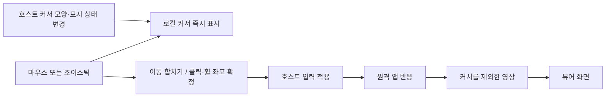

[문서 지도](../MOC.md) · [현재 구현 계약](../development/remote-desktop.md)

상태: **구현 전 기준 조사.** 후속 [당시 구현 결과](../history/remote-desktop-latency.md)는 이전 기록이며, 최신 상태는 [현재 계약](../development/remote-desktop.md)을 따른다. 아래 제안·미실측 표기는 조사 당시의 범위를 보존한다. 조사 기준은 mew `5c4ec7e`, helper Electron 44.3.0이다. 사용자는 연결 성공과 커서 끊김을 보고했다. 당시 직접/서버 경로, 호스트·클라이언트 OS, RTT는 확인되지 않았으므로 특정 병목을 실측 원인으로 단정하지 않는다.

## 결론

**커서를 영상에서 분리하고 클라이언트에서 즉시 표시하는 것이 첫 개선이다.** 입력 전송 주기, 커서 표시 주기, 영상 갱신 주기를 독립시킨다. 다음은 정지 화면의 불필요한 인코딩·키 프레임을 줄이고, 서버 전송의 혼잡 판단을 기본 왕복 시간과 분리하는 것이다. 코덱 교체는 그 뒤에 실측으로 판단한다.

클릭·휠이 생길 때만 서버 커서를 옮기는 방식은 제한된 절약 모드로 가능하다. 일반 데스크톱의 기본값으로는 호버 메뉴·툴팁·리사이즈 표시·드래그를 보존하는 **로컬 즉시 표시 + 이동 합치기 + 중요한 이벤트 직전 좌표 적용**을 권한다. 로컬 커서는 클릭 결과나 원격 앱의 화면 반응 자체를 앞당기지는 않는다.

## 1. 현재 코드에서 확인한 비용

현재 계약의 기준본은 [개발 문서](../development/remote-desktop.md)다. 아래는 조사 시점의 병목 후보와 근거다.

| 경로 | 코드에서 확인한 사실 | 영향·확인할 것 |
| --- | --- | --- |
| 캡처 | [sender.mjs](../../native/remote-desktop/sender.mjs)의 legacy `getUserMedia` 데스크톱 캡처. `contentHint='detail'`; 커서 제외·별도 메타데이터 없음 | 영상에 포함된 커서는 캡처→전송→표시 전체 경로를 기다림. 실제 포함 여부는 OS별 캡처로 확인 |
| 뷰어 | [remote-desktop.tsx](../../src/components/remote-desktop.tsx)의 video/canvas 표시. 원격 커서 모양·좌표를 별도 수신하지 않음 | 브라우저 기본 포인터는 보일 수 있지만 서버 커서와 모양·상태가 동기화된 로컬 커서는 아님. 영상 커서와 겹칠 수 있음 |
| 직접 영상 | [direct-sender.mjs](../../native/remote-desktop/direct-sender.mjs): VP8, 최대 1080p60·6Mbps, `maintain-framerate` | 낮은 대역폭에서 해상도·텍스트 선명도를 희생할 수 있음. 실제 FPS·하드웨어 사용은 미확인 |
| 서버 영상 | [relay-sender.mjs](../../native/remote-desktop/relay-sender.mjs): 최대 1080p30, 2.5Mbps 시작, 0.35–4Mbps, 약 2초마다 key frame | 30fps의 프레임 간격은 33.3ms. 커서까지 영상으로 보면 그 간격의 영향도 받음. 정지 장면의 실제 송신량은 별도 측정 필요 |
| 입력 | [desktop-input.ts](../../src/utils/desktop-input.ts), [desktop-connection.ts](../../src/utils/desktop-connection.ts): 이동 합치기 최대 60Hz, 버튼·키 즉시 전송, heartbeat 250ms | 이미 이벤트마다 무제한 전송하는 구조는 아님. 로컬 표시 분리 없이 이동 빈도만 낮추면 더 끊겨 보일 수 있음 |
| 흐름 제어 | [relay-protocol.mjs](../../native/remote-desktop/relay-protocol.mjs): 표시 ACK까지 최대 4프레임, 바이트 제한 | 큐 폭주 방지는 좋지만 ACK 왕복이 길면 FPS 자체를 제한 |
| 혼잡 판단 | ACK 소요가 220ms 초과이면 bitrate ×0.75, 90ms 미만이면 ×1.1; 조정 간격 2초 초과 | 긴 기본 RTT·느린 디코더·혼잡을 구분하지 않음. 250ms의 안정된 경로도 하한까지 화질을 낮출 수 있음 |

### 입력 바이트보다 영상 경로를 먼저 본다

예를 들어 입력 메시지가 평균 200바이트라면 60회/초는 payload 약 96kbps, 20회/초는 32kbps다. 절감은 약 64kbps이며 현재 서버 영상의 시작 목표 2.5Mbps에 비해 작다. 이는 **가정에 따른 계산**으로 TLS·TCP·SCTP·WS 헤더와 실제 JSON 크기는 포함하지 않았다. 핵심 이득은 작은 커서 이동 때문에 영상을 갱신할 필요를 줄이고, 화면 주사율대로 커서를 보여주는 데 있다. VP8도 프레임 간 압축을 하므로 커서 이동마다 전체 원시 화면을 보내는 것은 아니다.

## 2. 권장 커서·입력 설계

### 제안 주기와 의미

아래 수치는 실험 시작값이며 채택된 기본값이 아니다.

| 상황 | 로컬 표시 | 호스트 전송 |
| --- | --- | --- |
| 일반 마우스 | 가능한 경우 브라우저의 native CSS cursor 사용 | 최신 절대 좌표를 20–30Hz로 합침. 멈추면 마지막 좌표도 확실히 전달 |
| 모바일 조이스틱 | 화면 주사율에 맞춰 별도 레이어 위치 갱신 | 절대 좌표를 지원하는 호스트부터 동일 모델 적용 |
| 버튼 down/up | 즉시 위치 반영 | 이벤트 시점의 좌표와 버튼 상태를 reliable 스냅샷 하나로 즉시 전달 |
| 휠 | 로컬 커서 유지 | 이벤트 좌표를 먼저 갱신하고 누적 휠 전달. 짧게 합쳐도 마지막 휠은 확실히 복구 |
| 드래그·그리기 | 즉시 표시 | 60Hz부터 검증. 경로 보존이 필요한 그리기는 별도 샘플 정책 필요 |
| 정지 | 위치 갱신 없음 | 현재 250ms heartbeat·해제 계약 유지 |
| 클릭 시에만 이동하는 절약 모드 | 즉시 표시 | 호버가 필요 없는 사용에 한정. 버튼을 누른 동안에는 연속 이동 필수 |

일반 포인터는 React 상태를 매 이벤트 갱신하는 대신 native cursor를 우선한다. 터치·조이스틱은 ref와 rAF로 별도 레이어를 움직인다. 모양은 호스트가 제공한 이미지·hotspot(실제 클릭 지점)·visible·shape ID를 캐시하고 **바뀔 때만** 보낸다. 일반 화살표·I-beam·리사이즈 커서 및 커스텀 커서를 다룬다. RFC 6143도 커서 모양을 별도로 전달하고 클라이언트에서 표시하는 방식을 정의한다. [RFC 6143 §7.8.1](https://www.rfc-editor.org/rfc/rfc6143.html#section-7.8.1)

### 정확성을 지킬 조건

- 기존 `seq/epoch`, 누적 이동·휠, reliable 버튼·키 전환을 유지한다. 로컬 표시를 위해 입력 ACK를 기다리지 않는다.
- down뿐 아니라 **up·wheel에서도 해당 이벤트의 좌표를 다시 계산**한다. 현재 UI는 down/move에서만 `directPoint()`를 호출하므로 먼저 보완할 부분이다.
- 버튼·휠은 호스트의 같은 입력 처리 순서에서 위치 적용 뒤 실행한다. 별도의 move 메시지가 먼저 도착할 것이라고 가정하지 않는다. 현재 [protocol.mjs](../../native/remote-desktop/protocol.mjs)의 위치→버튼/휠 적용 순서를 재사용한다.
- 마지막 이동/휠 패킷이 유실되면 현재는 다음 reliable heartbeat가 복원할 수 있다. 저빈도화 시 250ms를 기다리지 않도록 동작 종료 시점의 reliable flush를 비교한다. 클릭과 중복 적용되지 않게 누적 카운터를 유지한다.
- 좌표는 영상의 letterbox·확대·pan을 역변환하고 모니터의 실제 bounds에 맞춘다. 혼합 DPI·음수 모니터 원점·화면 가장자리·영역 밖 드래그 해제를 검사한다.
- 호스트 실제 마우스 이동, 앱의 커서 강제 이동, 다른 모니터로의 이동은 보정 이벤트가 필요하다. 적용한 입력 seq와 화면 generation을 포함해 늦은 응답이 최신 로컬 위치를 되감지 않게 한다. 모양 변경은 원격 처리 지연만큼 늦을 수 있다.
- 조이스틱 상대 이동은 OS 가속·좌표 클램프 때문에 로컬 적분만으로 정확히 일치한다고 가정하지 않는다. Wayland는 현재 상대 전용이므로 캡처·입력 stream 일치와 호스트 위치 메타데이터를 확보하기 전까지 기존 표시 유지가 필요하다.
- 게임의 상대 포인터·pointer lock은 별도 모드다. 호버용 절대 포인터 정책을 그대로 적용하지 않는다. 숨김 커서나 앱이 직접 그린 커서는 영상에서 자동 분리되지 않을 수 있다.
- blur·취소·전환·종료의 입력 해제와 watchdog은 그대로 유지한다. 모양 데이터 크기·빈도·캐시 상한을 검증하고 기존 인증·단일 제어권 안에서만 전달한다.

### 가장 먼저 풀 기술 과제: 캡처 영상의 커서 제외

CSS cursor만 추가하면 영상에 남은 서버 커서가 뒤따라오는 이중 커서가 된다. 호스트 OS의 커서를 전역 숨기거나 캡처 위를 사각형으로 덮는 방식은 해결책으로 삼지 않는다. **캡처 단계에서 합성하지 않아야 한다.**

Screen Capture 명세에는 `cursor: 'never'`가 있지만, 현재 mew의 legacy `chromeMediaSource` 캡처에서 적용된다는 보장은 없다. 먼저 Electron 44.3.0의 지원 제약·track settings와 실제 픽셀 결과를 확인한다. 옵션이 거절되지 않았다는 사실만으로 성공 처리하지 않는다. `getDisplayMedia`로 바꿀 경우 화면 선택·권한·기존 수명 계약을 함께 검증한다. [W3C Screen Capture](https://www.w3.org/TR/screen-capture/#dom-cursorcaptureconstraint-never), [Electron desktopCapturer](https://www.electronjs.org/docs/latest/api/desktop-capturer)

| OS | 네이티브 경로 후보 | 남은 확인 |
| --- | --- | --- |
| Windows/WSL | Windows Graphics Capture `IsCursorCaptureEnabled=false`; DXGI의 포인터 모양/위치 분리 | DXGI는 이미 이미지에 그려진 커서도 가능하므로 모든 GPU에서 분리된다고 가정하지 않음. 로그인 세션 helper 안에서 처리 |
| macOS | ScreenCaptureKit `showsCursor=false` | 커서 모양·hotspot 수집 경로는 별도 검증. 캡처 설정이 메타데이터 전송까지 해주지는 않음 |
| X11 | XFixes 커서 이미지·변경 이벤트와 커서 없는 캡처 조합 | 현재 Chromium 캡처에 연결하는 방법, 실제 cursor image·좌표 검사 |
| Wayland | portal `AvailableCursorModes`의 Hidden/Metadata와 PipeWire 메타데이터 | compositor 지원 확인, 캡처·입력 stream 통합 필요. 지원 안 되는 mode를 요청하면 세션이 종료될 수 있음 |

공식 근거: [Windows 커서 제외](https://learn.microsoft.com/en-us/uwp/api/windows.graphics.capture.graphicscapturesession.iscursorcaptureenabled), [DXGI 포인터 처리](https://learn.microsoft.com/en-us/windows/win32/direct3ddxgi/desktop-dup-api#updating-the-desktop-pointer), [Apple showsCursor](https://developer.apple.com/documentation/screencapturekit/scstreamconfiguration/showscursor?language=objc), [XCB XFixes](https://xcb.freedesktop.org/manual/xfixes_8h_source.html), [ScreenCast portal](https://flatpak.github.io/xdg-desktop-portal/docs/doc-org.freedesktop.portal.ScreenCast.html).

Electron에서 제외가 안 되면 작은 CSS 수정으로 완료할 수 없다. OS 캡처 어댑터와 영상 track/인코더 연결까지 검토해야 한다. 브라우저 JS로 metadata가 그대로 노출된다고 가정하지 않는다. 지원이 확인된 OS부터 capability로 켜고 나머지는 기존 영상 커서를 유지한다.

## 3. 영상 대역폭과 지연을 함께 줄이는 순서

### A. 화면 변화가 없을 때 보내지 않기

1. 커서를 제외한 정지 장면에서 실제 캡처 빈도·인코딩 빈도·bytes/s를 먼저 잰다. Chromium이 이미 변화가 없는 프레임을 줄이는지도 확인한다.
2. 가능하면 OS의 damage/dirty metadata를 사용해 인코딩 전 생략한다. 전체 RGBA를 CPU로 매 프레임 복사·해시하면 절약보다 복사 비용이 커질 수 있다. VP8의 기존 프레임 간 압축을 활용하고 초기 단계에 자체 타일 코덱을 추가하지 않는다.
3. 검증된 정지 상태에서는 영상 전송을 멈추거나 매우 낮은 주기로 낮춘다. 화면 변경 신호가 오면 즉시 복귀한다. 단순히 캡처를 1fps로 낮추면 입력 직후 변화도 최대 1초 늦게 발견할 수 있다. 입력 없는 원격 애니메이션·알림도 놓치지 않아야 한다.
4. 약 2초마다 생성하는 key frame은 정지 중 반복할 필요를 측정한다. 최초 접속·디코더 재설정·명시적 복구에는 반드시 key frame을 보내고, delta 의존성을 유지한다.
5. **현재 수신기는 15초 동안 표시 프레임이 없으면 종료한다.** 영상 유휴 상태와 전송 장애를 구분하는 liveness 메시지를 먼저 설계해야 무전송 최적화가 가능하다. 입력 heartbeat만으로 영상 인코더 정상 동작을 증명하지 않는다. 재개 시 표시 확인·실패 제한 시간도 둔다.

정지 시 확보한 대역폭은 텍스트 화질에 배분하고, 스크롤·드래그 시에만 높은 FPS를 사용한다. 커서가 로컬에서 부드럽게 움직이면 영상 FPS를 항상 높게 유지할 필요가 줄어든다. 절감률은 정지/스크롤/영상 비율에 따라 달라진다.

### B. 서버 전송: 기본 RTT와 큐 지연 분리

현재 ACK 시간은 **인코딩 output 이후 송신→IPC/WS→디코드→canvas 그리기→ACK 복귀**다. 캡처와 인코딩 시간은 포함하지 않고, 실제 모니터 scanout까지 확인한 값도 아니다. 이를 순수 RTT나 종단 간 지연으로 표시하면 안 된다.

- 별도 작은 ping/echo로 기본 왕복 시간을 측정하고, ACK 시간의 최소값·추세·대기 바이트·decode 시간과 함께 본다. 고정 `220ms` 초과를 혼잡으로 판정하는 대신 기본 경로보다 늘어난 지연에 반응한다. 같은 WS의 ping도 큐 영향을 받으므로 완벽한 순수 네트워크 측정치는 아니다.
- bitrate 증가·감소에 평활화와 여유 폭을 두고, 설정 변경 때마다 key frame을 강제하는 현재 코드의 일시적 트래픽 증가도 계산한다.
- `4 / ACK초`는 4프레임 window의 이상적인 처리량 상한이다. ACK 200ms이면 최대 약 20fps, 300ms이면 약 13.3fps다. 실제 FPS는 캡처·인코딩·키 프레임·바이트 제한으로 더 낮을 수 있다.
- **window를 무조건 1로 줄이지 않는다.** ACK 100ms에서 상한이 약 10fps가 된다. 반대로 무작정 늘리면 오래된 영상이 쌓인다. 필요한 비행 중 프레임과 정체된 큐를 구분하고, 기본 왕복 시간×목표 FPS를 참고하되 시간·바이트의 상한을 함께 둔다. window 계약 변경은 송신·서버·수신을 같이 검토한다.
- 인코딩 전 프레임 생략과 디코딩 후 최신 화면 하나만 표시하는 현재 정책을 유지한다. **인코딩된 delta를 임의로 버려 다음 delta만 보내면 디코딩 의존성이 깨진다.** 오래된 전송을 폐기하려면 명시적 스트림 재동기화가 필요하다.

WebSocket/TCP 손실 시 뒤의 데이터가 기다리는 성질은 유지된다. 영상은 하행, 입력은 상행이므로 같은 소켓이라는 이유만으로 입력 바이트가 하행 영상 바이트 뒤에 줄 선다고 설명해서는 안 된다. 다만 입력의 reliable 전송, 디코딩된 반응 화면의 하행 정체, 공유 이벤트 루프·IPC의 지연은 여전히 존재한다. 입력 전용 WS 분리는 해당 병목이 측정될 때만 검토한다.

### C. 직접 연결과 인코딩

- 직접 UDP가 되는 환경에서는 현재 WebRTC 우선 경로를 유지한다. 기본 외부 STUN/TURN 없음과 기존 서버 fallback이라는 [ADR 0139](../../../.mew/docs/decisions/0139-mew-desktop-server-transport.md)의 배포 조건을 보존한다. 외부 접속에서 direct가 된다고 가정하지 않는다.
- CPU 인코딩이 병목이면 먼저 VP8의 실제 encode 시간과 하드웨어 사용을 확인한다. `hardwareAcceleration: 'prefer-hardware'`는 힌트이며 지원 검사 성공이 하드웨어 사용 보장은 아니다. [WebCodecs 하드웨어 가속 계약](https://www.w3.org/TR/webcodecs/#hardware-acceleration)
- 수신 WebRTC jitter buffer의 실제 지연을 확인하고, 지원되는 `jitterBufferTarget`은 실험으로만 비교한다. 0 설정이 0ms 재생을 보장하지 않으며 너무 줄이면 끊김이 늘 수 있다. [WebRTC receiver 계약](https://www.w3.org/TR/webrtc/#dom-rtcrtpreceiver-jitterbuffertarget)
- 텍스트 작업은 해상도 보존, 큰 화면 변화는 FPS 보존 정책을 비교한다. 현재 1080p 캡처 상한 때문에 4K 원본 글자가 이미 축소된다. bitrate만 올려도 원본 디테일이 복원되지 않는다.
- H.264·AV1·HEVC는 **호스트 encode 시간 + 네트워크 바이트 + 클라이언트 decode 시간**을 함께 비교할 후속 후보다. 압축률만 좋아져도 CPU 인코딩·미지원 디코딩 때문에 지연이 늘 수 있다. 코덱 변경은 VP8을 명시한 ADR 0139와 충돌하므로 새 ADR, 브라우저 지원·배포 조건 검토가 먼저 필요하다.

## 4. StarDesk에서 참고할 것과 확인되지 않은 것

비교 대상은 GearUP의 **stardesk.net** 제품으로 가정한다. 비슷한 이름의 다른 제품 자료를 섞지 않는다. 공식 사이트는 직접 P2P 우선·실패 시 relay와 최대 4K HDR/144fps를 안내한다. 공식 기술 소개는 복사 감소, 하드웨어 encode/decode, 작은 인코더 버퍼, 혼잡 제어·프레임 간격 조절을 강조한다. [StarDesk 공식 사이트](https://www.stardesk.net/), [공식 지연 설명](https://www.stardesk.net/blog/stardesk-zero-latency-remote-desktop.html)

이 자료만으로 실제 codec, 커서 protocol, OS별 zero-copy 구현, 동일 조건의 지연 수치를 확인할 수 없다. 144fps나 “zero latency” 문구를 mew의 목표 수치나 검증된 성능으로 옮기지 않는다. 참고할 원리는 **입력 피드백 독립·복사와 큐 최소화·하드웨어 활용·직접 경로**다. StarDesk도 클릭 때만 커서를 옮긴다는 근거는 확인되지 않았다.

비교 실험에서는 같은 호스트·클라이언트·망·해상도·주사율·작업 장면을 사용하고 각 앱의 direct/relay 여부를 기록한다. StarDesk의 direct와 mew의 서버 경로를 비교한 차이를 codec 차이로 해석하지 않는다.

## 5. 검증 계획과 구현 순서

### 측정

| 축 | 최소 비교 조건 |
| --- | --- |
| 경로 | LAN 직접 / 같은 망에서 서버 전송 / 실제 외부 서버 전송 |
| 망 | RTT 20·80·150·250ms, 제한 대역폭 1·3·10Mbps, 손실 0·1%를 독립 변수로 비교 |
| 장면 | 정지 화면에서 포인터만 이동 / 작은 호버 메뉴 / 텍스트 스크롤 / 창 드래그·그리기 / 동영상 |
| 장비 | Windows/WSL부터, Mac·X11·Wayland 후속; desktop Chromium과 실제 Safari/iOS·Android |
| 좌표 | 모니터 교체, 혼합 DPI, letterbox, zoom/pan, 가장자리, 원격 실제 마우스 개입 |

- 로컬 커서 지연과 **클릭부터 원격 화면 변화까지의 지연**을 별도로 기록한다. 평균뿐 아니라 p50/p95, 프레임 간격 p95, 멈춤 횟수·시간을 비교한다.
- 같은 합성 장면을 60초씩 3회, 워밍업 후 측정한다. 포인터만 움직이는 장면은 호버 효과가 없는 것으로 고른다. 실제 화면·입력 내용을 기록하지 않고 카운터와 시간만 수집한다.
- 직접 경로: `ΔbytesReceived`, `framesDecoded`, `framesDropped`, `ΔtotalDecodeTime / ΔframesDecoded`, `ΔjitterBufferDelay / ΔjitterBufferEmittedCount`, candidate RTT. 호스트에서는 encode 시간과 `qualityLimitationReason`을 수집한다. 미지원 필드는 없는 것으로 처리한다. [W3C WebRTC stats](https://www.w3.org/TR/webrtc-stats/)
- 서버 경로: 캡처/인코딩/전달/디코딩/그리기 시간, FPS, key frame 바이트, 송신 중 프레임·바이트, ACK 분포, 인코딩 전 생략 횟수, idle/wake 전환 시간, 입력 전송량을 분리한다.
- UI의 현재 Mbps는 영상 payload 중심이므로 총 네트워크 사용량과 다르다. 클라이언트와 relay 서버의 송수신 wire bytes를 별도로 비교한다.
- 시간은 각 프로세스의 monotonic clock으로 잰다. 서로 다른 장비의 timestamp를 그대로 빼지 않는다. 실제 click-to-photon은 동일 시계의 실험 장치/고속 촬영한 합성 화면 등 별도 방법이 필요하고 canvas draw 완료는 대리지표로 명시한다.

### 단계별 종료 조건

1. **기준 측정·커서 제외 가능성 확인:** 사용 경로와 OS 확정, 병목 분해. 실제 Electron 캡처에서 커서 제외를 검증한다. 불가능하면 OS 캡처 변경 범위부터 확정한다.
2. **로컬 커서와 입력 정책:** 검증된 OS에서 분리·모양 동기화, hover 20–30Hz/drag 60Hz 비교, down/up/wheel 좌표 확정. 포인터 이동이 영상 FPS·RTT에 종속되지 않고 이중 커서·클릭 오차·누른 상태 고착이 없어야 한다.
3. **서버 ACK 제어 개선:** 고정 RTT를 혼잡으로 오인하지 않는지 검증. 긴 RTT에서 큐 제한·최신성·화질의 균형을 비교하며 단순 window 확대를 성능 개선으로 간주하지 않는다.
4. **정지 영상 절감:** liveness 변경을 먼저 검증한 뒤 정지 전송·키 프레임 감소. 60초 정지에서도 연결이 유지되고 첫 변화의 반응 p95가 악화되지 않아야 한다.
5. **후속 codec/네이티브 캡처 판단:** 동일 화질에서 총 바이트와 반응 p95가 함께 개선되는 후보만 채택한다. 모든 장면에서 동시에 개선된다고 약속하지 않는다.

효과 크기를 미리 보장하지 않는다. 성공 기준은 같은 글자 가독성·작업 조건에서 포인터만 움직일 때의 영상 트래픽이 정지 화면 수준에 가까워지고, 로컬 커서 반응은 네트워크와 독립하며, 클릭·휠·드래그의 정확성과 반응 p95가 나빠지지 않는 것이다.

이번 작업은 연구 문서 작성까지다. 실행 코드·현재 ADR 결정·서버 설정은 변경하지 않았으며 빌드·재시작·실제 원격 입력 실험은 수행하지 않았다. 채택 시 바뀌는 구현 계약은 개발 문서에, OS 캡처 소유권·프로토콜 공통 계약·코덱 등 기존 결정 변경은 중앙 ADR에 먼저 기록한다.
