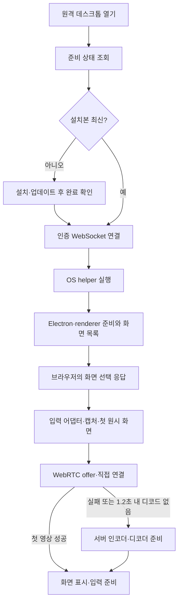

# 원격 데스크톱 최초 화면 표시 시간 단축 연구

[문서 지도](../MOC.md) · [현재 구현 계약](../development/remote-desktop.md) · [설치·사용법](../guides/remote-desktop.md)

상태: **기준 조사; 일부 후속 구현 완료.** 2026-09-23에 전용 Windows Node 직접 탐색·bridge 경로 캐시, DXGI 빈 프레임 대기 단축, 설치 초기 폴링 단축을 구현했다. 최신 수치·검증 범위는 [현재 계약](../history/remote-desktop-electron-transport.md#최초-연결-최적화-검증--2026-09-23)을 따른다. 2026-10-01 상주 GPU 호스트·직결 전환은 [ADR 0185](../../../.mew/docs/decisions/0185-mew-desktop-resident-direct-host.md)와 [구현 기록](../work/remote-desktop-resident-direct.md)을 따른다. 아래 분석·미구현 제안은 조사 당시 내용을 보존한다.

2026-09-22 작업트리(`c7a6335` 기반, 기존 미커밋 변경 포함)를 조사했다. 기존 [지연·대역폭 연구](remote-desktop-latency.md)는 연결 후 응답성이 중심이며, 이 문서는 원격 데스크톱 열기부터 첫 화면과 입력 준비까지를 다룬다. 사용자가 겪은 소요 시간·설치 여부·호스트 OS·접속망은 아직 특정하지 못했다. 실행 서버와 현재 소스의 일치 여부도 확인되지 않았다.

## 결론과 우선순위

설치가 끝난 환경은 **Windows 실행 단계와 캡처 초기화, 실패할 직접 연결을 순서대로 기다리는 비용**을 먼저 조사한다. 최초 설치가 원인이면 런타임을 설치·업데이트 시점에 미리 준비하는 것이 가장 큰 개선이다. 접속 순간의 시간을 최대한 줄이려면 캡처하지 않는 대기 helper까지 미리 실행할 수 있지만, 이는 기존 연결별 실행 정책을 바꾸는 별도 설계다.

| 순서 | 제안 | 줄일 수 있는 구간 | 난이도·제약 |
| --- | --- | --- | --- |
| 1 | 첫 표시까지 단계별 시간 계측 | 실제 병목을 확정; 자체적으로 시간을 줄이지는 않음 | 낮음. 화면·입력·토큰 없이 시간과 단계만 수집 |
| 2 | Windows 경로 탐색 통합·재사용, broker의 PowerShell·동적 컴파일 비용 축소 | 매 연결 Node 탐색, broker/launcher 시작 | 경로 캐시는 낮음~중간, 사전 컴파일 broker는 높음. 로그인 세션 검증·부모 종료 처리는 유지 |
| 3 | DXGI가 첫 화면을 못 주는 경우 GDI로 더 빨리 전환 | 두 번의 약 1초 초기 화면 대기 | 중간. 정상 DXGI를 불필요하게 포기하는 비율과 GDI CPU 비용 확인 |
| 4 | 서버 전송이 필요한 환경에 맞춘 전송 선택 | offer 이후 최대 약 1.2초의 직접 연결 유예와 그 뒤 서버 전송 준비 | 중간~높음. 서버 우선·동시 시도는 ADR 변경 필요 |
| 5 | 상태 확인·화면 선택의 왕복 축소, 캡처와 통신 준비 중첩 | 망 RTT와 현재 직렬 초기화 | 중간. 사용자 화면 선택·권한·실패 처리 보존 |
| 6 | 설치를 Mew 설치·업데이트 때 선행, 검증된 OS별 묶음 배포 | 최초 다운로드·의존성 설치·Mac 컴파일 | 중간~높음. 설치 총비용이 사라지는 것은 아니며 배포 용량 증가 |
| 7 | 로그인 세션의 캡처 없는 helper 사전 실행·제한된 재사용 | Windows broker와 Electron의 반복 시작 | 높음. 메모리와 수명·인증·업데이트 정책 변경 |

실제 절감 초·개선율은 전체 접속 계측 전에는 보장할 수 없다. 특히 1.2초 변경만으로 수십 초 지연을 해결한다고 해석하지 않는다.

## 현재 접속의 순서

Windows/WSL의 F는 Windows Node 탐색 → Node bridge → PowerShell broker → 임시 InteractiveToken 작업 등록·실행 → 로그인 세션 PowerShell launcher → Electron이다. broker는 연결마다 `Add-Type`으로 작은 C# P/Invoke 타입도 준비한다. 여러 프로세스 실행과 작업 등록이 존재한다는 것은 확인했지만 각 비용은 아직 측정하지 않았다. [실행 경로](../../server/remote-desktop-host.ts), [bridge](../../native/remote-desktop/windows-bridge.mjs), [broker·launcher](../../native/remote-desktop/windows-session.ps1)

## 코드에서 확인한 지연과 이미 적용된 개선

| 구간 | 확인한 사실 | 해석 |
| --- | --- | --- |
| 자동 설치 | 최신 마커가 없으면 설치 후 1.5초 간격으로 완료 조회 | 완료 인지에 0~약 1.5초와 조회 비용이 추가될 수 있음. 평균 0.75초는 완료 시점이 균등하다는 가정 |
| helper 버전 | OS 공통 파일 목록 전체의 해시가 설치 판정을 결정 | Windows에서도 Mac 전용 파일 변경이 업데이트를 유발할 수 있음. OS별 설치 지문 분리를 검토하되 공통 프로토콜 변경은 모두 무효화 |
| 의존성 | lockfile·OS·아키텍처 지문이 같으면 npm ci 생략 | 재연결마다 npm 설치한다는 설명은 틀림. `install-runtime.mjs` 실행도 항상 재다운로드했다는 증거는 아님 |
| 경로 | host 경로는 성공·진행 요청을 30초 재사용; 두 wslpath는 병렬 | 이미 구현된 최적화. Windows Node bridge 경로 탐색은 별도이며 매 spawn에서 실행 |
| 방화벽 | 조회는 helper spawn 뒤 비동기 진단 | 최대 8초 timeout을 초기 연결에 매번 더하면 안 됨 |
| 화면 목록 | renderer 준비 뒤 `getSources`, 썸네일 크기 0·아이콘 없음 | 썸네일 제거는 이미 적용. 네이티브 캡처 시 `screen` 목록을 먼저 쓰는 방안은 display ID·권한·fallback 계약 검증 필요 |
| 캡처 | Windows DXGI에서 첫 pixels를 못 받으면 약 1초씩 두 번 시도 후 GDI | 약 2초는 해당 실패 경로의 반복 대기이며 모든 접속의 고정 지연이 아님. worker 생성·요청·정리 비용은 별도 |
| Mac 캡처 | 네이티브 첫 화면 대기는 약 3초 예산 후 Chromium fallback | Windows와 다른 경로. Mac 실기 측정 없이 같은 원인으로 묶지 않음 |
| 전송 | 캡처 뒤 offer. 첫 디코드가 없으면 offer 수신부터 1.2초 후 서버 전환 | OS 권한·캡처 이전 시간에는 이 타이머가 돌지 않음. ICE 후보는 이미 Trickle 방식으로 전달 |
| 재접속 | 닫기·백그라운드 전환·모니터 변경은 세션 종료와 새 실행 | 짧은 재진입에도 helper 시작 비용을 다시 지불. 이전 helper 정리 대기는 진짜 첫 접속과 별도로 측정 |
| 완료 판정 | 직접 경로는 입력 DataChannel 두 개가 열리면 connected; 서버 경로는 첫 canvas 처리 때 connected | 현재 connected만 재면 실제 첫 화면이 보이는 시간과 비교가 어긋남 |

근거: [준비](../../src/utils/desktop-preparation.ts), [설치 지문](../../native/remote-desktop/helper-version.mjs), [캡처 시작](../../native/remote-desktop/main.mjs), [전송 선택](../../src/utils/desktop-connection.ts), [직접 수신](../../src/utils/desktop-direct.ts), [서버 수신](../../src/utils/desktop-relay.ts), [세션 종료](../../server/remote-desktop.ts).

25·40·90·95초는 실패 시 기다리는 상한이다. 정상 연결 시간이나 줄일 수 있는 고정 대기가 아니다. 단순히 timeout을 낮추면 느린 성공을 빠른 실패로 바꿀 수 있다.

## 제안의 구체적인 범위

### 현재 구조를 유지하는 개선

- host와 bridge의 경로 확인을 하나의 준비 결과로 공유한다. 캐시는 실행 파일 경로와 버전 등 재검증 가능한 정보만 다루고, 로그인 세션·권한·인증은 매 연결 확인한다. 준비와 spawn 사이의 중복 실행을 제거한다.
- broker 동적 컴파일과 PowerShell 시작 비용이 실측 병목이면 작은 사전 컴파일 launcher/broker를 비교한다. Task Scheduler InteractiveToken과 파이프 SID/세션 검증, 비밀번호 없는 실행, 프로세스 핸들 기반 정리 계약은 유지한다. 일반 WSL 프로세스에서 Electron을 바로 실행하는 것으로 대체하지 않는다. InteractiveToken은 이미 로그인한 사용자 세션을 사용한다. [Microsoft 계약](https://learn.microsoft.com/en-us/windows/win32/taskschd/principal-logontype)
- DXGI 첫 프레임 대기를 더 짧게 제한하는 실험부터 한다. 반복 실패 장비는 실패 이유·화면 구성·짧은 TTL을 가진 힌트로 재시도를 줄일 수 있다. GDI 선행/동시 준비나 세션 도중 DXGI 승격은 더 큰 변경이며 ADR 0146의 보조 경로 정책을 갱신해야 한다. DXGI는 새 화면/포인터 변화가 없으면 timeout을 반환할 수 있다. [AcquireNextFrame](https://learn.microsoft.com/en-us/windows/win32/api/dxgi1_2/nf-dxgi1_2-idxgioutputduplication-acquirenextframe)
- VP8 지원 검사와 전송 객체 준비는 캡처 대기 동안 선행할 수 있다. ICE 사전 후보 수집도 후보지만 실제 연결이 되는 망에서만 효과가 있고 캡처·broker 지연은 줄이지 않는다. 현재 코드는 이미 후보를 즉시 교환하므로 Trickle ICE를 새 기능으로 제안하지 않는다. [Trickle ICE](https://www.rfc-editor.org/info/rfc8838/), [WebRTC 설정](https://www.w3.org/TR/webrtc/)
- 기본 모니터는 처음 요청에 선호 ID를 포함하고 helper의 최신 목록으로 검증해 자동 선택하면 목록을 브라우저에 보낸 뒤 선택을 돌려받는 한 번의 왕복을 줄일 수 있다. 모니터 변경·없는 ID·OS 선택창 경로를 처리해야 한다.
- 설치 완료는 기존 인증 연결의 완료 이벤트 또는 완료 직전 더 짧은 조회로 전달한다. 준비 상태 GET과 WS 연결을 합치는 방안은 실패 복구·설치 수명 분리를 함께 설계한다.

### 전송 정책 변경

현재 기본 ICE는 외부 STUN/TURN 없이 빈 목록이며 모든 접속이 direct부터 시작한다. 외부망이라는 이유만으로 반드시 실패한다고 단정하지 않되, 반복해서 서버 전송이 선택되는 환경은 매번 같은 유예를 지불할 이유가 적다.

우선 후보는 최근 서버 전송 성공을 짧게 기억해 다음 접속에서 서버 전송을 먼저 여는 방식이다. 브라우저 VP8 지원 확인과 direct 복구 경로가 필요하며, 네트워크 변경을 완벽히 감지할 수 없으므로 영구 고정하지 않는다. 서버 우선이면 해당 경로의 1.2초 유예를 없앨 수 있지만 전체 접속은 캡처·전송 준비 비용만큼 여전히 걸린다.

더 공격적인 후보는 서버 영상과 직접 협상을 짧게 병행해 먼저 표시 가능한 경로를 선택하거나, 서버 영상으로 시작한 뒤 direct로 전환하는 것이다. 첫 화면을 서두를 수 있지만 일시적인 이중 인코딩·대역폭·키 프레임·커서·입력 소유권 전환이 복잡해진다. 두 경로가 동시에 입력을 주입해서는 안 된다. 현재 [ADR 0139](../../../.mew/docs/decisions/0139-mew-desktop-server-transport.md)의 direct 우선·한 방향 전환 변경이므로 채택 전 새 ADR이 필요하다.

### 설치 선행과 helper 사전 실행

최초 다운로드가 지배하면 Mew 설치·업데이트 시 OS별 helper를 미리 준비하거나, 런타임·의존성·Mac 네이티브 모듈을 검증한 배포물을 제공한다. 다운로드·설치 자체를 없애는 것이 아니라 첫 원격 접속의 대기에서 옮기는 방식이다. 기존 자동 준비는 누락·버전 불일치 복구로 남긴다. Electron 공식 배포도 바이너리 선행 설치와 다운로드 캐시를 지원한다. [Electron 설치](https://www.electronjs.org/docs/latest/tutorial/installation)

설치된 환경에서 더 큰 단축 후보는 **캡처하지 않는 helper를 로그인된 세션에 미리 준비**하는 것이다. 잠시 재사용하면 반복 Electron·renderer 시작과 Windows 작업 등록을 접속 시점 밖으로 옮길 수 있다. 단, 첫 로그인 직후 준비가 끝나기 전에 접속하면 cold 시작 비용은 남는다. 메모리/RSS·유휴 CPU를 측정하고 제한된 TTL을 둔다. 화면·마이크 캡처와 입력 수신은 인증된 명시적 세션에서만 활성화하고, 닫기·권한 회수·부모 소멸 시 즉시 해제해야 한다. 대기 프로세스 유지와 캡처 유지의 수명을 구분한다.

이는 [ADR 0138](../../../.mew/docs/decisions/0138-mew-desktop-automatic-preparation.md)의 연결마다 일회성 실행·비상주 정책을 바꾸므로 후속 ADR 대상이다. Electron 전체를 OS별 네이티브 앱으로 교체하면 Chromium 시작 비용을 더 줄일 가능성은 있지만 WebRTC·코덱·배포·OS별 수명 구현 부담이 크므로 앞선 계측과 개선 후에도 목표에 미달할 때 비교한다. Electron 공식 성능 지침 역시 실제 병목 측정과 불필요한 시작 작업 축소를 우선한다. [성능 지침](https://www.electronjs.org/docs/latest/tutorial/performance)

## 측정과 다음 구현의 판정 기준

연결을 세 종류로 분리한다: 설치가 필요한 첫 사용, 설치 완료 후 helper가 꺼진 첫 접속, 닫았다가 다시 여는 접속. 여기에 Windows/WSL·Mac·Linux, LAN·외부망, direct·server, DXGI·GDI·Chromium을 구분한다. 사용자 권한 승인 시간은 전체 체감 시간에는 포함하되 프로그램 처리 시간과 별도 표시한다.

이벤트는 열기 → status 완료 → 설치 시작/끝 → WS open → Windows 경로 확인 → broker → 로그인 launcher → Electron ready → renderer ready → sources → select → 캡처 ready/첫 pixels → offer/answer → direct 채널 ready 또는 relay ready → 첫 decode → 첫 표시 → 입력 준비를 수집한다. 실제 조작 반응은 별도 합성 장면에서 측정한다.

직접 영상의 첫 표시는 `requestVideoFrameCallback`으로 compositor에 전달된 프레임을 확인하고, 서버 영상은 rAF canvas draw를 기록한다. 둘 모두 실제 패널의 광학 표시 완료를 보장하는 값은 아니다. DataChannel open·ICE connected·framesDecoded만으로 화면 표시를 대신하지 않는다. [영상 프레임 콜백 제안](https://wicg.github.io/video-rvfc/)

프로세스별 단조 시계로 구간 시간을 재고, 브라우저의 클릭부터 표시까지는 같은 브라우저 시계를 사용한다. 서로 다른 프로세스의 `performance.now()`나 OS 시계를 그대로 빼지 않는다. 초기 탐색은 같은 조건 5회, 채택 판단은 조건별 30회 이상으로 p50·p95·최댓값·실패율을 비교한다. p95는 작은 표본에서 불안정하므로 반복 재현 여부를 함께 본다. 종료 후 캡처/입력 해제, 정상 direct 성공률, GDI CPU·메모리, 재연결 안정성이 나빠지면 조정한다.

이번에는 캡처·입력·서버 변경 없는 제한된 조회만 수행했다. 현재 WSL 에이전트 프로세스의 준비 상태 함수는 새 프로세스 첫 호출 약 0.60초, 직후 두 호출 13~14ms로 모두 ready였다. HTTP·인증·브라우저·실제 서버 프로세스는 제외되며 OS 캐시까지 비운 cold 측정도 아니다. Windows bridge 경로 확인은 이 에이전트 환경에서 실패하여 이후 실제 시작·캡처·첫 화면은 측정하지 못했다. ready는 설치 파일 준비를 뜻하므로 실행 성공과 구분해야 한다. 이 결과로 사용자가 겪은 병목을 확정하지 않는다.

실행 코드·설정·현재 ADR은 변경하지 않았다. 연구 문서와 지도만 추가했으며 빌드·재시작·설치·실제 원격 세션 실행은 수행하지 않았다.
