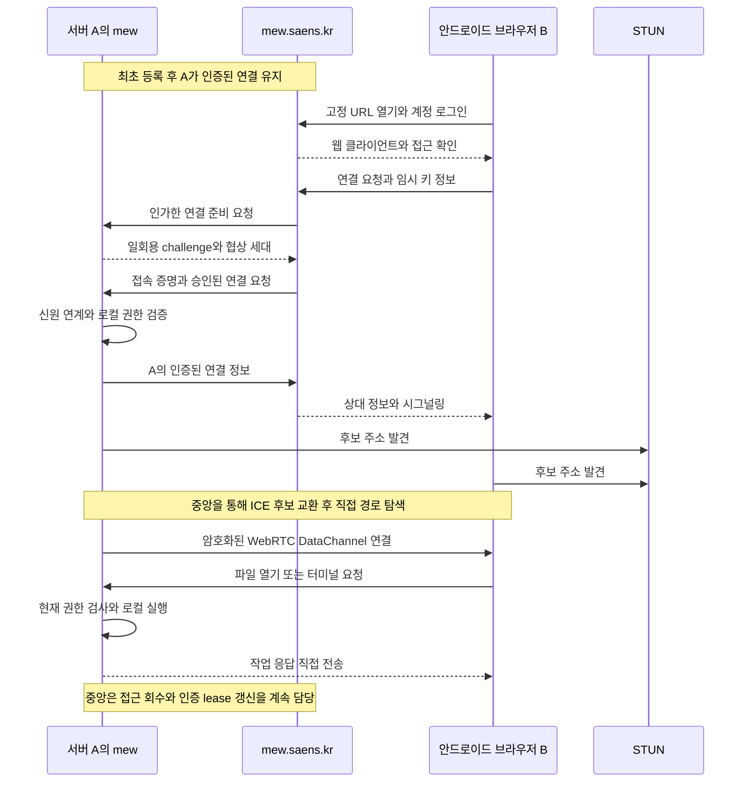

# mew 중계 기능 만들기

## 목표와 현재 상태

**핵심 연결·파일/실시간 전송·관리 UI 구현 및 로컬 자동 검증 완료 · 미배포.** 검토일: 2026-10-07. 중앙 로그인 제공자 설정과 실제 로그인, DNS·인증서·중앙 운영 인프라, 외부망 실측과 출시 검증은 남아 있다. `done`은 출시 확인까지 미완료로 유지한다.

현재 코드 계약은 [P2P 원격 접속](../development/remote-access.md), 중앙 서비스 적용 절차는 [중앙 서비스 설치](../deployment/remote-central.md)가 소유한다. 아래 요구사항과 출시 기준은 계속 이 태스크에서 관리한다.

사용자가 설치한 mew를 별도 도메인·VPN·터널 설정 없이 다른 PC나 휴대폰 브라우저에서 쓰게 한다. 서버 컴퓨터 A를 한 번 등록하고, B·C·D는 `https://mew.saens.kr/<user-id>/<device-name>` 또는 대시보드에서 로그인해 접속한다. 접속 브라우저의 등록이나 매번 A에서의 승인은 요구하지 않는다.

여기서 **중계는 계정 인증·기기 목록·접근 승인·시그널링**을 뜻한다. 파일·터미널·에이전트·협업·영상 데이터는 A와 브라우저 사이에서 직접 전송한다. 기존 Cloudflare Tunnel·Tailscale·사용자 HTTPS 접속과 로컬 로그인을 유지한다.

[ADR 0195](../../../.mew/docs/decisions/0195-mew-account-based-p2p-remote-access.md) · [보안 기준](../../SECURITY.md) · [서버 구조](../development/architecture.md) · [계정별 권한](../development/access-control.md) · [네이티브 배포](../deployment/native.md)

## 구현 가능성 검토

**기술적으로 구현 가능하다. 다만 중앙 로그인 사이트만 추가해서 끝나는 기능은 아니다.** 가장 큰 작업은 기존 HTTP·WebSocket 기반 앱을 인증된 DataChannel 전송에 연결하는 것이다. 외부망 연결 성공률은 구현 후 실제 기기로 확인해야 한다.

| 현재 확인한 구조 | 활용 또는 추가 작업 |
| --- | --- |
| `server/serve.ts`가 정적 UI·HTTP API와 여러 WebSocket을 단일 포트에서 제공 | 중앙에서 정적 UI를 제공하되 A의 API·구독에는 별도 전송 계층 필요 |
| `src/api/client.ts`·다른 API 모듈이 직접 `fetch` 호출 | 공통 요청 어댑터로 점진 전환; `client.ts`만 바꿔서는 완성되지 않음 |
| 터미널·에이전트·presence·협업·DB·브라우저·데스크톱이 개별 WebSocket 사용 | 연결별 인증 문맥을 받는 구독/세션 어댑터 필요 |
| 이미지·PDF·미디어·다운로드가 `/api/...` URL을 직접 사용 | 바이너리 스트림·Blob URL·Range 처리 등 별도 자원 전달 필요 |
| `server/reqAuth.ts`는 로컬 세션 쿠키를 해석하고 현재 계정 저장·권한은 이메일 키를 사용 | 불변 중앙 신원과 명시적 로컬 계정 매핑을 추가하고 HTTP/P2P가 같은 권한 판정을 사용 |
| 원격 데스크톱의 `native/remote-desktop/native-host.mjs`가 `node-datachannel` 사용 | 네이티브 RTC·NAT 준비 경험은 활용 가능; 캡처/입력 호스트를 앱 전송용으로 그대로 쓰지는 않음 |
| 로컬 서버는 loopback 바인딩, 기존 네이티브 배포는 루트 경로 전제 | A가 중앙으로 나가는 WSS와 P2P 모듈을 추가하고 HTTP 공개·하위 경로 배포는 피함 |

외부 적용의 첫 게이트는 **WSL 서버 A ↔ 외부 Android 브라우저 B의 인증된 DataChannel**이다. 현재는 같은 호스트의 실제 Chromium·네이티브 RTC와 격리 HTTPS 중앙에서 서명된 연결, 기존 파일 API의 읽기·저장·권한, 자원·WS 전송을 자동 검증했다. 외부망 게이트는 아직 통과하지 않았다. WSL의 UDP/NAT와 Windows 네이티브 helper 배치가 연결 가능성과 설치 난이도에 영향을 주므로, 이 시제품 결과를 확인한 뒤 앱 전체 전송 전환을 진행한다. 단순 echo 성공만으로 파일 권한·앱 사용·출시 가능성을 판정하지 않는다.

직접 연결만 사용하는 조건에서는 제한적인 NAT·UDP 차단망에서 실패할 수 있다. “설정 없이 로그인해 연결을 시도할 수 있음”과 “모든 네트워크에서 연결됨”을 구분한다. TURN이나 작업 데이터 HTTP 중계를 추가하려면 기존 ADR을 바꾸는 후속 결정이 필요하다.

## 사용자 경험

### 설치 및 등록

1. WSL 내에서 Git clone 후 `cd mew && ./mew`로 설치·초기 설정한다. macOS/Linux는 기존 설치 흐름에 같은 등록 기능을 연결한다.
2. 외부 접속 방법을 선택한다: mew 계정 접속 / Cloudflare Tunnel / Tailscale / 사용 안 함. 후자의 안내·자동화 범위는 기존 지원 여부를 확인해 정하며, 이 태스크에서 모두 자동 설치한다고 가정하지 않는다.
3. mew 계정 접속을 선택하면 로컬 owner UI의 등록 안내를 표시한다. 임시 비밀번호를 먼저 변경하고 계정 관리에서 등록을 시작하면 일회용 URL을 받는다. `./mew remote-access account`로 안내를 다시 확인한다. 설치 터미널에 OAuth 토큰을 입력하지 않는다.
4. mew.saens.kr에서 로그인하고 서버 이름을 입력하면 A의 등록 요청과 소유 계정이 연결된다. A가 등록 완료를 검증한 후 고정 주소를 표시한다.
5. A는 저장한 서버 자격증명으로 중앙 연결을 자동 유지한다. 대시보드에는 온라인·오프라인 상태와 기기 이름이 표시된다.

최종 로그인 요구는 **Google·Apple·GitHub·이메일**이다. 네 제공자의 OAuth/OIDC 어댑터를 구현했고 설정된 제공자만 표시한다. 이메일의 메일 링크/비밀번호는 운영자가 구성한 OIDC 제공자가 담당한다. 실제 제공자 설정·로그인 검증은 남아 있다. 제공자 간 계정 합치기는 제공하지 않으며 같은 이메일로 자동 연결하지 않는다.

### 다른 기기에서 접속

- 고정 주소를 열면 로그인·권한 확인 후 대상 mew에 연결한다.
- `https://mew.saens.kr`에서 로그인하면 `/dashboard`에 등록·허용된 기기 목록이 나타난다. 기기를 선택하면 같은 접속 흐름을 시작한다.
- 오프라인·권한 없음·직접 연결 실패·버전 불일치를 구분해 표시한다. A의 전원·mew 실행·인터넷 연결이 필요하다.

등록·접속·멤버 승인에 대한 상세 계약은 아래 절을 따른다.

## 확정한 범위

- 공개 접속 주소는 `https://mew.saens.kr/<user-id>/<device-name>`이다. device-name은 A의 서버 이름이다.
- 최초 서버 등록은 A의 로컬 owner가 계정 로그인과 함께 승인한다. 이후 접속마다 A에서 승인하거나 B·C·D를 등록하지 않는다.
- 소유자와 소유자가 허용한 멤버 계정만 접속한다. 로그인 성공과 파일·터미널 등의 사용 권한은 별도로 검사한다.
- 파일·터미널·에이전트·협업 데이터와 원격 데스크톱 영상·입력은 중앙 서비스가 전달하거나 저장하지 않는다.
- 중앙 서비스에서 브라우저 화면 코드를 내려받고 인증·시그널링 메타데이터를 교환하는 통신은 남는다. STUN도 외부 주소 발견을 돕는다.
- 기본 설계는 직접 연결만 사용한다. 직접 연결이 막히면 실패를 표시한다. TURN 도입은 별도 결정 사항이다.
- A의 전원·mew 실행·인터넷 연결이 필요하다. 원격 데스크톱의 OS 권한과 화면 공유 조건은 기존 계약을 따른다.

기존 로컬 로그인과 사용자가 구성한 HTTPS 접속은 유지한다. 현재 [보안 기준](../../SECURITY.md), [네이티브 배포](../deployment/native.md), [계정별 권한](../development/access-control.md)을 이 문서만으로 변경하지 않는다.

## 구성 요소와 데이터 경계

| 구성 요소 | 책임 | 다루는 데이터 |
| --- | --- | --- |
| mew.saens.kr 웹 클라이언트 | 로그인 화면과 mew UI 제공, 대상 서버 선택, 브라우저에서 P2P 연결 | 앱 정적 코드와 로그인 상태; 작업 내용은 연결 후 브라우저에서 처리 |
| 중앙 계정·접근 승인 서비스 | OAuth/OIDC 로그인, 서버 소유권·멤버 접근 관리, 접속 증명 발급·회수 | 계정 식별자, 서버 등록, 멤버십, 세션·정책 정보 |
| 중앙 시그널링 서비스 | A의 온라인 상태 확인, 승인된 A·B 사이의 SDP·ICE 교환 | 짧게 유지하는 연결 메타데이터; 작업 본문 없음 |
| A의 연결 모듈 | 최초 등록, 중앙 연결 유지·재연결, WebRTC와 접속 증명 검증 | A의 비공개 서버 자격증명과 연결별 인증 문맥 |
| A의 mew | 파일·터미널·에이전트·협업 실행, 로컬 권한 검사 | 실제 작업 데이터·공급자 자격증명·OS 자원 |
| STUN | NAT 외부 주소·포트 발견 | 연결 주소 정보; 파일·터미널·영상 중계 없음 |

중앙 서비스는 여러 서버의 등록·인증을 관리하지만 사용자 워크스페이스나 셸을 호스팅하지 않는다. 각 A의 OS 권한 경계는 [SECURITY](../../SECURITY.md)와 같다. 중앙 서비스가 작업 데이터를 보관하지 않는다는 계약은 브라우저 측 텔레메트리·오류 수집에도 적용한다.

## 사용자 흐름

### A를 처음 등록할 때

1. A의 `http://localhost:5000` 또는 설치한 실제 포트에서 로컬 owner로 로그인하고 원격 접속 등록을 시작한다. 이 관리 요청은 로컬 mew에서 인가한다.
2. A가 서버 키와 등록 요청을 만들고, 사용자는 mew.saens.kr의 로그인 페이지에서 OAuth/OIDC 로그인을 완료한다. 등록 요청을 A의 키·일회용 challenge·로그인 트랜잭션에 묶어 다른 서버 등록 요청과 바꾸지 못하게 한다.
3. 사용자가 서버 이름을 정하면 중앙 서비스가 등록 계정·불변 instance ID·A의 공개 키를 연결한다. A는 자신의 요청에 대한 등록 응답을 검증하고 등록을 완료한다. 한 등록 흐름 안에서 처리하며 별도의 접속 기기 승인은 만들지 않는다.
4. A는 비공개 서버 자격증명을 mew 데이터 폴더에 OS 사용자만 읽을 수 있게 저장한다. 계정 OAuth 토큰을 서버의 상시 연결 자격증명으로 사용하지 않는다.
5. A가 중앙 서비스에 인증된 WSS 연결을 유지한다. 재시작·일시적 네트워크 단절 후에는 저장한 서버 자격증명으로 자동 재연결한다. 재설치로 키를 잃었거나 등록을 폐기했을 때만 다시 등록한다.

완료 후 사용자는 다음과 같은 고정 주소를 받는다.

```text
https://mew.saens.kr/saens/home
```

서버 이름은 표시·탐색용이다. 접속 증명의 대상과 권한 저장에는 이름 변경과 무관한 instance ID를 사용한다. URL을 안다고 접근 권한을 얻지는 않는다.

### B에서 접속할 때

1. B가 고정 주소를 열면 중앙 서비스에서 신뢰된 mew 웹 클라이언트를 내려받는다. A의 파일이나 API를 중앙 HTTP 프록시로 가져오지 않는다.
2. 로그인하지 않았다면 OAuth/OIDC 로그인을 진행한다. 이미 로그인한 유효 세션은 재사용한다. 중앙 서비스가 해당 계정의 A 접근 권한을 확인한다.
3. B는 이 연결에만 사용할 임시 키와 WebRTC 연결 정보를 만든다. 중앙 서비스는 인가한 연결 준비 요청을 A로 보내 A가 생성한 일회용 challenge·협상 세대를 받는다. 이어 특정 사용자·A·challenge·B의 연결 정보에 묶인 짧은 수명의 접속 증명을 발급한다. 임시 키 생성은 브라우저 내부 동작이며 기기 등록·허용 기기 목록을 만들지 않는다.
4. 중앙 시그널링이 접속 증명을 A로 전달한다. A는 자신의 challenge·접속 증명·외부 계정 연계·로컬 허용 목록을 검증한 뒤 자신의 인증된 연결 정보를 보낸다. 양쪽은 STUN으로 후보 주소를 발견하고 ICE로 직접 경로를 탐색한다.
5. A와 B가 상대와 연결의 일치를 확인하고 암호화된 DataChannel을 연다. A가 인증 문맥과 현재 권한을 확정한 뒤 작업 요청을 받는다.
6. B의 파일 읽기·저장·터미널·에이전트·협업 요청과 응답은 A ↔ B로 직접 흐른다. 원격 데스크톱도 기존 별도 WebRTC 영상·입력 경로를 사용한다.

C·D에서도 동일한 URL과 계정 로그인으로 접속한다. 앱 접속은 브라우저별 독립 연결이며 원격 데스크톱의 동시 제어 제한은 별도로 유지한다.



### 멤버를 허용하고 회수할 때

A에 연결된 owner가 멤버 접근과 로컬 역할·기능·파일 범위를 승인한다. 중앙 멤버십은 접속 가능 여부를 관리하고, A가 승인한 로컬 정책이 실제 작업 권한의 상한이다. 중앙의 멤버 추가만으로 A의 owner·manager 권한을 만들지 않는다.

멤버 초대·신원 연결·권한 변경은 A가 승인한 관리 작업으로 반영한다. A가 오프라인이면 로컬 정책 반영 전까지 새 접근을 허용하지 않는다. 초대 수락만으로 이메일이 같은 로컬 계정을 자동 인수하지 않는다. 허용된 멤버는 이후 자신의 계정으로 로그인하기만 하면 된다.

회수·계정 차단·서버 등록 폐기는 새 접속을 차단하고 활성 연결에도 전달한다. 이미 내려받은 자료와 실행된 OS 프로세스를 소급 회수하지 못하는 기존 경계는 유지한다.

## 신원과 접속 증명

중앙 계정은 제공자와 제공자의 불변 subject 또는 사용자 ID로 식별한다. 이메일·표시 이름·URL의 user-id 문자열을 권한 증명으로 사용하지 않는다. A의 로컬 계정과 중앙 계정의 연계는 owner가 승인한 명시적 매핑으로 관리한다.

최초 등록한 중앙 소유자와 로컬 owner를 연결하되, 기존 계정의 임시 비밀번호 변경 요구를 OAuth 연결만으로 해제하지 않는다. 외부 로그인은 기존 로컬 계정으로 명시적으로 매핑하며 등록 과정에서 새 로컬 계정을 만들거나 계정 형식을 이관하지 않는다. [기존 GitHub 연결](../development/git-connections.md)의 토큰을 중앙 mew 로그인용으로 전용하지 않는다.

접속 증명은 다음 조건을 모두 검증한다. 현재 포맷은 EdDSA JWT와 프로토콜 1이며 `jose`로 검증한다. 수치와 전송 경계는 [구현 계약](../development/remote-access.md#프로토콜과-자원-수명)을 따른다.

- 고정한 발급자·대상 instance ID·사용자 ID·세션 ID·발급 시각·짧은 만료·허용 알고리즘·키 식별자.
- A의 challenge와 B의 임시 키 소유 증명, 실제 WebRTC 연결의 인증서 지문과 접속 트랜잭션의 결합. 동일 요청의 다른 peer나 다른 협상 세대로 전용하지 못해야 한다.
- 일회용 증명 ID와 재사용 차단. A 재시작 시 기존 협상·미사용 증명을 무효화하는 연결 세대도 둔다.
- A에 저장된 계정 연계·허용 목록·현재 권한. 중앙이 보낸 역할 문자열을 그대로 로컬 인가 문맥으로 사용하지 않는다.

중앙 세션 쿠키·OAuth 토큰·서버 비공개 키를 A ↔ B 작업 메시지나 URL에 넣지 않는다. 연결용 비밀값은 짧게 메모리에 유지하고 로그·브라우저 영구 저장소에 남기지 않는다. A의 공개 키와 연결 정보 확인도 신뢰된 등록·시그널링 경로에 묶는다. 이것이 중앙 인증·배포에 대한 신뢰를 없애는 것은 아니다.

접속 증명 만료는 신규 연결에 대한 유효기간이며 활성 연결의 무제한 사용 허가가 아니다. 활성 연결에는 갱신이 필요한 제한된 인증 lease를 둔다. 중앙이 정책 변경을 푸시하면 즉시 재검증하고, 푸시를 받지 못하거나 중앙과 단절되면 lease 만료 시 작업을 차단한다. 최대 회수 지연은 출시 전 수치로 정하고 테스트해야 한다.

## 기존 mew와 전송 계층의 연결

WebRTC는 A의 localhost HTTP 서버를 일반 인터넷 주소로 바꾸지 않는다. 현재 앱의 HTTP API·WebSocket·절대 경로 자원 요청에 원격 전송 계층이 필요하다.

- 브라우저의 공통 전송 계층이 로컬 HTTP/WSS 또는 원격 DataChannel 경로를 선택한다. 파일·첨부·업로드·다운로드·협업 구독·터미널·에이전트·브라우저 패널 등 실제 경로를 모두 목록화한다.
- A에서는 검증된 연결별 인증 문맥을 사용해 기존 작업 서비스와 권한 판정을 호출한다. 브라우저가 전달한 auth·역할·Host·forwarded 헤더로 인증 문맥을 만들지 않는다.
- 단순 loopback HTTP 프록시로 기존 인증·Origin 검사를 우회하거나, 임의 URL·포트·파일 경로로 로컬 서비스를 연결하는 범용 터널을 만들지 않는다. 대표 구현 진입점은 `server/reqAuth.ts`, `server/access-policy.ts`, `server/authRoutes.ts`, `server/serve.ts`다.
- RPC 요청 ID·응답·취소·오류와 실시간 구독의 시작·해제를 정의한다. 채널 분할, 메시지·파일 크기 제한, 동시 작업 수 제한, backpressure로 큰 파일이나 느린 기기가 메모리를 고갈시키지 않게 한다.
- 재연결은 현재 권한으로 새 인증 문맥을 만든다. 저장·셸 실행 등 부작용 있는 요청을 무조건 재전송하지 않고 중복 실행 방지와 결과 확인을 정의한다.
- 같은 브라우저가 여러 A나 계정을 사용할 때 요청·캐시·구독·화면 상태를 사용자와 instance ID별로 분리한다. 로그아웃·계정 변경 시 이전 연결과 민감한 브라우저 캐시를 정리한다.
- A의 프로토콜·클라이언트 버전과 지원 기능을 협상한다. 중앙의 최신 클라이언트가 오래된 A에 연결 가능하다고 가정하지 않으며 호환 불가 시 업데이트가 필요하다고 표시한다.

`/user-id/device-name`은 중앙 클라이언트의 경로다. 로컬 mew의 `/api`를 해당 경로 아래에 그대로 프록시하지 않으므로 기존 [루트 경로 배포 전제](../deployment/native.md)는 유지한다. 문서 이미지·미리보기·다운로드도 DataChannel 경로를 사용해야 하며, 누락된 요청을 중앙 데이터 프록시로 몰래 대체하지 않는다.

원격 데스크톱의 기존 HTTPS/WSS 협상 역할은 원격 연결에서는 인증된 전송 계층이 대신한다. 영상은 기존 별도 peer로 직접 보내고, 권한·Origin에 해당하는 검증된 호출 출처·session ID·단일 제어·입력 lease·OS 승인을 보존한다. [원격 데스크톱 계약](../development/remote-desktop.md)과 [외부 직결 계약](../development/remote-desktop-connectivity.md)의 안전 조건을 생략하지 않는다.

## 연결 실패와 수명

| 상황 | 처리 |
| --- | --- |
| A가 꺼져 있거나 연결 모듈이 오프라인 | 로그인·인가 후 서버 오프라인 표시; 중앙에서 대신 실행하지 않음 |
| 사용자에게 A 접근 권한이 없음 | 접속 증명·시그널링 발급 거부; 서버·멤버·온라인 상태를 노출하지 않음 |
| STUN·ICE 탐색 실패 또는 직접 경로 차단 | 단계별 오류와 제한된 재시도 제공; 중계로 자동 전환하지 않음 |
| Wi-Fi ↔ 이동통신 전환 또는 모바일 백그라운드 종료 | 현재 권한 확인 후 ICE 재협상 또는 새 연결; 작업 상태를 재조회 |
| 중앙 인증·시그널링 장애 | 신규 접속 차단; 기존 연결도 인증 lease 만료 뒤 차단 |
| 로그아웃·멤버 회수·서버 등록 폐기 | 관련 peer·구독·입력을 종료하고 새 요청 차단 |
| 브라우저·A 버전 불일치 | 호환성 오류 표시; 지원하지 않는 메시지는 거부 |

제한적인 NAT·UDP 차단·회사 방화벽에서는 직접 연결이 성립하지 않을 수 있다. 모든 네트워크에서 접속된다고 약속하지 않는다. STUN만 추가한다고 이 한계가 없어지지 않는다. A의 임시 NAT 준비를 활용하더라도 기존 OS 승인·짧은 매핑 lease·정리 계약을 유지하며 수동 공유기 설정을 기본 사용자 흐름으로 요구하지 않는다.

TURN은 향후 선택지로만 남긴다. 도입 시 암호화된 작업 데이터가 중계 서버를 통과한다는 사실, 이용 조건·전송량·비용·원격 데스크톱 정책을 문서와 제품에 반영해야 한다. 현 설계와 기존 원격 데스크톱의 중계 금지를 변경하려면 후속 ADR이 필요하다.

## 중앙 서비스 보안

중앙은 사용자 서버 접근을 승인하고 브라우저 코드를 배포하는 신뢰 지점이다. 인증 정보·경로만 관리하더라도 핵심 보안 서비스로 운영한다.

| 보호 대상 | 설계 요구 |
| --- | --- |
| 로그인·계정 연결 | 검증된 OAuth/OIDC 구현, Authorization Code와 PKCE, 제공자·callback·state·nonce 검증을 해당 흐름에 맞게 적용; 외부 토큰 검증과 세션 갱신·폐기 |
| 서버 소유권·멤버십 | 소유권 이전·신원 연결·권한 확대에 재인증; A의 명시적 승인과 최종 인가; instance ID마다 접근 확인 |
| 시그널링 | 승인된 사용자·A·세션 사이만 전달; 상대 지문·challenge·협상 세대 결합; 후보·메시지 크기·빈도·수명 제한 |
| 접속 증명 서명 | 일반 웹·시그널링·결제 서비스에서 서명 키를 추출할 수 없게 관리; 별도 발급 경계에서 신원·대상·정책 검사; 키 교체와 긴급 폐기 |
| 브라우저 세션 | Secure·HttpOnly·적절한 SameSite와 host 전용 쿠키; 상태 변경 요청의 Origin·CSRF 검증; URL·로컬 저장소로 토큰 전달 금지 |
| 사용자 콘텐츠 | 경로가 같은 origin의 보안 격리를 만들지 않음을 전제; Markdown·HTML·미리보기의 스크립트 실행 방지와 sandbox·별도 origin 격리, 엄격한 CSP |
| 클라이언트 배포 | 인증·작업 화면의 외부 스크립트 최소화; 고정 의존성·릴리스 검증·배포 권한 분리·변경 감사·롤백; 사용자 콘텐츠가 Service Worker나 앱 코드를 배포하지 못하게 함 |
| 운영·인프라 | 운영자 보안 키 기반 MFA·최소 권한; DNS·등록기관·인증서·CI·복구 계정 보호; 관리 접근과 제품 사용자 접근 분리 |
| 악용·자원 고갈 | 계정·instance·세션별 속도·동시 연결·메시지 한도; 열거·로그인·연결 남용 탐지; TURN 도입 시 짧은 제한 자격증명과 전송 한도 |
| 사고 대응 | 접속 증명 발급 중단, 키 교체, 세션·등록 회수, 클라이언트 롤백, 영향 범위 확인과 사용자 알림 절차 |

saens.kr의 다른 서브도메인과 쿠키를 공유하지 않는다. 가능한 경우 `__Host-` 쿠키를 사용하고, SameSite만으로 같은 상위 도메인의 요청을 신뢰하지 않는다. `postMessage`·WebSocket 등의 호출은 정확한 허용 origin·연결 문맥을 확인한다. 관리 화면의 origin과 배포 권한은 구현 전에 구체화한다.

계정 인증, 접속 증명 발급, 시그널링, 정적 코드 배포, 결제를 권한과 자격증명 수준에서 분리한다. 결제 확인이 인증·서명·로컬 권한을 대신하지 않는다. 관리형 키 서비스도 이미 허용된 악성 서명 요청까지 자동으로 방어하지 않으므로 발급 경계의 정책 검사와 운영 탐지가 필요하다.

**보장하지 않는 것:** 중앙 발급 권한이 장악되면 유효한 접속 증명이 악용될 수 있고, 배포 서버가 악성 클라이언트를 보내면 브라우저가 받은 작업 내용을 탈취할 수 있다. P2P 암호화는 이 신뢰를 없애지 않는다. 독립적인 외부 신원 검증으로 발급 권한 의존을 줄일 수 있는지는 공급자 선정 시 별도 검토한다. 사용자에게 기기 등록을 필수로 요구하는 방식으로 대체하지 않는다.

## 중앙 저장과 비용

중앙의 지속 저장은 계정 식별·서버 등록과 공개 키·멤버 접근 정책·세션 회수·필요한 과금 정보·보안 감사 메타데이터에 한정한다. 연결 SDP·ICE·challenge는 필요한 동안만 메모리에서 유지하고 만료·종료 시 폐기한다. 보관 기간은 구현 전에 명시한다.

파일 본문·첨부·터미널 입출력·에이전트 대화·영상·로컬 비밀번호 해시·Git 및 AI 공급자 토큰은 중앙에 전송·보관하지 않는다. 로그와 클라이언트 오류 수집도 해당 내용을 포함하지 않으며, 주소·SDP·ICE 자격증명·쿠키·접속 증명을 기록하지 않는다. IP·온라인 상태·접속 시각 등 연결 메타데이터의 처리 범위는 개인정보 안내에 명시한다. P2P 상대와 STUN 서비스는 연결에 필요한 주소 정보를 알 수 있다.

직접 연결에서 작업 데이터는 중앙 전송량에 포함되지 않는다. 중앙 웹 코드 배포·인증 요청·상시 연결·시그널링·저장·모니터링·보안 운영·결제·지원 비용은 남는다. 월 $1은 앞서 검토한 가격 가설이며 확정 요금이 아니다. 직접 연결 성공률·동시 연결 수·연결 재시도량·지원 부담을 측정한 뒤 사업성을 판단한다.

## 구현 계획

체크된 항목은 코드와 로컬 자동 검증의 완료 범위다. 각 단계의 실제 기기·외부 서비스 통과 조건과 미지원 항목은 별도로 남긴다. 중앙 서비스는 별도 Node 진입점과 SQLite로 구현했으며 실제 호스팅은 적용하지 않았다. 기존 ADR의 범위 안에서 진행하고 공통 계약 변경은 중앙 ADR로 결정한다.

이번 검증에는 서명된 실제 브라우저 접속, 실제 파일 권한·계정 루트, 1MiB 스트림, native 이미지·Range·큰 WS, 조기 403·취소·연결 종료 후 중앙 fallback 차단, 계정/기기별 저장소 분리, PC/모바일 등록·멤버 회수가 포함된다. 전체 회귀 실행은 실패가 남아 있어 출시 검증 완료로 간주하지 않는다.

### 0. 연결·신원 계약과 외부망 시제품

- [x] 모든 요청·구독·자원 경로를 조사해 로컬/P2P 지원, 권한 검사, 구현 단계가 있는 목록을 만든다. HTTP·SSE·WebSocket뿐 아니라 이미지·첨부·PDF·Range 다운로드·브라우저 프록시·디버거도 포함한다.
- [x] 외부 신원 ↔ 로컬 계정 매핑, 등록 승인·초대·계정 연결/해제, 임시 비밀번호 유지와 외부 전용 계정 저장 형식을 정한다. 초기에는 기존 계정 저장 형식을 무조건 전면 이관하지 않는다.
- [x] 프로토콜 버전·메시지 envelope·허용 작업·구독 수명·증명 검증·lease·오류 코드를 정의한다. 인증 전에는 작업 메시지를 처리하지 않는다.
- [ ] 앱용 RTC helper를 격리해 Node IPC로 연결하는 안을 우선 검토한다. 현재 네이티브 RTC 의존성의 OS별 설치·재배포 조건을 확인하고, WSL 안에서 실행할지 Windows 쪽에서 실행할지는 외부망 결과로 결정한다. IPC는 인증된 고정 프로토콜만 받고 임의 localhost URL·포트를 받지 않는다.
- [x] 테스트용 등록·서명·시그널링과 실제 브라우저를 사용해 A ↔ B 직접 연결·임시 키 소유·지문 결합·권한 있는 파일 읽기 1건·연결 종료를 검증한다. 제공자 실제 로그인은 1단계에서 완성하며 테스트용 인증은 출시 경로에 남기지 않는다.
- [ ] 가정망 ↔ LTE/5G·다른 가정망·차단망에서 성공/실패, 연결 시간, 선택 ICE 경로를 측정한다. 실패 원인이 런타임·설치·직접 연결 정책 중 어디에 있는지 기록한다.

**통과 조건:** 대표 지원 환경의 실제 외부망에서 인증된 직접 연결과 파일 읽기를 확인하고, 실패 환경을 식별한다. 통과하지 못하면 전송 전환 확대를 보류하고 원인·지원 범위를 정한다. TURN 자동 도입으로 통과 처리하지 않는다.

### 1. 중앙 로그인·등록·대시보드

- [ ] 중앙 웹·계정/등록 저장소·접속 증명 발급·시그널링의 책임과 운영 권한을 나눈다. 공급자·호스팅·키 서비스·보관 기간·개인정보 안내를 확정한다.
- [x] Google·Apple·GitHub·이메일 OIDC 어댑터와 세션 발급/회수·state/nonce/PKCE 검증 경로를 구현한다.
- [ ] 실제 OAuth/OIDC 앱·callback·제공자별 로그인/회수, 이메일 로그인 운영과 명시적 계정 연결을 검증·확정한다.
- [ ] A의 키 생성·일회용 등록·불변 instance ID·서버 이름 중복/변경·등록 취소와 key 분실 후 재등록을 구현한다. URL의 user-id/device-name은 탐색용 slug로 정의한다.
- [x] A의 인증된 상시 WSS·heartbeat·재시도 backoff·온라인 판정과 대시보드·고정 URL 진입을 구현한다. 미허용 계정에는 기기 존재·상태를 노출하지 않는다.
- [x] 기존 `./mew` 설치 흐름에 owner 승인과 등록 URL 안내·완료 확인·원격 접속 해제를 연결한다. 승인과 URL 발급·완료 확인은 로컬 owner UI에서 수행한다. 로컬 UI에서도 같은 등록 서비스를 호출한다.

**통과 조건:** 최초 등록 후 A 재시작에도 재등록 없이 온라인으로 복귀한다. 새 PC/Android 브라우저가 로그인만으로 소유 기기를 선택하고, 미허용 사용자의 등록·조회·연결 요청은 거부된다.

### 2. 공통 전송 계층과 파일 작업 MVP

- [x] 브라우저에 로컬 HTTP/WSS와 원격 DataChannel 구현을 둔다. 전역 `fetch`·`WebSocket` 덮어쓰기 대신 호출부를 명시적 어댑터로 옮긴다.
- [x] 서버 전송을 분리하고 기존 파일·프로젝트 Express 라우터와 WS upgrade를 인증 문맥이 결합된 메모리 socket에서 공유한다. `server/reqAuth.ts`·`server/access-policy.ts`·`server/account-workspace.ts`의 인증·권한·계정별 프로젝트 문맥을 보존한다. P2P용 쿠키 위조나 범용 loopback 프록시를 만들지 않는다.
- [x] 요청 ID·취소·timeout·오류, 신뢰성 있는 앱 채널의 제어/실시간·파일 스트림을 정의한다. 청크 크기·전체 크기·동시 요청·송신 큐 한도와 backpressure를 적용한다. 청크 전송은 파일 전체를 메모리에 쌓는 방식으로 구현하지 않는다.
- [ ] 프로젝트/트리 조회·문서 열기·저장·이미지/첨부·업로드·다운로드를 연결한다. 저장 충돌 검사와 기존 업로드 제한을 유지한다.
- [x] 재연결 시 읽기·구독 복구와 쓰기 결과 확인을 구분한다. 저장·셸 실행의 응답 유실에는 자동 재실행 대신 결과 미확인 상태와 명시적 복구를 제공한다.
- [x] 사용자·instance ID로 캐시/IndexedDB·프로젝트/UI 상태를 분리하고 연결별 요청/구독을 종료한다. 재생성 캐시는 정리하고 미저장 초안·PDF 필기·탭/설정은 보존한다. 중앙 세션과 A의 작업 상태를 혼용하지 않는다.

**통과 조건:** 로컬/P2P에서 같은 파일 권한과 저장 충돌 동작을 보장한다. Android에서 이미지 포함 문서를 편집·저장하고 업로드/다운로드한다. 전송 중 취소·권한 회수·A 재시작이 잘못된 계정의 저장이나 중복 쓰기를 만들지 않는다.

이 단계의 결과는 **파일 작업 MVP**다. 터미널·에이전트·브라우저·데스크톱까지 완성한 출시로 표시하지 않는다. 미지원 기능은 기능 협상 결과에 따라 비활성화하며 중앙 API 요청으로 새지 않게 한다.

### 3. 실시간 기능과 나머지 API

- [x] 터미널·에이전트·presence·Yjs 협업·DB·SSE의 세션/구독을 전송 어댑터에 연결한다. 기존 WS의 인증·연결 재검증·account workspace와 동등한 검사를 적용한다.
- [ ] 터미널·에이전트는 재접속 시 기존 세션 상태를 조회하고 실행 요청을 자동 반복하지 않는다. 협업은 문서별 권한과 구독 해제를 유지한다.
- [x] Git·태스크·설정·검색·디버거 등 0단계 경로 목록의 앱 API를 명시적 요청 어댑터에 연결한다. 공급자 토큰·로컬 비밀번호 해시를 중앙 로그인 계층으로 보내지 않는다.
- [ ] 큰 파일 전송과 터미널/협업을 동시에 사용해 지연·큐/메모리 상한·느린 수신자의 영향을 확인한다. 채널을 나눴다는 사실만으로 대역폭 격리를 보장하지 않는다.

**통과 조건:** 원격에서 허용된 실시간 기능을 사용하고 읽기 전용·member·manager·owner 권한이 로컬과 동일하게 적용된다. 로그아웃·권한 회수·구독 종료 때 기존 작업 데이터가 계속 전달되지 않는다.

### 4. 브라우저·미디어·원격 데스크톱과 멤버 관리

- [ ] 브라우저 DOM 스트림·자원 프록시·Android iframe·PDF/미디어 Range 요청을 각각 연결한다. 일반 `iframe src`·`img src`는 DataChannel RPC를 직접 호출하지 못하므로 자원별 전달/격리 방법을 정하고 검증한다. native 자원은 요청한 탭의 Service Worker 연결을 사용한다. Android iframe·일반 프록시는 미지원으로 남기고 원격 UI에서 숨긴다.
- [ ] 중앙 origin에 사용자 HTML·스크립트를 직접 실행시키지 않는다. sandbox·별도 origin을 필요한 기능에 적용하고, 호환 불가능한 미리보기는 미지원으로 명시한다.
- [ ] 원격 데스크톱의 협상 메시지를 인증된 앱 전송으로 전달한다. 영상/입력은 기존 별도 peer를 유지하고 상주 호스트·OS 승인·단일 제어·인증/입력 lease·NAT 정리를 보존한다. 데스크톱 실패는 앱 연결과 구분한다.
- [x] owner가 중앙 계정 ID로 기존 로컬 계정을 매핑하고 기존 역할/경로 정책으로 승인·회수하도록 연결한다. 초대 이메일 발송은 제공하지 않는다. 중앙 멤버십과 A의 정책 반영 상태를 구분하고 오프라인 A에는 새 권한을 확정하지 않는다.

**통과 조건:** 출시 지원 기능의 자원·영상이 중앙을 통과하지 않는다. 실제 지원 OS/기기에서 앱·데스크톱 연결, 악성 콘텐츠 격리, 멤버 정책 동기화·회수를 확인한다. 기존 기기별 실기 검증 요구를 유지한다.

### 5. 보안·호환성·운영 및 출시

- [ ] 아래 출시 기준과 자동화 가능한 증명/권한/회수/자원 한도 회귀 검사를 완료한다. 외부 보안 검토, 키 교체·긴급 발급 중단·백업 복구·클라이언트 롤백을 수행한다.
- [ ] 중앙 클라이언트와 A의 지원 버전 범위·기능 협상·업데이트 안내를 정한다. 여러 A/계정 동시 탭과 모바일 절전·망 전환을 검사한다.
- [ ] 실제 네트워크별 연결 성공률·연결 시간·동시 연결 한도·중앙 비용을 측정하고 지원 환경과 이용 조건을 확정한다. 요금/과금은 연결 검증 이후 별도 작업으로 다룬다.
- [x] 기능·개발·사용법·설치/운영 기준 문서를 실제 구현에 맞춰 갱신한다. 도메인·외부 서비스를 구성하면 중앙 서비스 인벤토리도 갱신하고, 구현 완료·사용자 적용·실서비스 배포를 별도로 기록한다.

**통과 조건:** 아래 출시 확인 기준을 충족한 지원 범위에서만 출시한다. 같은 PC·격리 NAT 테스트와 실제 외부망·실서비스 검증을 혼용하지 않는다.

## 확정한 구현과 남은 결정·일정

| 항목 | 계획안 또는 결정 기준 |
| --- | --- |
| 중앙 로그인/인프라 공급자 | 별도 Node 중앙 서비스·SQLite 구현. 실제 호스팅·OAuth/OIDC 앱과 메일 운영·보관 정책은 미설정 |
| 외부 전용 로컬 계정 | 제공자/issuer/subject의 불변 중앙 ID ↔ owner가 승인한 기존 로컬 이메일 키. 계정 자동 생성·이메일 자동 인수 없음 |
| RTC 런타임 | 선택 의존성 node-datachannel 0.33.4와 앱용 격리 IPC helper 구현. 실제 OS 설치·외부망·배포 조건 검증은 남음 |
| 접속 증명·lease | 현재 증명/challenge 60초, lease 60초·20초 갱신·1초 검사, 신호 단절 즉시 작업 종료. 실제 부하·시계 오차·외부망 회수 검증은 남음 |
| 권한 회수 | 푸시 도착 시 즉시 차단, 미도착 시 lease 상한 적용; 전송 대기열/구독/데스크톱 입력을 함께 중단 |
| 자원 한도·보관 기간 | 청크/큐/전체 파일/동시 연결과 보안 메타데이터 보관 기간을 시제품 결과·기존 제한에 맞춰 확정; SDP/ICE는 연결 수명 내 임시 보유 |
| 로그인 제공자 확대 | 네 제공자 어댑터 구현, email은 외부 OIDC. 실제 앱 설정·로그인·계정 연결은 미완료 |
| MVP와 최종 출시 | 2단계 파일 MVP, 3–5단계 지원 기능 확대·최종 출시; 각 단계에서 미지원 기능 명시 |

현재 태스크의 `2026-10-10`–`2026-10-13` 일정은 유지한다. **이 기간에 전체 기능·4종 로그인·보안 검토·실서비스 출시를 완료할 수 있다고 판단할 근거는 없다.** 코드의 연결·전송·관리 UI는 준비됐으나 외부망 게이트가 남아 있다. 실제 제공자·외부망·지원 기능 검증 결과로 적용과 출시 일정을 산정한다. 기간·범위 확정 전 `done`을 완료로 바꾸지 않는다.

## 출시 확인 기준

- 새 안드로이드·PC 브라우저에서 URL과 로그인만으로 접속한다. 기기 등록·VPN·도메인 구매·수동 공유기 설정을 요구하지 않는다.
- 소유자·허용 멤버·미허용 계정을 구분하고, URL 변경·다른 instance ID·이메일 변경으로 타인의 서버에 접근하지 못한다.
- 서명 위조·만료·재사용·다른 peer·다른 협상 세대의 증명을 거부하며, 잘못된 시그널링으로 작업 채널을 열지 못한다.
- 멤버·기능·파일 권한 회수와 로그아웃이 열린 연결에도 적용되고, 중앙 단절 시 정한 lease 한도를 넘겨 사용하지 못한다.
- 서버 A와 외부 이동통신·다른 가정망·제한망의 실제 기기로 연결 성공·실패를 구분한다. 같은 PC 테스트를 외부 접속 성공으로 기록하지 않는다.
- 중앙 트래픽·로그·오류 수집에서 작업 본문·파일·영상이 흐르지 않음을 확인한다. TURN 미구성 상태와 실제 선택된 ICE 경로도 검증한다.
- 큰 파일·느린 브라우저·연결 폭주·망 전환·A 재시작에서 메모리 한도, 중복 쓰기·실행 방지, 구독 정리가 동작한다.
- 같은 origin의 다른 서버·계정 전환, 악성 Markdown·HTML·첨부가 세션·작업 데이터에 접근하거나 앱 코드를 실행하지 못한다.
- 기존 로컬 인증, 임시 비밀번호 요구, 기능·파일 권한, 원격 데스크톱 OS 승인·단일 제어·lease가 유지된다.
- 클라이언트 버전 불일치, 등록 키 분실·폐기, 발급 키 교체, 긴급 발급 중단과 롤백 절차를 검증한다.

## 기술 근거

- [WebRTC 연결과 시그널링](https://webrtc.org/getting-started/peer-connections): 연결 정보 교환과 ICE·STUN·TURN의 역할.
- [WebRTC DataChannel RFC 8831](https://www.rfc-editor.org/rfc/rfc8831.html): 임의 데이터 전송과 DTLS 기반 채널.
- [WebRTC 보안 RFC 8827](https://www.rfc-editor.org/rfc/rfc8827.html): 상대 인증과 웹 코드·시그널링에 대한 신뢰 경계.
- [OAuth 보안 RFC 9700](https://www.rfc-editor.org/rfc/rfc9700.html): 로그인 흐름·redirect·토큰 재사용·권한 제한의 보안 기준.
- [OWASP 권한 설계](https://cheatsheetseries.owasp.org/cheatsheets/Authorization_Cheat_Sheet.html): 기본 거부·최소 권한·각 요청에서의 인가 검사.
- [OWASP CSP 지침](https://cheatsheetseries.owasp.org/cheatsheets/Content_Security_Policy_Cheat_Sheet.html): 웹 콘텐츠 격리와 스크립트 실행 제약을 보완하는 정책.

위 자료는 기술적 성질의 근거다. 이 문서의 서비스 구조와 출시 요구사항은 mew를 위한 설계이며 구현 결과나 측정값을 뜻하지 않는다.
