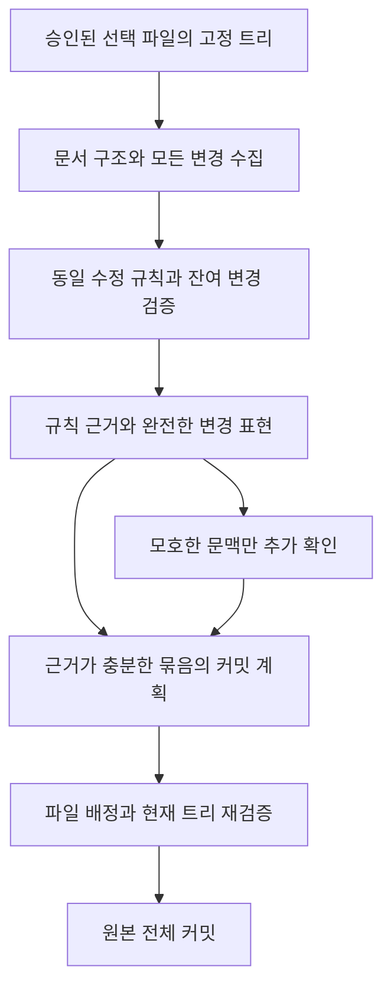

# 대량 문서 변경의 AI 커밋 압축 연구

상위: [진행 작업](MOC.md). 선행 실측: [AI 커밋 토큰 절감 검토](git-ai-commit-token-efficiency.md). 현재 동작의 기준본: [AI 커밋 실행 계약](../development/agent-sessions.md#git-ai-commit-작업).

**연구 결론은 문서 구조에 맞춘 변경 표현, 반복 수정의 공통화, 변경 시점의 의도 기록을 결합하는 것이다.** 임베딩만으로 diff를 대체하는 방식은 현재 ACP 입력과 맞지 않고, 발췌만 먼저 보내는 방식은 실제 실행에서 대량 스킵을 일으켰다. 의미가 다른 변경을 없애는 대신 같은 정보를 반복해서 읽는 비용을 줄여야 한다.

로컬 실험에서 실제 문서 43개의 모든 변경을 복원하는 표현은 3줄 문맥 Git diff보다 기준 토큰을 **48.5%** 줄였다. 반복된 동일 수정 100건의 합성 사례에서는 **88.8%** 줄었다. 반대로 고유한 새 내용 100건은 거의 줄지 않았다. 실제 코퍼스에서 단순 발췌 없이 90%를 줄였다는 근거는 없다.

이 문서는 조사·재현 가능한 오프라인 실험·구현 제안이다. 실험 도구는 자동 커밋 실행 경로에 연결하지 않았다. 모델의 그룹 판단, 실제 완료 시간, 임베딩·LLMLingua의 이 서버 성능은 미측정이다. 기본 스킬·운영 계약은 이 제안으로 교체하지 않는다.

## 무엇을 빠르게 해야 하는가

Git은 이미 변경 부분만 나타내는 delta를 만든다. 남은 문제는 변경 전후의 긴 문장 반복, 여러 문서에 적용한 동일 수정, 변경과 무관한 문맥, 반복 지침, AI 호출·추론·출력 시간이다. 커밋의 원본은 Git 트리로 보존하고, AI에는 커밋의 목적·논리적 묶음·메시지를 판단할 근거를 제공해야 한다.

다음 세 가지는 별도 목표다. 구분하지 않으면 입력을 줄인 대신 커밋할 파일도 줄이는 실패가 생긴다.

| 목표 | 확인할 것 |
| --- | --- |
| 입력의 완전성 | 모든 선택 파일·변경 구간·전후 차이가 표현됐는가 |
| 판단의 정확도 | 제목·설명이 실제 변경과 맞으며 독립 작업을 잘 묶었는가 |
| 실제 실행의 안전성 | 선택 범위·전체 원본·HEAD·트리·stage·취소·권한을 지키는가 |

커밋 메시지 작성이 전체 코드·문서 감사를 대신하지는 않는다. 제공된 근거로 알 수 있는 변경만 설명하고 테스트·검토 완료를 주장하지 않는 계약이 필요하다. 제목에 영향을 주는 의도가 모호하면 해당 문맥을 더 읽어야 하지만, 모든 변경 파일의 구현 정확성을 증명하는 일을 기본 전제로 삼을 필요는 없다. 이 구분은 제안이며 현재 스킬에 적용하지 않았다.

## 실제 스킵이 발생한 이유

2026-10-04 빠른 경로의 완료 작업은 선택 145개 중 13개 파일을 4개 커밋으로 기록하고 132개를 남겼다. 전체 스킵률은 91.0%, 문서는 45개 중 43개가 남아 95.6%였다. 작업 경과 시간은 181.0초다. 다수의 사유가 부분 diff만 받아 전체 변경을 확인하지 못했다는 내용이었다. 저장된 스킵 배열만 기준 토크나이저로 4,014토큰이었다. 이것은 실제 공급자가 청구한 출력 토큰 수가 아니다.

현재 구현에는 네 가지 문제가 함께 있다.

1. 8,000자 조각마다 최대 약 1,200자 이하를 고르므로 상당수 변경 근거가 처음부터 사라진다. 서로 다른 작은 파일을 같은 조각에 넣으면 작은 문서도 전체 조각의 일부라는 이유로 부분 입력이 된다.
2. 원본을 6개씩 2회만 요청할 수 있어, 변경량이 커지면 아직 읽지 못한 조각이 남는 것이 구조적으로 불가피하다. 전체 조각 수에 비례해 근거를 확보할 경로가 없다.
3. 근거가 부족하면 스킵하라는 계약과 제한된 재확인 예산이 결합했다. 호출 횟수만 줄이고 처리 완전성을 보장하지 않았다.
4. 문서·코드가 함께 선택되면 전체 크기가 큰 변경 경로를 결정한다. 문서만 별도로 보면 단일 입력에 들어가는 변경도 혼합 입력에서 손실될 수 있다.

종료된 작업의 `input.json`과 원본 조각은 정상 정리돼 남아 있지 않았다. 따라서 당시 전체 프롬프트·모델 설정·정확한 호출별 기여도는 재구성하지 않았다. 아래 압축 실험은 이후 남아 있는 문서 변경을 **새 고정 스냅샷**으로 측정한 결과이며, 이 145개 파일 작업과 직접적인 완료 시간 비교는 하지 않는다.

**후속 설계에서는 크기·발췌 표시·남은 호출 예산만으로 파일을 스킵하지 않아야 한다.** 근거가 덜 제공됐으면 서버가 남은 근거를 다음 묶음으로 공급하고, 실질적으로 판단할 수 없는 경우와 자원 한도에 도달한 경우를 구분한다. 자동 커밋·push·권한 범위를 확대한다는 뜻은 아니다.

## 압축이라는 말의 서로 다른 의미

| 방법 | AI가 실제로 받는 것 | 장점 | 커밋에서의 한계 |
| --- | --- | --- | --- |
| gzip·zstd | 압축 바이트나 base64 | 저장·전송 용량 절감 | 모델이 읽을 변경 의미가 없다. 외부에서 풀면 입력 토큰은 돌아온다 |
| 검색 임베딩 | 원문 대신 벡터를 색인하고 검색 결과 원문을 전달 | 관련 후보 연결·검색 | 모든 선택 변경의 근거를 보내는 절차를 대신하지 않는다 |
| 학습된 memory·gist | 전용 decoder가 해석하는 잠재 표현 | 큰 압축의 연구 가능성 | 일반 텍스트 ACP에 그대로 넣을 수 없다. 모델·학습·서빙 변경이 필요하다 |
| 추출형 신경 압축 | 작은 모델이 남긴 단어·문장 | 일반 텍스트 입력과 호환 | 제거된 부정·수치·조건·관계가 판단을 바꿀 수 있다 |
| 문서 변경 표현 압축 | 전후 수정·공통 구간·문서 구조·참조 | 로컬 처리와 전체 변경 coverage를 함께 설계 가능 | 새로운 표현을 모델이 읽는 정확도는 별도 평가 필요 |
| 변경 의도 기록 | 작성 시 남긴 목적·그룹·검증된 범위 | 커밋 때 의도를 다시 추론하는 비용 절감 | 원본 해시·잔여 변경 검사 없이 기록만 믿을 수 없다 |

### 임베딩이 무엇을 해결하는가

Sentence-BERT는 문장을 유사도 비교에 쓸 벡터로 만드는 접근이다. 일반적인 사용은 벡터를 자연어 생성 모델에 diff의 대체 입력으로 넣는 것이 아니라 검색·군집화에 사용하는 것이다. [Sentence-BERT 논문](https://arxiv.org/abs/1908.10084), [Sentence Transformers 문서](https://www.sbert.net/docs/sentence_transformer/usage/semantic_textual_similarity.html)

현재 `AgentSession`은 `runOnce(text)`에서 ACP에 텍스트 content block을 전달한다. 임베딩 벡터를 latent input으로 해석하도록 연결한 경로가 없다. 숫자 배열을 프롬프트에 써 넣어도 이 벡터가 원래 diff의 의미로 변환되지는 않는다. 임베딩을 추가한다면 변경 구간을 관련 작업끼리 묶는 후보 생성에 쓰고, 실제 변경 근거는 별도로 보내는 설계가 맞다.

검색의 top-k는 일부 문서를 선택하는 방식이다. 모든 선택 파일을 배정해야 하는 커밋에서는 top-k 밖의 독립 수정도 남김없이 다뤄야 한다. 정확한 경로·API·링크·수치 관계는 어휘 검색과 구조 관계로 먼저 연결할 수 있다. 임베딩과 BM25를 결합하고 검색 결과 원문을 보내는 구조는 [Anthropic Contextual Retrieval](https://www.anthropic.com/engineering/contextual-retrieval)에서도 확인된다. 이를 커밋의 전량 분류에 그대로 적용하면 coverage 문제가 남는다는 것은 이 연구의 추론이다.

임베딩의 손익 조건은 다음과 같다. 이 서버에서 모델 다운로드·로딩·CPU/GPU 인코딩 시간을 실측하지 않았으므로 임베딩이 항상 빠르거나 느리다고 결론 내리지 않는다.

```text
추가 인코딩·검색·군집 비용
  < 없어진 AI 호출 준비·입력 처리 시간 - 늘어난 재확인·출력 시간
```

낯선 표현이 많고 기존 색인·상주 모델이 있다면 유사한 수정들을 찾는 데 도움이 될 수 있다. 동일 수정·링크·필드 변경은 해시와 정확 일치로 찾을 수 있어 먼저 임베딩할 이유가 약하다. 유사도 점수를 동일 의미의 증명으로 취급해서는 안 된다. 부정·반의어가 섞인 유사도 평가의 어려움은 [SemAntoNeg 연구](https://aclanthology.org/2022.blackboxnlp-1.20/)에서도 다룬다.

### 학습 압축 논문에서 가져올 것

[LLMLingua-2](https://aclanthology.org/2024.findings-acl.57/)는 bidirectional encoder의 토큰 분류로 남길 내용을 선택한다. 논문은 평가 과제에서 2~5배 압축과 1.6~2.9배 end-to-end 지연 개선을 보고한다. MeetingBank·LongBench 등의 결과이며 Mew의 한영 혼합 Markdown diff·커밋 분류·이 서버 CPU 성능 결과가 아니다. 반복 설명이 많은 새 문서의 본문을 줄이는 후속 후보로는 적합하지만, 조건·수치·링크·명령·코드·표를 보호한 상태에서 평가해야 한다. [공식 구현](https://github.com/microsoft/LLMLingua)

[Selective Context](https://aclanthology.org/2023.emnlp-main.391/)는 정보량에 따라 문맥의 일부를 제거한다. [Selection-p](https://aclanthology.org/2024.findings-emnlp.646/)도 토큰을 유지·제거할지 학습한다. 이런 방법의 과제 평균 점수가 높다고 모든 문서 변경의 작은 계약 차이를 보존하는 것은 아니다. 국소 부정이나 예외가 주된 수정인 diff에서는 삭제가 더 큰 영향을 줄 수 있다는 것은 적용상의 가설이다.

[Gist tokens](https://arxiv.org/abs/2304.08467)는 학습한 모델과 attention mask를 사용해 프롬프트를 압축한다. 논문의 최대 26배 프롬프트 압축이 보고된 wall time 개선은 4.2%였다. **압축률과 완료 시간 개선률은 같지 않다.** [ICAE](https://arxiv.org/abs/2307.06945)도 학습한 memory slot과 이를 해석하는 모델을 사용한다. 두 방식 모두 표준 ACP 텍스트 입력 앞에 외부 임베딩을 붙이는 변경으로 얻을 수 있는 기능은 아니다.

압축률뿐 아니라 실제 과제 성능·원문 근거·정보 보존을 따로 평가해야 한다는 근거는 [정보 보존을 평가한 EMNLP 연구](https://aclanthology.org/2025.findings-emnlp.949/)에 있다. 여기서는 압축기 복원 검증과 모델 판단 검증을 별도 단계로 설계한다.

## 실제 문서에서 한 로컬 실험

### 고정한 입력과 측정 범위

기존 작업트리의 변경 문서 43개·181개 hunk를 별도 Git index로 고정했다. 기준 HEAD는 `74351efbf9cb73bb6230bdbc290167cfe36e3b68`, 선택 변경 tree는 `3d5b7661b36d168b1512a19e4d224ea144e4bc1c`이다. 전체 문서 폴더·아카이브를 재귀 로드하지 않고 선택된 변경 문서의 현재·기준 blob만 읽었다.

환경은 Node `22.22.2`, Ryzen 5 9600X, `diff 9.0.0`, `markdown-it 14.3.0`, `yaml 2.9.1`이었다. 기준 토큰은 로컬 `tiktoken`의 `o200k_base`다. 운영 모델의 토크나이저·청구 사용량과 동일하다고 가정하지 않는다. 표의 입력에는 각 표현의 파일 목록·범위·형식 설명을 포함하고 공통 스킬·런타임 지침·모델 출력은 제외했다.

Git diff의 주변 문맥은 3줄과 0줄을 비교했다. 전역 공백 무시·잘린 원문·AI 요약은 사용하지 않았다. 모든 표현은 같은 고정 문서 집합을 사용했다.

### 표현별 결과

| 입력 표현 | 기준 토큰 | 3줄 Git 대비 절감 | 0줄 Git 대비 절감 | 보존하는 근거 |
| --- | ---: | ---: | ---: | --- |
| Git 3줄 문맥 | 51,025 | 기준 | — | 전량 변경·주변 3줄 |
| Git 0줄 문맥 | 30,330 | 40.6% | 기준 | 전량 변경·주변 문맥 별도 |
| 전후 문자열 JSON | 31,719 | 37.8% | -4.6% | 전량 변경. JSON 구조만 추가하면 오히려 증가 |
| 공통 문자열을 한 번 기록 | 27,007 | 47.1% | 11.0% | 모든 hunk의 전후 문자열 복원 |
| 위 표현과 동일 수정 사전 | 26,302 | **48.5%** | **13.3%** | 전량 변경 복원·반복 내용 1회 |
| 각 수정에 주변 32자 부착 | 37,634 | 26.2% | -24.1% | 모든 바뀐 문자열. 문맥이 중복돼 증가 |
| 겹친 문맥 통합·32자 후보와 전체 중 작은 것 | 23,925 | 53.1% | 21.1% | 모든 수정, 일부 바뀌지 않은 문맥은 생략 |
| 위 적응 선택의 80자 후보 | 25,412 | 50.2% | 16.2% | 모든 수정, 문맥이 부족할 가능성은 남음 |

**전체 hunk 복원과 의미 판단에 필요한 문맥 확보는 다르다.** 공통 문자열·사전 표현은 기준 파일에 적용해 결과 문서 전체가 원본과 같은지 검사했다. 주변 문맥 후보도 모든 문자 수정으로 결과를 복원하지만 모델에는 바뀌지 않은 문맥 일부를 주지 않는다. 조건의 주어·적용 범위가 그 부분에 있을 수 있으므로 53.1%를 의미 손실 없는 압축률이라고 부르지 않는다.

공통 문자열 예시는 다음과 같다. 문자열 항목은 양쪽 공통 내용이며 쌍은 `[이전, 이후]`다. 구분자 모양을 원문에서 추측하는 대신 명시적 JSON 타입으로 구분한다.

```json
{"shared":["접근을 ",["허용한다","허용하지 않는다"],".\n"]}
```

모델 입력만 이처럼 바꾼다. 실제 커밋 파일은 원본 전체이며 압축한 표현을 소스에 쓰지 않는다.

### 시간과 구조 분류에서 확인한 것

동일 스냅샷을 새 Node 프로세스에서 5회 측정했다. blob·hunk 읽기의 중앙값은 381ms, 3줄·0줄 기준과 여러 압축 후보를 모두 생성하는 준비 구간 중앙값은 917ms였다. 준비 구간의 범위는 894~1,009ms다. 이 값은 Git 스냅샷 생성·모듈 로딩·후속 AST 통계·합성 사례 생성·토큰화·ACP 준비·모델 호출·실제 커밋을 제외한다. 한 운영 후보만 생성하는 경로의 완료 시간이나 사용자 체감 시간이 아니다.

보수적인 `markdown-it` token 구조와 YAML 값 비교에서는 43개 모두 Markdown 본문 구조 또는 내용이 달랐다. 내용이 같고 공백만 바뀐 문서로 분류할 수 있는 파일은 없었다. 문서 제목·링크·계약·UI 사용 안내 등이 함께 바뀌었다. 이 코퍼스에 공백 무시를 적용하면 대부분이 사라진다는 가설은 지지되지 않았다. 이 파서는 Mew의 모든 확장을 재현하는 의미 검증기는 아니다.

gzip도 비교했다. 3줄 diff의 UTF-8 190,054바이트가 56,989바이트로 줄었고 처리에 약 5.5ms가 걸렸다. 하지만 base64 표현은 **51,891토큰**으로 원문 51,025보다 커졌다. 압축 바이트를 읽는 decoder를 호출하지 않고 모델이 이 값으로 변경을 이해할 수 있다고 가정하지 않았다. 이 사례에서는 저장·전송 압축도 AI 입력 절감으로 이어지지 않았다.

### 반복성과 새로운 정보의 차이

100개 문서에 동일 수정 또는 서로 다른 수정·추가를 만든 통제 사례다. 각 행 안에서 같은 문서 집합의 전후 문자열 JSON을 기준으로 비교한다. 실제 저장소 통계와 섞지 않는다.

| 합성 변경 | 전후 JSON | 공통 문자열·사전 | 절감 | 해석 |
| --- | ---: | ---: | ---: | --- |
| 같은 긴 문장의 같은 조건 수정 100건 | 42,550 | 4,751 | **88.8%** | 규칙·근거 1회와 적용 목록으로 큰 절감 |
| 서로 다른 긴 문장의 국소 수정 100건 | 82,550 | 44,350 | 46.3% | 파일 간 중복이 없어도 전후 공통 문장은 절감 |
| 동일 새 문서 내용 100건 | 37,450 | 4,883 | **87.0%** | 동일 추가 내용을 한 번 제공 |
| 서로 다른 새 내용 100건 | 71,774 | 71,874 | -0.1% | 중복이 없으면 사전 비용만 더해짐 |

서로 다른 긴 문장의 국소 수정에서는 적응 32자 문맥 후보가 8,767토큰으로 줄었다. 다만 바뀌지 않은 긴 문장의 정보를 생략한 결과이며 의미 보존·모델 판단은 검증하지 않았다. 합성 89.4% 절감을 실제 문서 43개의 성과로 인용하면 안 된다.

프로토타입은 문자 길이를 기준으로 후보를 골랐다. 일부 합성 추가에서는 문자가 줄어도 토큰은 증가했다. 운영 구현은 실제 런타임에 맞는 토크나이저나 확인 가능한 보수적 예산으로 비교하고, 압축이 불리하면 원래 표현을 사용해야 한다. 짧은 숫자 ID와 JSON이 무조건 토큰을 줄인다는 가정도 하지 않는다.

## 권장하는 문서용 변경 표현

### 파일과 조각보다 문서 구조를 우선한다

문서를 frontmatter, 제목 계층, 문단, 목록 항목, 표 행·셀, 코드 블록, 링크, HTML·주석으로 나눈다. 각 변경에 이전/이후 blob, 구조 위치, 변경 표현, 전체 원본 참조를 연결한다. 이동한 문단도 이전·이후의 상위 제목을 함께 보존한다. 같은 문장이 금지 항목에서 권장 항목으로 이동하면 의미가 달라질 수 있다.

변경 구간의 상태는 다음 세 가지가 필요하다. 단순한 전체/부분 조각 구분만으로는 모든 변경을 표현했는지 알 수 없다.

| 상태 | 뜻 | 다음 행동 |
| --- | --- | --- |
| 전체 변경 표현 | hunk의 전후 문자열이 모두 표현됨 | 메시지 판단에 충분하면 사용 |
| 구조적으로 검증한 수정 | 지정한 필드·링크·위치의 규칙 적용과 잔여 diff가 검증됨 | 규칙 근거를 공유하고 모든 적용 대상을 배정 |
| 문맥 확인이 필요한 수정 | 모든 수정은 있지만 적용 범위·의도가 모호함 | 해당 문단·제목·연결 구간을 추가 제공 |

### 동일 수정은 규칙과 적용 목록으로 보낸다

예를 들어 300개 문서의 같은 안내 문구가 바뀌면 대표 수정 하나와 문서·구간 ID 목록을 제공한다. 대표만 읽고 나머지를 같은 것으로 추측하지 않는다. 모든 적용 대상에서 이전 문자열·이후 문자열·구조 위치가 규칙과 맞고, 별도의 잔여 변경이 없는지 로컬에서 검사한다. 잔여 변경이 있으면 별도 변경으로 남긴다.

규칙 후보는 정확한 전후 문자열, frontmatter 키·값, 제목 수정, 링크 라벨·대상, 표의 지정 셀, 완전히 같은 삽입·삭제 블록으로 찾는다. 서로 비슷한 prose를 해시로 동일시하거나 줄 번호만으로 묶지 않는다. 의미적 군집은 메시지 후보에 쓸 수 있지만 규칙의 동일성을 증명하지 않는다.

**앞으로 큰 절감을 기대할 부분은 전량을 더 세게 자르는 것보다 반복을 한 번 판단하는 것이다.** 규칙·대상·예외가 완전히 검증된 기계적 수정은 표준 메시지 생성까지 로컬에서 처리하는 경로도 가능하다. 사용자 스킬이 요구하는 메시지·분할 규칙을 만족하는 범위에서만 적용하고, 일반 prose의 의미 판단까지 규칙으로 확정하지 않는다. 이 0회 AI 경로는 제안이며 구현하지 않았다.

### 긴 문장의 공통 부분은 한 번만 보낸다

전후 문장 전체를 각각 보내기보다 공통 부분과 변경 쌍을 사용한다. 삭제·삽입·부정·수치·명령·링크를 생략하지 않는다. 복원 검사는 압축기 버그를 잡는다. 새로운 표현의 지침과 구조 비용을 포함해도 이득인 경우만 선택한다.

Git의 `--word-diff=plain`은 원문 속 구분자를 escaping하지 않아 모호할 수 있고, 기본 단어 비교는 공백을 기준으로 한다. 따라서 표시용 plain 문자열을 무손실 codec으로 취급하지 않는다. [공식 Git diff 문서](https://git-scm.com/docs/git-diff). 프로토타입은 `diffChars`와 타입이 분명한 JSON을 사용했으며, 연산이 오래 걸리면 전체 전후 문자열로 돌아간다. [JsDiff 계약](https://github.com/kpdecker/jsdiff)

### 문맥을 줄이는 경우에는 겹침과 관계를 보존한다

각 문자 변경에 일정 문맥을 무조건 붙이면 작은 변경이 많은 문장에서 같은 내용이 여러 번 나타난다. 가까운 변경은 같은 문장·구조 구간으로 합친다. 남은 문맥이 불충분하면 문단을 확장한다. 고유한 새 문단·삭제한 계약·코드 블록은 원문 전체를 보내는 쪽이 짧거나 더 명확할 수 있다.

Markdown의 빈 줄·들여쓰기·두 칸 뒤 공백은 목록 구조·코드·강제 줄바꿈에 영향을 준다. frontmatter의 `title`·`parent`·`status`도 Mew 동작과 연결된다. 전체 공백 삭제나 prose의 불용어 제거는 기본 경로로 두지 않는다. [CommonMark 명세](https://spec.commonmark.org/0.31.2/), [GFM의 표·체크 목록 확장](https://github.github.com/gfm/). 실제 Mew 확장과 renderer에 맞춘 검증이 있어야 기계적 형식 변경으로 분류할 수 있다.

## 커밋 때 분석을 다시 하지 않는 장기 방안

편집·에이전트 작업이 끝날 때 목적, 관련 파일, 한 작업으로 묶은 이유, 전후 blob·블록 hash, 실제 확인한 검증을 작은 변경 기록에 남긴다. 같은 문구를 여러 문서에 적용하는 기능은 규칙·대상·예외를 함께 기록할 수 있다. 커밋 때는 기록과 현재 고정 스냅샷의 일치를 확인하고 **그 기록에 없는 잔여 변경만 분석**한다.

이것은 요약을 그대로 신뢰하는 캐시와 다르다. 다른 작업의 후속 편집·수동 변경·리베이스·선택 범위 변경으로 hash가 달라지면 영향을 받는 기록을 무효화한다. 여러 작업이 한 파일을 수정한 경우 파일 단위 커밋 제약을 먼저 해결한다. 기록은 선택 파일의 커밋 승인이나 현재 stage 상태를 대신하지 않는다. 계정·저장소 경계 안에 보관하고 원문·비밀값을 불필요하게 복제하지 않는다.

현재 프로젝트에는 이 목적의 검증된 변경 기록 경로가 없다. 이번 변경의 과거 의도를 기록 없이 복원했다고 주장하지 않는다. 다만 앞으로 반복적인 문서 작업이 많다면 커밋 시점의 임베딩보다 작업 시점의 작은 의도 기록이 더 큰 지연 절감을 만들 가능성이 있다. 이 효과는 후속 측정 과제다.

## 실행 흐름과 지연 예산



첫 입력은 파일 목록만이 아니라 규칙·전체 변경 근거를 포함한다. 목적은 보통 1회 계획으로 끝나는 것이며, 의미가 다른 변경이 많은 경우에는 누락 없이 추가 묶음을 처리한다. 3회라는 고정 호출 제한을 모든 크기에 적용하는 것은 해결책이 아니다. 시간·입력·출력 예산은 사전에 알리고, 더 읽을 수 없는 상태를 내용상의 불확실성과 구분해야 한다.

문서만 있는 경우와 코드·테스트가 섞인 경우의 입력 예산을 분리해 볼 수 있다. `parent`·frontmatter의 `files`·같은 기능 문서·실제 변경 표현·링크 관계는 그룹 후보의 근거다. 디렉터리나 공통 단어 하나로 모든 파일을 강하게 연결하지 않는다. 관련 코드와 문서가 같은 변경이면 최종 그룹에서 함께 묶고, 여러 관심사가 한 파일에 있으면 파일 단위 제약에 맞게 묶거나 범위를 조정한다. 무조건 문서만 별도 커밋하는 정책을 새로 만들지 않는다.

분할이 필요하면 독립 묶음의 제한된 동시 분석을 비교할 수 있다. 동일 ACP 세션의 병렬 prompt는 현재 `busy` 계약과 맞지 않으므로 별도 세션·요청 제한이 필요하다. 병렬화는 벽시계 시간을 줄일 가능성이 있지만 읽는 총 토큰을 줄이지 않는다. 시작·종료 비용과 rate limit을 함께 측정한다. 같은 작업의 후속 확인에 세션을 재사용하는 안은 준비 비용 대신 누적 문맥 비용을 늘릴 수 있다.

```text
전체 시간 = 로컬 수집·압축
          + 호출별 대기·ACP 준비·입력 처리·추론·응답 생성·정리
          + 스냅샷 재검증·Git hook·서명·커밋
```

현재 로그의 호출 완료 시간만으로 이 항목들을 분리할 수 없다. 준비 시작/끝, 첫 토큰, 마지막 토큰, 호출 종료, 전체·캐시·출력·추론 사용량, 원본 추가 요청량, 결과 coverage를 수집해야 한다. `AgentSession`은 `turn_end.durationMs`와 사용량 관련 meta 경로를 갖지만 자동 커밋의 작업별 비용 분해는 연결돼 있지 않다. 런타임에서 제공하지 않는 사용량은 결측으로 표시한다.

입력만 줄이고 긴 분석·반복 스킵 이유·모든 경로의 재출력을 유지하면 완료 시간이 기대만큼 줄지 않을 수 있다. 메시지는 변경의 목적 위주로 간결하게 만들고 내부 파일 ID를 모델 응답에서 사용할 수 있게 하는 안을 검토한다. 서버가 ID를 경로로 복원해 기존 전량 배정 검사와 같은 검증을 수행해야 한다. 132건에 같은 스킵 사유를 출력했던 경로는 특히 줄일 대상이다.

공급자 prefix 캐시는 반복 지침·같은 입력의 처리 비용을 줄이는 보조 수단이다. 처음 읽는 고유한 변경을 없애지는 않는다. 동일 prefix·캐시 hit 사용량을 확인하고 ACP 런타임이 캐시 제어를 지원하는지 검증해야 한다. [Claude의 공식 캐시 계약](https://platform.claude.com/docs/en/build-with-claude/prompt-caching). 로컬 구조·hash 캐시는 모델 호출 전 재계산을 줄이며, 필드·구간 해시를 사용해야 앞쪽 편집 때문에 모든 조각이 무효화되는 일을 줄일 수 있다.

## 도입 전에 통과해야 할 평가

기존 커밋 벤치마크는 대체로 이미 정해진 단일 커밋의 메시지 생성이다. [Long Code Arena](https://arxiv.org/html/2406.11612v1)의 large commit 과제와 [CommitBench](https://arxiv.org/abs/2403.05188)는 참고가 되지만, Mew의 미커밋 변경 분할·문서·한국어·전량 처리 평가를 대신하지 않는다. BLEU·ROUGE 같은 문장 유사도만으로 올바른 그룹·누락 없는 커밋을 판정하지 않는다.

비교군은 원문 전체, 현재 발췌 경로, 완전한 공통 문자열·사전, 구조 규칙·잔여 변경, 적응 문맥, 보호 구간을 둔 신경 압축이다. 같은 스냅샷·모델·추론 강도·스킬을 고정하고 최초 실행과 동일 변경 재시도를 별도로 비교한다.

| 평가축 | 지표·합격 기준 제안 |
| --- | --- |
| 완전성 | 선택 파일·hunk·수정 구간 coverage 100%; 단순 크기 사유의 스킵 0건 |
| 복원 | 모든 UTF-8 문서·전후 mode·삽입·삭제·마지막 개행의 원본 일치 |
| 의미 | 부정·예외·수치·역할·링크 대상·표 셀·명령·체크 상태 변경의 누락 여부 |
| 그룹 | 사람이 정한 독립 작업의 분리·잘못된 합침·같은 기능의 코드/문서 분리 여부 |
| 메시지 | 사실 오류·빠진 주요 목적·근거 없는 테스트/검토 주장 |
| 속도 | 동일 처리 coverage에서 p50·p95 전체 시간, 호출 수, 첫 토큰 대기 |
| 비용 | 누적 입력·캐시·출력·추론 토큰, 재시도·복원 비용 포함 |
| 운영 | stage 보존·경합·취소·부분 성공·권한·사용자 스킬 보존 |

고정 사례에는 동일 수정 100/1,000건, 고유 prose 100건, 긴 문장 한 단어, 한 파일 안의 두 작업, 섹션 이동, 링크·이미지 대상 변경, 표/코드/HTML 변경, 마지막 개행, 중간에 숨은 조건 반전, 구조만 비슷한 서로 다른 계약을 포함한다. 실제 43개 문서 집합과 합성 집합은 따로 보고한다. 압축 원문을 사람이 복원할 수 있다는 것만으로 모델의 정확도를 통과시키지 않는다.

제안 도입 순서는 다음과 같다.

1. **계측·스킵 사유 분리:** 입력 부족이 커밋 완료로 조용히 끝나는 문제를 관찰 가능하게 만든다.
2. **문서의 완전한 변경 표현:** 반복 지침·staged 참고 중복을 줄이고 공통 문자열·동일 수정 사전을 사용한다. 잔여 diff와 전체 결과를 검증한다.
3. **구조 규칙과 그룹 후보:** 검증 가능한 반복 수정부터 적용하고 전체 모델 평가를 통과한 다음 확대한다.
4. **변경 의도 기록·구간 캐시:** 새 작업부터 적용하며 기록 없는 변경은 완전한 변경 표현으로 처리한다.
5. **임베딩·신경 압축 실험:** 위 경로로 남는 큰 고유 변경이 지연을 지배하는지 확인한 뒤 비교한다.

첫 실험의 목표는 현재 남은 변경을 실제로 처리하면서 모델 호출 수를 줄이는 것이다. 90% 토큰 절감이나 몇 초 완료를 먼저 약속하지 않는다. 같은 coverage와 판단 품질에서 얻은 p50·p95가 근거가 돼야 한다.

## 재현 도구와 확인한 범위

[오프라인 실험 도구](../../server/git-doc-compression-benchmark.ts)는 `{head,tree,files}`를 받아 고정된 Markdown blob과 Git U0 hunk를 읽고 후보를 생성한다. 원본 복원·mode 목록 보존을 검사하고, 필요하면 입력을 private 임시 폴더에 저장한다. AI 호출·stage·커밋·서버 변경은 수행하지 않는다. 현재 잠금 파일에 있는 `diff` 의존성을 연구용으로 사용하며 운영 경로에 도입할 때는 명시적 의존성 여부도 정리해야 한다. UTF-8 일반 파일만 대상으로 하며 바이너리·symlink에는 별도 표현이 필요하다.

현재 변경의 새 스냅샷은 다음과 같이 만들 수 있다. 최초 실측의 Git 객체가 남아 있을 때만 같은 코퍼스를 재현할 수 있으며, 새 clone이나 Git GC 이후에는 동일 객체가 없을 수 있다. 아래 명령은 그 시점의 새 변경을 측정하므로 이 문서의 숫자와 같다는 보장은 없다.

```bash
node --input-type=module <<'JS' > /tmp/mew-doc-snapshot.json
import { execFileSync } from 'node:child_process'
import { captureCommitChanges } from './server/git-ai-commit.ts'
const files = execFileSync('git', ['diff', '--name-only', 'HEAD', '-z', '--', 'docs'], { encoding: 'utf8' }).split('\0').filter(p => p.endsWith('.md'))
const snapshot = await captureCommitChanges(process.cwd(), files, false)
console.log(JSON.stringify({ head: snapshot.head, tree: snapshot.tree, files: snapshot.files }))
JS
node server/git-doc-compression-benchmark.ts --snapshot /tmp/mew-doc-snapshot.json --emit-directory /tmp/mew-doc-inputs
node --test server/git-doc-compression-benchmark.test.ts
```

이 스냅샷 예시는 tracked 문서의 변경만 선택한다. 새 미추적 문서를 측정하려면 명시적인 선택 목록에 추가한다.

기준 토큰은 같은 임시 파일의 문자열 전체를 `tiktoken.get_encoding('o200k_base').encode(text, disallowed_special=())`로 측정했다. 스킬·모델 출력·시스템 지침을 합산한 비용 실험은 아니다. `--emit-directory` 없이 실행하면 원문 입력 파일은 저장하지 않는다. 임시 원문은 문서나 Git에 추가하지 않는다.

복원 테스트는 부정·숫자·링크·표·fence·HTML 주석·들여쓰기·목록 빈 줄·강제 줄바꿈·Unicode·CRLF·삽입/삭제·마지막 개행과 60개 결정적 변형을 포함한다. 실제 43개 문서 및 4종 100문서 합성 집합의 전량 복원도 실험 중 검사했다. 이 확인은 압축기의 데이터 보존 검사이며, 운영 모델의 커밋 판단 품질 검사는 후속 과제로 남는다.

연구 도구의 4개 테스트, TypeScript와 대상 lint 검사를 통과했다.
