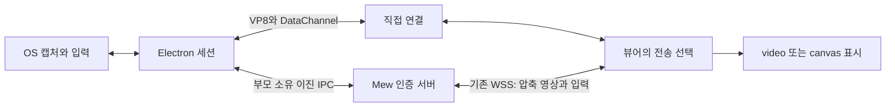

# 원격 데스크톱 서버 전송

[작업 지도](_work.md) · [ADR 0139](../../../.mew/docs/decisions/0139-mew-desktop-server-transport.md)

## 목표와 범위

외부 서비스·TURN 계정·추가 공개 포트 없이 현재 Mew 접속 경로로 원격 화면과 입력을 전달한다. 기존 직접 연결은 유지하고 실패 시 자동 전환한다. 배포 가능한 라이선스와 고지를 확인한다. 서버의 실제 빌드·재시작은 README에 따라 사용자가 수행한다.

## 설계

- 캡처 수명은 네이티브 세션, 전송 선택은 뷰어가 소유한다. 전환은 직접 → 서버 한 방향이며 같은 화면 공유를 유지한다.
- 직접 전송과 서버 전송은 동일 입력 스냅샷을 사용한다. 전환 시 눌린 입력을 해제하고 이전 채널을 분리한다.
- VP8 WebCodecs 인코더/디코더를 사용한다. 지원 여부는 런타임에서 검사한다. 서버는 압축 프레임을 수정하지 않는다.
- 프레임 프로토콜과 흐름 제어는 별도 모듈로 두고 길이·차원·순서·버전·ACK를 검증한다. 모든 큐에 상한과 종료 조건을 둔다.
- 네이티브 IPC는 기존 JSON 제어 메시지와 길이를 명시한 이진 영상 패킷을 구분한다. Base64와 화면 파일을 만들지 않는다.
- UI는 기존 전체 화면·조이스틱을 유지한다. 전환 안내와 직접/서버 연결 상태를 표시한다. 오류는 실제 실패 단계에 맞춘다.

## 순서와 완료 기준

- [x] 현재 구조·제약 조사, ADR 작성
- [x] 공유 프로토콜·흐름 제어·경계 검사
- [x] 네이티브 캡처 재사용·VP8 인코더·이진 IPC
- [x] 서버의 인증·수명·백프레셔를 유지한 전달
- [x] 뷰어 전환·VP8 디코더·canvas와 기존 조작 통합
- [x] 직접 경로 차단·실제 인코딩/디코딩·입력·중단·혼잡·권한 회수 검사
- [x] Windows 실기 영상 검사, 가능한 환경의 브라우저 검사
- [x] 배포 라이선스·사용법·서비스 인벤토리 갱신, 타입·린트·문서 검사

Mac/X11/Wayland OS 권한과 실제 Safari/iOS 장비 검증은 사용 가능한 환경에 따라 명시한다. 테스트 성공을 실측 지연이나 모든 네트워크에서의 성공으로 확대하지 않는다.

## 결과와 반영

관련 스위트 40개 중 39개 통과·Windows bridge 실기 항목 하나는 기본 실행에서 생략했다. 별도로 실제 Windows 화면을 캡처하여 빈 ICE 설정과 직접 경로 차단 상태에서 서버 전송의 연속 10프레임 재생·닫은 뒤 자식 종료를 통과했다. 이후 추가한 연결 중 전환·키 해제·ACK 정지/복구·미지원 디코더 브라우저 검사도 통과했다. 타입 검사와 린트 오류는 없으며 기존 다른 영역의 린트 경고 10개는 남아 있다. 모바일·데스크톱 합성 화면도 확인했다.

작업은 소스와 문서까지 반영했다. 실행 중인 Mew의 빌드·재시작은 수행하지 않았다. 사용자가 반영 후 원격 데스크톱을 열면 바뀐 helper를 자동 준비하고, 직접 경로가 막힐 때 서버 전송을 사용한다. 실제 사용자의 외부 접속망 확인은 그 단계에 남아 있다. 배포 조건은 [라이선스 문서](../development/remote-desktop-distribution.md)를 따른다.
